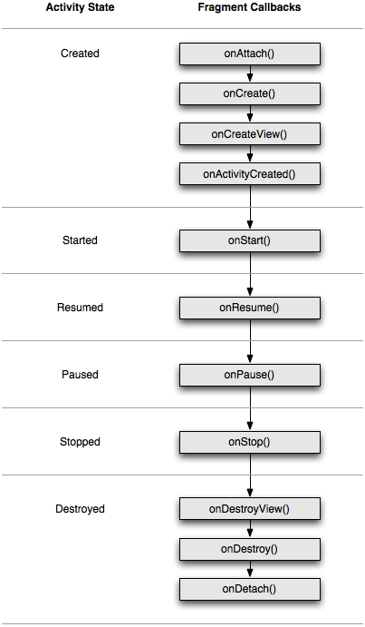
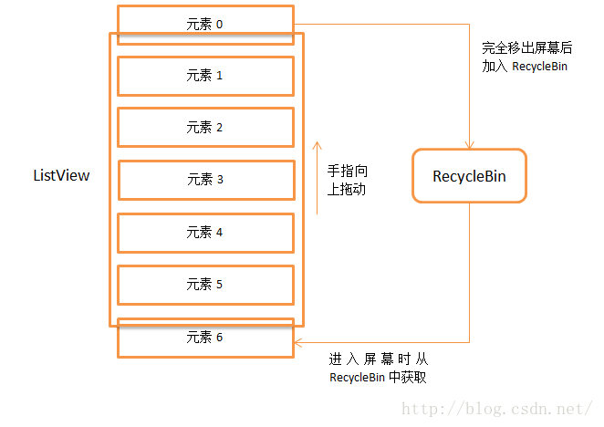
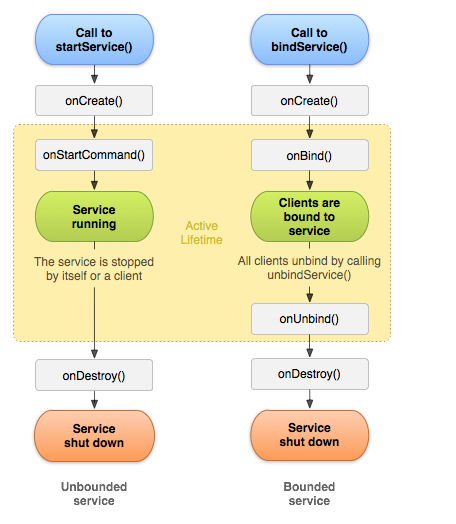

# Components

[TOC]

# Activity

## 启动模式

```xml
<activity 
          android:name=".xxActivity" 
          android:launchMode="standard/singleTop/singleTask/singleInstance"
          android:taskAffinity="com.example.xxx.yyy"/>
```

### standard

默认的启动模式，每次启动一个Activity都会新建一个实例不管栈中是否已有该Activity的实例

### singleTop

1. 当前栈中已有该Activity的实例并且该实例位于栈顶时，不会新建实例，而是复用栈顶的实例，并且会将Intent对象传入，回调`onNewIntent`方法
2. 当前栈中已有该Activity的实例但是该实例不在栈顶时，其行为和standard启动模式一样，依然会创建一个新的实例
3. 当前栈中不存在该Activity的实例时，其行为同standard启动模式

> standard和singleTop启动模式都是在原任务栈中新建Activity实例，不会启动新的Task，即使你指定了taskAffinity属性

### singleTask

根据taskAffinity去寻找当前是否存在一个对应名字的任务栈

1. 如果不存在，则会创建一个新的Task，并创建新的Activity实例入栈到新创建的Task中去
2. 如果存在，则得到该任务栈，查找该任务栈中是否存在该Activity实例 
   - 如果存在实例，则将它上面的Activity实例都出栈，然后回调启动的Activity实例的`onNewIntent`方法 
   - 如果不存在该实例，则新建Activity，并入栈 

此外，我们可以将两个不同App中的Activity设置为相同的taskAffinity，这样虽然在不同的应用中，但是Activity会被分配到同一个Task中去

#### taskAffinity

**指定方式**

1. 在Manifest中指定`android:taskAffinity` 属性
2. 在Intent中使用`addFlags（Intent.FLAG_ACTIVITY_xxx）`

第一种方式优先级低，无法指定`FLAG_ACTIVITY_CLEAR_TOP`等

第二种方式优先级高，无法指定singleInstance模式

> 可以使用`adb shell dumpsys activity` 查看任务栈

**常见FLAG**

- FLAG_ACTIVITY_NEW_TASK：同singleTask
- FLAG_ACTIVITY_CLEAR_TOP：将Activity上面的其他Activity实例都出栈，一般配合NEW_TASK使用
- FLAG_ACTIVITY_SINGLE_TOP：同singleTop
- FLAG_ACTIVITY_EXCLUDE_FROM_RECENTS：Activity不会出现在历史Activity中，同`android:excludeFromRecents="true"`

#### 作用

taskAffinity和singleTask配对使用时，它是具有该模式的Activity的目前任务栈的名字，待启动的Activity会运行在名字和taskAffinity相同的任务栈中。

当taskAffinity和allowTaskReparenting结合使用时。当应用A启动了应用B的Activity C后，如果这个Activity的allowTaskReparenting为true，当（单独）启动应用B时，C会从A的任务栈转移到B的任务栈

### singleInstance

除了具备singleTask模式的所有特性外，与它的区别就是，这种模式下的Activity会单独占用一个Task栈，具有全局唯一性，即整个系统中就这么一个实例，由于栈内复用的特性，后续的请求均不会创建新的Activity实例，除非这个特殊的任务栈被销毁了。以singleInstance模式启动的Activity在整个系统中是单例的，如果在启动这样的Activiyt时，已经存在了一个实例，那么会把它所在的任务调度到前台，重用这个实例

[彻底弄懂Activity四大启动模式](http://blog.csdn.net/mynameishuangshuai/article/details/51491074)

## 生命周期

### 一个Activity的生命周期


完整生存期：onCreate() - onDestroy()，内存初始化和释放

可见生存期：onStart() - onStop()，活动可见，不一定可交互，资源加载和释放

前台生存期：onResume() - onPause()，运行状态，可交互

如果一个Activity没有被完全遮挡住，是不会触发onStop的

[基础总结篇之一：Activity生命周期](http://blog.csdn.net/liuhe688/article/details/6733407)

### 不同位置调用finish()的结果

#### 表现

1. 在onCreate方法中调用finish

   在onCreate中，调用finish方法，不会显示出此Activity的界面，因为调用finish方法后，立马就会跑onDestroy。即跑的生命周期为：onCreate、onDestroy。

2. 在onStart方法中调用finish

   在onStart方法中，调用finish，会出现闪退，因为调用finish方法后，立马就会跑onStop方法。即跑的生命周期为：onCreate、onStart、onStop、onDestroy。

3. 在onResume方法中调用finish

   在onStart方法中，调用finish，会出现闪退，因为调用finish方法后，立马就会跑onStop方法。即跑的生命周期为：onCreate、onStart、onResume、onPause、onStop、onDestroy。

4. 在onPause、onStop、onDestroy中调用finish

   在onPause、onStop、onDestroy中，调用finish，显示正常。在退出时，正常退出。跑的生命周期为：onCreate、onStart、onResume、onPause、onStop、onDestroy。

#### 原理

在`mInstrumentation.callActivityOnCreate(activity, r.state)`中，执行完 onCreate()后，判断这时 activity 有没有finish ，没有就会接着执行 onStart()，否则会调用 destory()

```java
if (!r.activity.mFinished) {
    activity.performStart();
    r.stopped = false;
}
```

执行完 onStart()后会执行` handleResumeActivity` 函数，其中`performResumeActivity` 函数中会调用 onResume

```java
if (r != null && !r.activity.mFinished) {
    r.activity.performResume();
}
```

如果此时finish，就不会执行finish()，会调用`ActivityManagerNative.getDefault().finishActivity(token, Activity.RESULT_CANCELED, null)`执行销毁

[android 生命周期不同方法调用finish()，经历生命周期方法不一样，为什么？](https://github.com/android-cn/android-discuss/issues/430)

[Activity的生命周期函数&finish方法](http://blog.csdn.net/hanhan1016/article/details/49991981)

## 异常情况下Activity数据的保存和恢复

### 保存和恢复数据

可以通过onRestoreInstanceState和onCreate方法判读Activity是否被重建了，如果被重建了，那么我们就可以取出之前保存的数据并进行恢复，onRestoreInstanceState的调用时机在onStart之后。

> 在正常情况下Activity的创建和销毁不会调用onSaveInstanceState和onRestoreInstanceState方法

可能触发的场景：

1. 横竖屏切换
2. Home键返回桌面：onPause()----onSaveInstanceState()----onStop()
3. 直接后台切换到其他应用
4. 直接锁屏

从上边的可能性可以看出，onSaveInstanceState()的调用遵循一个重要原则，即当系统**未经你许可销毁了你的activity，而不是你自己手动销毁的**，这时候onSaveInstanceState会被系统调用，这是系统的责任，因为它必须要提供一个机会让你保存你的数据

而**onRestoreInstanceState被调用的前提是，activity A确实*被系统销毁了，而如果仅仅是停留在有这种可能性的情况下，则该方法不会被调用**

例如，当正在显示activityA时，这时候直接按下电源键锁屏，那么会执行onSaveInstanceState()，紧接着再打开屏幕，这时候activityA不会被系统销毁，所以不会执行onRestoreInstanceState()

使用

```java
@Override
public void onSaveInstanceState(Bundle outState) {
    super.onSaveInstanceState(outState, outPersistentState);
    outState.putString("editText",myEdit.getText().toString());
}

@Override
public void onRestoreInstanceState(Bundle savedInstanceState) {
    super.onRestoreInstanceState(savedInstanceState, persistentState);
    String str = savedInstanceState.getString("editText");
    myEdit.setText(str);
}
```

使用onRestoreInstanceState和onCreate恢复数据的区别：

1. onRestoreInstanceState的savedInstanceState一定是有值的，不需要额外判断
2. onCreate的savedInstanceState正常启动时为null，需要额外判断

### 防止Activity重建

在AndroidManifest.xml中对Activity的configChange属性进行配置。例如我们不希望屏幕旋转时重建，则需要设置为` android:configChanges="orientation|screenSize"` ， 如果有多个值，可以用“|”连接

> 自从Android 3.2（API 13），在设置Activity的`android:configChanges="orientation|keyboardHidden`后，还是一样会重新调用各个生命周期的。因为screen size也开始跟着设备的横竖切换而改变。所以，在AndroidManifest.xml里设置的MiniSdkVersion和 TargetSdkVersion属性大于等于13的情况下，如果你想阻止程序在运行时重新加载Activity，除了设置"orientation"，你还必须设置"ScreenSize"

常用的配置选项有

- orientation：屏幕方向发生了改变，例如横竖屏切换
- locale：设备的本地位置发生了改变，例如切换了系统语言
- keyboard：键盘类型发生了改变，例如插入了外接键盘
- keyboardHidden：键盘的可访问性发生了改变，例如移除了外接键盘
- screenSize：屏幕大小发生改版，例如横竖屏切换

不设置configChanges的Activity生命周期：

onPause()----onSaveInstanceState()----onStop()----onDestroy()----onCreate()-----onStart()-----onRestoreInstanceState()----onResume()

只设置`orientation|keyboard`的Activity生命周期：与不设置相同

设置`orientation|screenSize`的Activity生命周期：

`onConfigurationChanged`---`onWindowFocusChanged`

[横竖屏切换时候的生命周期以及configchanges介绍](https://blog.csdn.net/qq_33234564/article/details/53286474)

[异常情况下Activity数据的保存和恢复](http://blog.csdn.net/huaheshangxo/article/details/50829752#如何保存和恢复数据)

## 启动过程

启动Activity涉及到Instrumentation,ActivityThread,ActivityManagerService(AMS)

启动Activity的请求会由Instrumentation来处理，它通过Binder向AMS发送请求，AMS内部维护着一个ActivityStack并负责栈内的Activity的状态同步，AMS通过ActivityThread的`scheduleLaunchActivity`方法去同步Activity的状态从而完成生命周期方法的调用

### 具体过程记录（非重点）

1. **startActivity**的各种重载中最终都会调用startActivityForResult，其中调用了**mInstrumentation#execStartActivity**

2. execStartActivity中调用了ActivityManagerNative.getDefault().startActivity，相当于**AMS#startActivity**

   > 继承关系：ActivityManagerService->ActivityManagerNative->实现了IActivityManager的Binder

3. checkStartActivity，检查启动Activity的结果，无法正确启动时抛出异常

4. **AMS#startActivity**中，从ActivityStackSupervisor的startActivityMayWait开始转移，到starActivityLocked，startActivityUncheckedLocked，最终到**ActivityStack#resumeTopActivitiesLocked**

5. **ActivityStack#resumeTopActivitiesLocked**，resumeTopActivityInnerLocked，ActivityStackSuperVisor#startSpecificActivityLocked，**realStartActivityLocked**，其中调用了app.thread.scheduleLaunchActivity，即**ApplicationThread#scheduleLaunchActivity**

   > app.thread类型为IApplicationThread，继承自IInterface，是一个Binder接口，内部包含了大量启动停止Activity的接口，实现类为ApplicationThread


1. **ApplicationThread#scheduleLaunchActivity**发送启动消息到Handler H，调用ActivityThread#handleLaunchActivity，其中**performLaunchActivity**最终完成了：

   1. 从ActivityClientRecord中获取待启动的Activity组件信息
   2. 通过mInstrumentation的newActivity使用类加载器创建Activity对象
   3. 通过LoadedApk的makeApplication尝试创建Application对象
   4. 创建ContextImpl对象并通过Activity的attach完成重要数据初始化
   5. 调用Activity的生命周期方法

   > ContextImpl是Context的具体实现，通过Activity#attach与Activity建立联系，除此之外，attach还会建立Window并关联Activity

### Instrumentation

Instrumentation可以把测试包和目标测试应用加载到同一个进程中运行。既然各个控件和测试代码都运行在同一个进程中了，测试代码当然就可以调用这些控件的方法了，同时修改和验证这些控件的一些数据

Android Instrumentation是Android系统里面的一套控制方法或者”钩子“。这些钩子可以在正常的生命周期（正常是由操作系统控制的)之外控制Android控件的运行，其实指的就是Instrumentation类提供的各种流程控制方法

一般在开发Android程序的时候，需要写一个manifest文件，其结构是：

```xml
<application android:icon="@drawable/icon" android:label="@string/app_name">
    <activity 
              android:name=".TestApp" 
              android:label="@string/app_name">
    </activity>
</application>
```

这样，在启动程序的时候就会先启动一个Application，然后在此Application运行过程中根据情况加载相应的Activity，而Activity是需要一个界面的。

但是Instrumentation并不是这样的。可以将Instrumentation理解为一种没有图形界面的，具有启动能力的，用于监控其他类(用Target Package声明)的工具类。

## IntentFilter匹配规则

为了匹配过滤列表，需要同时匹配过滤列表中的action，category，data信息，否则匹配失败。另外，一个Activity中可以有多个intent-filter，一个Intent只要能匹配任何一组intent-filter即可成功启动对应的Activity

- action：要求Intent中的action存在且必须和过滤规则中的其中一个action相同，区分大小写

- category：要求Intent中如果含有category，那么所有的category都必须和过滤规则中的其中一个category相同才匹配

  intent中的category可以为空，因为在intent-filter中系统自动加上了DEFAULT这个category用来匹配空值

- data：要求Intent中必须含有data数据，并且data数据能够完全匹配过滤规则中的某一个data

# BroadcastReceiver

## 注册方式

静态注册

```xml
<receiver android:name=".Receiver" >  
    <intent-filter>  
        <action android:name="android.intent.action.BOOT_COMPLETED" />  
    </intent-filter>  
</receiver>  
```

动态注册

```java
MyBroadcastReceiver broadcast= new MyBroadcastReceiver();  
IntentFilter filter = new IntentFilter("android.intent.action.BOOT_COMPLETED");  
registerReceiver(broadcast, filter); 
```

> 动态注册的广播 永远要快于 静态注册的广播,不管静态注册的优先级设置的多高,不管动态注册的优先级有多低
>
> 动态注册广播不是 常驻型广播 ，也就是说广播跟随activity的生命周期。注意: 在activity结束前，移除广播接收器
>
> 静态注册是常驻型 ，也就是说当应用程序关闭后，如果有信息广播来，程序也会被系统调用自动运行

## 工作原理（非重点）

### 静态注册

由PackageManagerService（PMS）完成

### 动态注册

1. registerReceiver，ContextImpl.registerReceiver，registerReceiverInternal，其中通过mPackageInfo获取IIntentReceiver（Binder）对象，跨进程向AMS发送广播注册请求

   > BroadcastReceiver是Android组件，不能跨进程传递，需要通过IIntentReceiver中转，由LoadedApk.ReceiverDispatcher.InnerReceiver实现，与Service和ServiceDispatcher.InnerConnection的关系类似

2. AMS#registerReceiver中，将InnerReceiver和IntentFilter存储起来，就完成了注册

### 发送和接收

1. sendBroadcast，ContextImpl#sendBroadcast，AMS#broadcastIntent，broadcastIntentLocked

   > broadcastIntentLocked中默认不发送广播给已经停止的应用（包括手动停止的和安装后未启动过的）
   >
   > ```java
   > // By default broadcasts do not go to stopped apps
   > intent.addFlags(Intent.FLAG_EXCLUDE_STOPPED_PACKAGES);
   > ```
   >
   > 如果确实确实需要发送广播给未启动的应用，只需要添加`FLAG_INCLUDE_STOPPED_PACKAGES`，以覆盖另一个标签

2. `broadcastLocked`内，根据IntentFilter查找匹配的接收者，将接收者添加到BroadcastQueue中，再发送给接收者

3. BroadcastQueue并没有立即发送广播，而是发送了一个BROADCAST_INTENT_MSG的消息，收到后调用`processNextBroadcast`，遍历无序广播mParallelBroadcasts，并通过`deliverToRegisteredReceiverLocked`，`performReceiveLocked`发送给接收者

4. `performReceiveLocked`内，通过`ApplicationThread#scheduleRegisteredReceiver`调起应用程序，其中通过`InnerReceiver#performReceive`，`LoadedApk.ReceiverDispatcher#performReceive`实现广播接收，并调用`onReceive`

# Fragment

## 加载方式

依赖于Activity,不能单独存在，需要宿主

- 静态加载，在xml文件中，当做一个标签使用，这种方式频率比较低

```xml
<fragment
          android:id="@+id/left_fragment"
          android:name="com.example.fragmenttest.LeftFragment"
          android:layout_width="0dp"
          android:layout_height="match_parent"
          android:layout_weight="1"/>
```

- 动态加载，利用FragmentManager管理

```xml
<FrameLayout
             android:id="@+id/right_layout"
             android:layout_width="0dp"
             android:layout_height="match_parent"
             android:layout_weight="3">
</FrameLayout>
```

```java
void replaceFragment(Fragment fragment) {
    FragmentManager fragmentManager = getSupportFragmentManager();
    FragmentTransaction transaction = fragmentManager.beginTransaction();
    transaction.replace(R.id.right_layout, fragment);
    transaction.addToBackStack(null); // 实现返回栈
    transaction.commit();
}
```

## 生命周期



## 常见问题

1. Fragment跟Activity如何传值

   使用`getActivity()`从Fragment获取Ativity的信息，就可以调用Ativity的方法了

2. FragmentPagerAdapter与FragmentStatePagerAdapter区别

   - FragmentPagerAdapter适合用于页面较少的情况，切换时不回收内存，只是把UI和Activity分离，页面少时对内存影响不明显
   - FragmentStatePagerAdapter适合用于页面较多的情况，切换时回收内存

3. Fragment的replace和add方法的区别

   - add的时候可以把Fragment 一层层添加到FrameLayout上面,而replace是删掉其他并替换掉最上层的fragment
   - 一个FrameLayout只能添加一个Fragment种类,多次添加会报异常,replace则随便替换 
   - 替换上一个fragment会->destroyView和destroy,新的Fragmetnon:三个Create(create+view+activity)->onStart->onResume)
   - 因FrameLayout容器对每个Fragment只能添加一次,所以达到隐藏效果可用fragment的hide和show方法结合

4. Fragment如何实现类似Activity的压栈和出栈效果`FragmentTransaction.addToBackStack`

   - 内部维持的是双向链表结构
   - 该结构可记录我们每次的add和replace我们的Fragment;
   - 当点击back按钮会自动帮我们实现退栈按钮

5. Fragment之间通信

   - 在fragment中调用activity中的方法getActivity();
   - 在Activity中调用Fragment中的方法，接口回调；
   - 在Fragment中调用Fragment中的方法findFragmentById/Tag

# ListView和RecyclerView

## ListView

### ListView/GridView优化

1. convertView的复用

   在Adapter类的getView方法中通过判断convertView是否为null，是的话就需要在创建一个视图出来，然后给视图设置数据，最后将这个视图返回给底层，呈现给用户；如果不为null的话，其他新的view可以通过复用的方式使用已经消失的条目view，重新设置上数据然后展现出来

2. 使用内部类ViewHolder

   可以创建一个内部类ViewHolder，里面的成员变量和view中所包含的组件个数、类型相同，在convertview为null的时候，把findviewbyId找到的控件赋给ViewHolder中对应的变量，就相当于先把它们装进一个容器，下次要用的时候，直接从容器中获取

3. 分段分页加载

   分批加载大量数据，缓解一次性加载大量数据而导致OOM崩溃的情况

4. 减少变量的使用，减少逻辑判断和加载图片等耗时操作，减少GC的执行，减少耗时操作造成的卡顿

5. 根据列表滑动状态控制任务执行频率，例如快速滑动时不适合开启大量异步任务

   SCROLL_STATE_FLING：快速滑动状态，不适合加载图片

   SCROLL_STATE_IDLE或SCROLL_STATE_TOUCH_SCROLL：慢速或停止滑动，可以加载图片

6. 开启硬件加速

```java
@Override
public View getView(int position, View convertView, ViewGroup parent) {
    ViewHolder holder;
    View itemView = null;
    if (convertView == null) {
        itemView = View.inflate(context, R.layout.item_news_data, null);
        holder = new ViewHolder(itemView);
        //用setTag的方法把ViewHolder与convertView "绑定"在一起
        itemView.setTag(holder);
    } else {
        //当不为null时，我们让itemView=converView，用getTag方法取出这个itemView对应的holder对象，就可以获取这个itemView对象中的组件
        itemView = convertView;
        holder = (ViewHolder) itemView.getTag();
    }

    NewsBean newsBean = newsListDatas.get(position);
    holder.tvNewsTitle.setText(newsBean.title);
    holder.tvNewsDate.setText(newsBean.pubdate);
    mBitmapUtils.display(holder.ivNewsIcon, newsBean.listimage);

    return itemView;
}

public class ViewHolder {
    @ViewInject(R.id.iv_item_news_icon)
    private ImageView ivNewsIcon;// 新闻图片
    @ViewInject(R.id.tv_item_news_title)
    private TextView tvNewsTitle;// 新闻标题
    @ViewInject(R.id.tv_item_news_pubdate)
    private TextView tvNewsDate;// 新闻发布时间
    @ViewInject(R.id.tv_comment_count)
    private TextView tvCommentIcon;// 新闻评论

    public ViewHolder(View itemView) {
        ViewUtils.inject(this, itemView);
    }
}
```

[ListView的四种优化方式](http://blog.csdn.net/xk632172748/article/details/51942479)

[Android性能优化之提高ListView性能的技巧](http://blog.csdn.net/xk632172748/article/details/51942479)

### ListView的内部点击事件

在使用ListView的时候，我们通常会使用到其item的点击事件。而有些时候我们可能会用到item内部控件的点击操作，比如在item内部有个Button，当点击该Button时，删除所在的item。


ListView布局文件

```xml
<ListView
          android:id="@+id/listView"
          android:layout_width="match_parent"
          android:layout_height="wrap_content"
          />
```

item布局文件list_item.xml中包括了一个TextView和一个Button，其中Button添加了一个属性`android:focusable="false"` ，目的是为了不让Button强制获取item的焦点，否则item的点击事件就没用了

```xml
<?xml version="1.0" encoding="utf-8"?>
<LinearLayout xmlns:android="http://schemas.android.com/apk/res/android"
              android:layout_width="match_parent"
              android:layout_height="match_parent"
              android:orientation="horizontal">

    <TextView
              android:id="@+id/item_tv"
              android:layout_width="0dp"
              android:layout_height="wrap_content"
              android:layout_weight="1"
              android:gravity="center"
              android:text="this is text"
              android:textSize="24dp"/>

    <Button
            android:focusable="false"
            android:id="@+id/item_btn"
            android:layout_width="wrap_content"
            android:layout_height="wrap_content"
            android:text="删除"/>
</LinearLayout>
```

实现Adapter时，采用接口回调，将点击item的position作为参数传出去

```java
private List<String> mList = new ArrayList<>();

public MyAdapter(Context context, List<String> list) {
    mContext = context;
    mList = list;
}

@Override
public View getView(final int i, View view, ViewGroup viewGroup) {
    ViewHolder viewHolder = null;
    if (view == null) {
        viewHolder = new ViewHolder();
        view = LayoutInflater.from(mContext).inflate(R.layout.list_item, null);
        viewHolder.mTextView = (TextView) view.findViewById(R.id.item_tv);
        viewHolder.mButton = (Button) view.findViewById(R.id.item_btn);
        view.setTag(viewHolder);
    } else {
        viewHolder = (ViewHolder) view.getTag();
    }
    viewHolder.mTextView.setText(mList.get(i));
    viewHolder.mButton.setOnClickListener(new View.OnClickListener() {
        @Override
        public void onClick(View v) {
            mOnItemDeleteListener.onDeleteClick(i);
        }
    });
    return view;
}
/**
     * 删除按钮的监听接口
     */
public interface onItemDeleteListener {
    void onDeleteClick(int i);
}

private onItemDeleteListener mOnItemDeleteListener;

public void setOnItemDeleteClickListener(onItemDeleteListener mOnItemDeleteListener) {
    this.mOnItemDeleteListener = mOnItemDeleteListener;
}
```

Activity中用匿名类实现该接口

```java
List<String> mList = new ArrayList<>();
initList();
final MyAdapter adapter = new MyAdapter(MainActivity.this, mList);
//ListView item 中的删除按钮的点击事件
adapter.setOnItemDeleteClickListener(new MyAdapter.onItemDeleteListener() {
    @Override
    public void onDeleteClick(int i) {
        mList.remove(i);
        adapter.notifyDataSetChanged();
    }
});
```

[Android ListView：实现item内部控件的点击事件](http://blog.csdn.net/JZhowe/article/details/54767477)

### 工作原理

ListView在借助RecycleBin机制的帮助下，实现了一个生产者和消费者的模式，不管有任意多条数据需要显示，ListView中的子View其实来来回回就那么几个，移出屏幕的子View会很快被移入屏幕的数据重新利用起来，原理示意图如下所示：



#### 问题分析

每当有新的元素进入界面时就会回调getView()方法，而在getView()方法中会开启异步请求从网络上获取图片，注意网络操作都是比较耗时的，也就是说当我们快速滑动ListView的时候就很有可能出现这样一种情况，某一个位置上的元素进入屏幕后开始从网络上请求图片，但是还没等图片下载完成，它就又被移出了屏幕。这种情况下会产生什么样的现象呢？根据ListView的工作原理，被移出屏幕的控件将会很快被新进入屏幕的元素重新利用起来，而如果在这个时候刚好前面发起的图片请求有了响应，就会将刚才位置上的图片显示到当前位置上，因为虽然它们位置不同，但都是共用的同一个ImageView实例，这样就出现了图片乱序的情况

#### 解决方案

##### findViewWithTag

```java
/** 
 * 原文地址: http://blog.csdn.net/guolin_blog/article/details/45586553 
 * @author guolin 
 */  
public class ImageAdapter extends ArrayAdapter<String> {

    private ListView mListView; 

    //......

    @Override
    public View getView(int position, View convertView, ViewGroup parent) {
        if (mListView == null) {  
            mListView = (ListView) parent;  
        } 
        String url = getItem(position);
        View view;
        if (convertView == null) {
            view = LayoutInflater.from(getContext()).inflate(R.layout.image_item, null);
        } else {
            view = convertView;
        }
        ImageView image = (ImageView) view.findViewById(R.id.image);
        image.setImageResource(R.drawable.empty_photo);
        image.setTag(url);
        BitmapDrawable drawable = getBitmapFromMemoryCache(url);
        if (drawable != null) {
            image.setImageDrawable(drawable);
        } else {
            BitmapWorkerTask task = new BitmapWorkerTask();
            task.execute(url);
        }
        return view;
    }

    //......

    /**
	 * 异步下载图片的任务。
	 * 
	 * @author guolin
	 */
    class BitmapWorkerTask extends AsyncTask<String, Void, BitmapDrawable> {

        String imageUrl; 

        @Override
        protected BitmapDrawable doInBackground(String... params) {
            imageUrl = params[0];
            // 在后台开始下载图片
            Bitmap bitmap = downloadBitmap(imageUrl);
            BitmapDrawable drawable = new BitmapDrawable(getContext().getResources(), bitmap);
            addBitmapToMemoryCache(imageUrl, drawable);
            return drawable;
        }

        @Override
        protected void onPostExecute(BitmapDrawable drawable) {
            ImageView imageView = (ImageView) mListView.findViewWithTag(imageUrl);  
            if (imageView != null && drawable != null) {  
                imageView.setImageDrawable(drawable);  
            } 
        }

        //......

    }

}
```

1. 获得ListView的实例，通过getView的第三个参数`ViewGroup parent`获得

2. 使用ImageView的setTag方法，把当前位置图片的URL作为参数传入

3. 在BitmapWorkerTask的onPostExecute方法中，通过ListView的findViewWithTag方法获取ImageView控件的实例，判断下是否为空，不为空则显示图片

   > 由于ListView中的ImageView控件都是重用的，移出屏幕的控件很快会被进入屏幕的图片重新利用起来，那么getView()方法就会再次得到执行，而在getView()方法中会为这个ImageView控件设置新的Tag，这样老的Tag就会被覆盖掉，于是这时再调用findVIewWithTag()方法并传入老的Tag，就只能得到null了，而我们判断只有ImageView不等于null的时候才会设置图片，这样图片乱序的问题也就不存在了

##### 使用弱引用关联

让ImageView和BitmapWorkerTask之间建立一个双向关联，互相持有对方的引用，再通过适当的逻辑判断来解决图片乱序问题，然后为了防止出现内存泄漏的情况，双向关联要使用弱引用的方式建立

```java
/** 
 * 原文地址: http://blog.csdn.net/guolin_blog/article/details/45586553 
 * @author guolin 
 */  
public class ImageAdapter extends ArrayAdapter<String> {

    private ListView mListView; 

    private Bitmap mLoadingBitmap;

    /**
	 * 图片缓存技术的核心类，用于缓存所有下载好的图片，在程序内存达到设定值时会将最少最近使用的图片移除掉。
	 */
    private LruCache<String, BitmapDrawable> mMemoryCache;

    public ImageAdapter(Context context, int resource, String[] objects) {
        super(context, resource, objects);
        mLoadingBitmap = BitmapFactory.decodeResource(context.getResources(),
                                                      R.drawable.empty_photo);
        // 获取应用程序最大可用内存
        int maxMemory = (int) Runtime.getRuntime().maxMemory();
        int cacheSize = maxMemory / 8;
        mMemoryCache = new LruCache<String, BitmapDrawable>(cacheSize) {
            @Override
            protected int sizeOf(String key, BitmapDrawable drawable) {
                return drawable.getBitmap().getByteCount();
            }
        };
    }

    @Override
    public View getView(int position, View convertView, ViewGroup parent) {
        if (mListView == null) {  
            mListView = (ListView) parent;  
        } 
        String url = getItem(position);
        View view;
        if (convertView == null) {
            view = LayoutInflater.from(getContext()).inflate(R.layout.image_item, null);
        } else {
            view = convertView;
        }
        ImageView image = (ImageView) view.findViewById(R.id.image);
        BitmapDrawable drawable = getBitmapFromMemoryCache(url);
        if (drawable != null) {
            image.setImageDrawable(drawable);
        } else if (cancelPotentialWork(url, image)) {
            BitmapWorkerTask task = new BitmapWorkerTask(image);
            AsyncDrawable asyncDrawable = new AsyncDrawable(getContext()
                                                            .getResources(), mLoadingBitmap, task);
            image.setImageDrawable(asyncDrawable);
            task.execute(url);
        }
        return view;
    }

    /**
	 * 自定义的一个Drawable，让这个Drawable持有BitmapWorkerTask的弱引用。
	 */
    class AsyncDrawable extends BitmapDrawable {

        private WeakReference<BitmapWorkerTask> bitmapWorkerTaskReference;

        public AsyncDrawable(Resources res, Bitmap bitmap,
                             BitmapWorkerTask bitmapWorkerTask) {
            super(res, bitmap);
            bitmapWorkerTaskReference = new WeakReference<BitmapWorkerTask>(
                bitmapWorkerTask);
        }

        public BitmapWorkerTask getBitmapWorkerTask() {
            return bitmapWorkerTaskReference.get();
        }

    }

    /**
	 * 获取传入的ImageView它所对应的BitmapWorkerTask。
	 */
    private BitmapWorkerTask getBitmapWorkerTask(ImageView imageView) {
        if (imageView != null) {
            Drawable drawable = imageView.getDrawable();
            if (drawable instanceof AsyncDrawable) {
                AsyncDrawable asyncDrawable = (AsyncDrawable) drawable;
                return asyncDrawable.getBitmapWorkerTask();
            }
        }
        return null;
    }

    /**
	 * 取消掉后台的潜在任务，当认为当前ImageView存在着一个另外图片请求任务时
	 * ，则把它取消掉并返回true，否则返回false。
	 */
    public boolean cancelPotentialWork(String url, ImageView imageView) {
        BitmapWorkerTask bitmapWorkerTask = getBitmapWorkerTask(imageView);
        if (bitmapWorkerTask != null) {
            String imageUrl = bitmapWorkerTask.imageUrl;
            if (imageUrl == null || !imageUrl.equals(url)) {
                bitmapWorkerTask.cancel(true);
            } else {
                return false;
            }
        }
        return true;
    }

    /**
	 * 将一张图片存储到LruCache中。
	 * 
	 * @param key
	 *            LruCache的键，这里传入图片的URL地址。
	 * @param drawable
	 *            LruCache的值，这里传入从网络上下载的BitmapDrawable对象。
	 */
    public void addBitmapToMemoryCache(String key, BitmapDrawable drawable) {
        if (getBitmapFromMemoryCache(key) == null) {
            mMemoryCache.put(key, drawable);
        }
    }

    /**
	 * 从LruCache中获取一张图片，如果不存在就返回null。
	 * 
	 * @param key
	 *            LruCache的键，这里传入图片的URL地址。
	 * @return 对应传入键的BitmapDrawable对象，或者null。
	 */
    public BitmapDrawable getBitmapFromMemoryCache(String key) {
        return mMemoryCache.get(key);
    }

    /**
	 * 异步下载图片的任务。
	 * 
	 * @author guolin
	 */
    class BitmapWorkerTask extends AsyncTask<String, Void, BitmapDrawable> {

        String imageUrl; 

        private WeakReference<ImageView> imageViewReference;

        public BitmapWorkerTask(ImageView imageView) {  
            imageViewReference = new WeakReference<ImageView>(imageView);
        }  

        @Override
        protected BitmapDrawable doInBackground(String... params) {
            imageUrl = params[0];
            // 在后台开始下载图片
            Bitmap bitmap = downloadBitmap(imageUrl);
            BitmapDrawable drawable = new BitmapDrawable(getContext().getResources(), bitmap);
            addBitmapToMemoryCache(imageUrl, drawable);
            return drawable;
        }

        @Override
        protected void onPostExecute(BitmapDrawable drawable) {
            ImageView imageView = getAttachedImageView();
            if (imageView != null && drawable != null) {  
                imageView.setImageDrawable(drawable);  
            } 
        }

        /**
		 * 获取当前BitmapWorkerTask所关联的ImageView。
		 */
        private ImageView getAttachedImageView() {
            ImageView imageView = imageViewReference.get();
            BitmapWorkerTask bitmapWorkerTask = getBitmapWorkerTask(imageView);
            if (this == bitmapWorkerTask) {
                return imageView;
            }
            return null;
        }

        /**
		 * 建立HTTP请求，并获取Bitmap对象。
		 * 
		 * @param imageUrl
		 *            图片的URL地址
		 * @return 解析后的Bitmap对象
		 */
        private Bitmap downloadBitmap(String imageUrl) {
            Bitmap bitmap = null;
            HttpURLConnection con = null;
            try {
                URL url = new URL(imageUrl);
                con = (HttpURLConnection) url.openConnection();
                con.setConnectTimeout(5 * 1000);
                con.setReadTimeout(10 * 1000);
                bitmap = BitmapFactory.decodeStream(con.getInputStream());
            } catch (Exception e) {
                e.printStackTrace();
            } finally {
                if (con != null) {
                    con.disconnect();
                }
            }
            return bitmap;
        }

    }

}
```

> 在getAttachedImageView()方法当中，它会使用当前BitmapWorkerTask所关联的ImageView来反向获取这个ImageView所关联的BitmapWorkerTask，然后用这两个BitmapWorkerTask做对比，如果发现是同一个BitmapWorkerTask才会返回ImageView，否则就返回null。那么什么情况下这两个BitmapWorkerTask才会不同呢？比如说某个图片被移出了屏幕，它的ImageView被另外一个新进入屏幕的图片重用了，那么就会给这个ImageView关联一个新的BitmapWorkerTask，这种情况下，上一个BitmapWorkerTask和新的BitmapWorkerTask肯定就不相等了，这时getAttachedImageView()方法会返回null，而我们又判断ImageView等于null的话是不会设置图片的，因此就不会出现图片乱序的情况了

##### 使用NetworkImageView

```xml
<?xml version="1.0" encoding="utf-8"?>
<LinearLayout xmlns:android="http://schemas.android.com/apk/res/android"
    android:layout_width="match_parent"
    android:layout_height="match_parent" >

    <com.android.volley.toolbox.NetworkImageView
        android:id="@+id/image"
        android:layout_width="match_parent"
        android:layout_height="120dp"
        android:src="@drawable/empty_photo" 
        android:scaleType="fitXY"/>

</LinearLayout>
```

```java
/**
 * 原文地址: http://blog.csdn.net/guolin_blog/article/details/45586553
 * @author guolin
 */
public class ImageAdapter extends ArrayAdapter<String> {

    ImageLoader mImageLoader;

    public ImageAdapter(Context context, int resource, String[] objects) {
        super(context, resource, objects);
        RequestQueue queue = Volley.newRequestQueue(context);
        mImageLoader = new ImageLoader(queue, new BitmapCache());
    }

    @Override
    public View getView(int position, View convertView, ViewGroup parent) {
        String url = getItem(position);
        View view;
        if (convertView == null) {
            view = LayoutInflater.from(getContext()).inflate(R.layout.image_item, null);
        } else {
            view = convertView;
        }
        NetworkImageView image = (NetworkImageView) view.findViewById(R.id.image);
        image.setDefaultImageResId(R.drawable.empty_photo);
        image.setErrorImageResId(R.drawable.empty_photo);
        image.setImageUrl(url, mImageLoader);
        return view;
    }

    /**
	 * 使用LruCache来缓存图片
	 */
    public class BitmapCache implements ImageCache {

        private LruCache<String, Bitmap> mCache;

        public BitmapCache() {
            // 获取应用程序最大可用内存
            int maxMemory = (int) Runtime.getRuntime().maxMemory();
            int cacheSize = maxMemory / 8;
            mCache = new LruCache<String, Bitmap>(cacheSize) {
                @Override
                protected int sizeOf(String key, Bitmap bitmap) {
                    return bitmap.getRowBytes() * bitmap.getHeight();
                }
            };
        }

        @Override
        public Bitmap getBitmap(String url) {
            return mCache.get(url);
        }

        @Override
        public void putBitmap(String url, Bitmap bitmap) {
            mCache.put(url, bitmap);
        }

    }

}
```

## RecyclerView

### 使用

在gradle中添加依赖

```
dependencies {
    compile 'com.android.support:recyclerview-v7:24.2.1'
}

```

在布局中添加RecyclerView

```xml
<android.support.v7.widget.RecyclerView
                                        android:id="@+id/recycler_view"
                                        android:layout_width="match_parent"
                                        android:layout_height="match_parent" />
```

新建Adapter

```java
public class FruitAdapter extends RecyclerView.Adapter<FruitAdapter.ViewHolder>{

    private List<Fruit> mFruitList;

    // 静态内部类ViewHolder
    static class ViewHolder extends RecyclerView.ViewHolder {
        View fruitView;
        ImageView fruitImage;
        TextView fruitName;

        public ViewHolder(View view) {
            super(view);
            fruitView = view;
            fruitImage = (ImageView) view.findViewById(R.id.fruit_image);
            fruitName = (TextView) view.findViewById(R.id.fruit_name);
        }
    }

    // 初始化数据源
    public FruitAdapter(List<Fruit> fruitList) {
        mFruitList = fruitList;
    }

    // 创建ViewHolder实例，可以针对每个view实现点击事件
    @Override
    public ViewHolder onCreateViewHolder(ViewGroup parent, int viewType) {
        View view = LayoutInflater.from(parent.getContext()).inflate(R.layout.fruit_item, parent, false);
        final ViewHolder holder = new ViewHolder(view);
        holder.fruitView.setOnClickListener(new View.OnClickListener() {
            @Override
            public void onClick(View v) {
                int position = holder.getAdapterPosition();
                Fruit fruit = mFruitList.get(position);
                Toast.makeText(v.getContext(), "you clicked view " + fruit.getName(), Toast.LENGTH_SHORT).show();
            }
        });
        holder.fruitImage.setOnClickListener(new View.OnClickListener() {
            @Override
            public void onClick(View v) {
                int position = holder.getAdapterPosition();
                Fruit fruit = mFruitList.get(position);
                Toast.makeText(v.getContext(), "you clicked image " + fruit.getName(), Toast.LENGTH_SHORT).show();
            }
        });
        return holder;
    }

    // 对子项数据进行赋值
    @Override
    public void onBindViewHolder(ViewHolder holder, int position) {
        Fruit fruit = mFruitList.get(position);
        holder.fruitImage.setImageResource(fruit.getImageId());
        holder.fruitName.setText(fruit.getName());
    }

    @Override
    public int getItemCount() {
        return mFruitList.size();
    }
}
```

Activity中使用

```java
RecyclerView recyclerView = (RecyclerView) findViewById(R.id.recycler_view);
LinearLayoutManager layoutManager = new LinearLayoutManager(this); // 竖直线性布局
// layoutManager。setOrientation(LinearLayoutManager.HORIZONTAL); // 水平线性布局
// StaggeredGridLayoutManager layoutManager = new StaggeredGridLayoutManager(3, StaggeredGridLayoutManager.VERTICAL); // 3格网格布局，可以实现瀑布流布局
recyclerView.setLayoutManager(layoutManager);
FruitAdapter adapter = new FruitAdapter(fruitList);
recyclerView.setAdapter(adapter);
```

# PendingIntent

处于pending状态的意图，即待定，即将发生的意思

Intent是立即发生

## 用途

### 主要方法

| 用途         | 主要方法                                                     |
| ------------ | ------------------------------------------------------------ |
| 启动Activity | getActivity(Context, int requestCode, Intent intent, int flags)<br>获得一个PendingIntent，当发生时相当于Context.startActivity(Intent) |
| 启动Service  | getService(Context, int requestCode, Intent intent, int flags)<br>获得一个PendingIntent，当发生时相当于Context.startService(Intent) |
| 发送广播     | getBroadcast(Context, int requestCode, Intent intent, int flags)<br>获得一个PendingIntent，当发生时相当于Context.sendBroadcast(Intent) |

### 匹配规则

1. 内部Intent相同，即
   1. ComponentName相同
   2. intent-filter相同
2. requestCode相同

### 参数解析

Context：上下文

requestCode：Pending发送方请求码，默认为0

Intent：要调用的Intent

flags：

1. FLAG_ONE_SHOT：当前PendingIntent只能使用一次，自动cancel
2. FLAG_NO_CREATE：当前PendingIntent无法主动创建，使用很少
3. FLAG_CANCEL_CURRENT：当前PendingIntent如果已存在，则cancel所有之前的，并创建一个新的PendingIntent
4. FLAG_UPDATE_CURRENT：当前PendingIntent如果已存在，则更新其中Intent的Extras

# Service

## startService和bindService

### startService

 `onCreate()`--->`onStartCommand()` ---> `onDestory()`

> 如果服务已经开启，不会重复的执行`onCreate()`， 而是会调用`onStart()`和`onStartCommand()`
>
> 服务停止的时候调用 `onDestory()`。服务只会被停止一次

一旦服务开启跟调用者(开启者)就没有任何关系了。开启者退出了，开启者挂了，服务还在后台长期的运行。

开启者**不能调用**服务里面的方法

### bindService

`onCreate()` --->`onBind()`--->`onunbind()`--->`onDestory()`

> 绑定服务不会调用`onstart()`或者`onstartcommand()`方法

bind的方式开启服务，绑定服务，调用者挂了，服务也会跟着挂掉。
绑定者**可以调用**服务里面的方法

Service

```java
public class MyService extends Service {
    public MyService() {
    }

    @Override
    public IBinder onBind(Intent intent) {
        //返回MyBind对象
        return new MyBinder();
    }

    private void methodInMyService() {
        Toast.makeText(getApplicationContext(), "服务里的方法执行了。。。",
                       Toast.LENGTH_SHORT).show();
    }

    /**
     * 该类用于在onBind方法执行后返回的对象，
     * 该对象对外提供了该服务里的方法
     */
    private class MyBinder extends Binder implements IMyBinder {

        @Override
        public void invokeMethodInMyService() {
            methodInMyService();
        }
    }
}

public interface IMyBinder { // 自定义的MyBinder接口用于保护服务中不想让外界访问的方法
    void invokeMethodInMyService();
}
```

Activity

```java
public class MainActivity extends Activity {

    private MyConn conn;
    private Intent intent;
    private IMyBinder myBinder;

    @Override
    protected void onCreate(Bundle savedInstanceState) {
        super.onCreate(savedInstanceState);
        setContentView(R.layout.activity_main);
    }

    //开启服务按钮的点击事件
    public void start(View view) {
        intent = new Intent(this, MyService.class);
        conn = new MyConn();
        //绑定服务，
        // 第一个参数是intent对象，表面开启的服务。
        // 第二个参数是绑定服务的监听器
        // 第三个参数一般为BIND_AUTO_CREATE常量，表示自动创建bind
        bindService(intent, conn, BIND_AUTO_CREATE);
    }

    //调用服务方法按钮的点击事件
    public void invoke(View view) {
        myBinder.invokeMethodInMyService();
    }

    private class MyConn implements ServiceConnection {
        @Override
        public void onServiceConnected(ComponentName componentName, IBinder iBinder){
            //iBinder为服务里面onBind()方法返回的对象，所以可以强转为IMyBinder类型
            myBinder = (IMyBinder) iBinder;
        }

        @Override
        public void onServiceDisconnected(ComponentName componentName) {
        }
    }
}
```

[Android 服务两种启动方式的区别](https://www.jianshu.com/p/2fb6eb14fdec)

## 生命周期





## HandlerThread

HandlerThread 是一个包含 Looper 的 Thread，我们可以直接使用这个 Looper 创建 Handler

HandlerThread相当于Thread + Looper，要停止的话需要先停止Looper，Looper停止后线程会自动结束

使用场景：**在子线程中执行耗时的、可能有多个任务的操作**。比如说多个网络请求操作，或者多文件 I/O 等等

### 原理

```java
public void run() {
    mTid = Process.myTid();
    Looper.prepare();
    synchronized (this) {
        mLooper = Looper.myLooper();
        notifyAll();
    }
    Process.setThreadPriority(mPriority);
    onLooperPrepared(); // 可以设置的回调接口，用于在loop前进行自定义设置
    Looper.loop();
    mTid = -1;
}
```

### 使用

```java
private HandlerThread mHandlerThread;
private Handler mThreadHandler;
private Handler mMainHandler = new Handler();
private TextView tvMain;

@Override
protected void onCreate(Bundle savedInstanceState) {
    super.onCreate(savedInstanceState);
    setContentView(R.layout.activity_main);

    mHandlerThread = new HandlerThread("check-message-coming");
    mHandlerThread.start();

    // 获取子线程的Looper创建Handler，可以执行耗时操作
    mThreadHandler = new Handler(mHandlerThread.getLooper())
    {
        @Override
        public void handleMessage(Message msg)
        {
            update();//模拟数据更新
            if (isUpdateInfo)
                mThreadHandler.sendEmptyMessage(MSG_UPDATE_INFO);
        }
    };
}

@Override
protected void onResume() {
    super.onResume();
    //开始查询
    isUpdateInfo = true;
    mThreadHandler.sendEmptyMessage(MSG_UPDATE_INFO);
}

@Override
protected void onPause() {
    super.onPause();
    //停止查询
    //以防退出界面后Handler还在执行
    isUpdateInfo = false;
    mThreadHandler.removeMessages(MSG_UPDATE_INFO);
}

@Override
protected void onDestroy() {
    super.onDestroy();
    //释放资源
    mHandlerThread.quit();
}

private void update() {
    try {
        //模拟耗时
        Thread.sleep(2000);
        mMainHandler.post(new Runnable() {
            @Override
            public void run() {
                String result = "每隔2秒更新一下数据：";
                result += Math.random();
                tvMain.setText(result);
            }
        });

    } catch (InterruptedException e) {
        e.printStackTrace();
    }
}
```

## IntentService

### 使用场景

Android中的Service是用于后台服务的，当应用程序被挂到后台的时候，问了保证应用某些组件仍然可以工作而引入了Service这个概念，那么这里面要强调的是Service不是独立的进程，也不是独立的线程，它是依赖于应用程序的主线程的，也就是说，在更多时候不建议在Service中编写耗时的逻辑和操作，否则会引起ANR

那么我们当我们编写的耗时逻辑，不得不被service来管理的时候，就需要引入IntentService，IntentService是继承Service的，那么它包含了Service的全部特性，当然也包含service的生命周期，那么与service不同的是，IntentService在执行onCreate操作的时候，内部开了一个线程，在onHandleIntent中执行耗时操作

由于IntentService是服务，优先级高，不容易被系统杀死，适合执行一些高优先级的任务

### 使用

```java
public class MyIntentService extends IntentService {
    public MyIntentService() {
        // 获取当前类名传入super
        // 类似的可以用getMethodName获取当前方法名
        super(Thread.currentThread().getStackTrace()[1].getClassName);
    }
    
    @Override
    protected void onHandleIntent(Intent intent) {
        // ...
    }
}

Intent service = new Intent(this, MyIntentService.class);
service.putExtra("args", "args1");
startService(service); // 可以多次运行，每次都会调用onHandleIntent
```

### 原理

IntentService在执行onCreate的方法的时候，其实开了一个线程HandlerThread,并获得了当前线程队列管理的looper，并且在onStart的时候，把消息置入了消息队列

在消息被handler接受并且回调的时候，执行了onHandlerIntent方法，该方法的实现是子类去做的

由于每启动一个后台任务就必须启动一次IntentService，而IntentService内部通过消息方式向HandlerThread请求执行任务，Handler的Looper是顺序处理消息的，所以IntentService也是顺序执行后台任务的，按照外界发起的顺序

`stopSelf()`会立刻停止服务

`stopSelf(int statId)`在尝试停止服务之前会判断最近启动服务的次数是否和statId相等，如果相等则停止服务，否则不停止

[Android中IntentService与Service的区别](http://blog.csdn.net/matrix_xu/article/details/7974393)

## 启动和绑定过程

### 启动

1. **startService**，ContextImpl#startService，startServiceCommon，**AMS#startService**
2. AMS通过ActiveServices#startServiceLocked，startServiceInnerLocked，bringUpServiceLocked，realStartServiceLocked，**ApplicationThread#scheduleCreateServcice**，创建Service对象并调用其onCreate，通过sendServiceArgsLocked调用其他生命周期方法
3. 与启动Activity类似，最终由H#handleCreateService
   1. 加载Service类并创建实例
   2. 创建Application对象并调用onCreate
   3. 创建ContextImpl并通过Service的attach建立联系
   4. 调用Service的onCreate
   5. sendServiceArgsLocked调用其他生命周期方法

### 绑定

1. **bindService**，ContextImpl#bindService，bindServiceCommon，**AMS#bindService**

   在此过程中，客户端的ServiceConnection会转化为ServiceDispatcher.InnerConnection的Binder对象

2. 与启动过程类似，最终会调用ApplicationThread#scheduleBindService，ActiveServices#requestServiceBindingLocked，**scheduleBindService**，**H#handleBindService**

3. **H#handleBindService**通过AMS#publishService通知客户端已经成功连接Service，其中RunConnection#run会将ServiceConnection对象和Service对象绑定，调用Service#onBind

# Window

即窗口，一般通过WindowManager，用于在桌面显示悬浮窗

## 用法

将一个Button添加到屏幕坐标为(100, 300)的位置上

```java
mFloatingButton = new Button(this);
mFloatingButton.setText("click me");
mLayoutParams = new WindowManager.LayoutParams(
    LayoutParams.WRAP_CONTENT, LayoutParams.WRAP_CONTENT, 
    0, 0, PixelFormat.TRANSPARENT);
mLayoutParams.flags = LayoutParams.FLAG_NOT_TOUCH_MODAL
                    | LayoutParams.FLAG_NOT_FOCUSABLE
                    | LayoutParams.FLAG_SHOW_WHEN_LOCKED;
mLayoutParams.type = LayoutParams.TYPE_SYSTEM_ERROR;
mLayoutParams.gravity = Gravity.LEFT | Gravity.TOP;
mLayoutParams.x = 100;
mLayoutParams.y = 300;
mFloatingButton.setOnTouchListener(this);
mWindowManager.addView(mFloatingButton, mLayoutParams);
```

Flags参数，表示Window的属性，控制显示特性

1. `FLAG_NOT_FOCUSABLE`：不需要获取焦点，也不需要接收各种输入事件，默认启动`FLAG_NOT_TOUCH_MODAL`，事件会传递给下层具有焦点的Window
2. `FLAG_NOT_TOUCH_MODAL`：将当前Window区域的单击事件传给底层的Window，区域以内的自己处理
3. `FLAG_SHOW_WHEN_LOCKED`：让Window显示在锁屏界面上

type参数，表示Window的类型，控制显示层级

- 默认层级：应用Window 1-99，子Window 1000-1999，系统Window 2000-2999，数字越大，层级越高，显示越靠上
- 显示为系统层级，需要指定为`TYPE_SYSTEM_OVERLAY`或`TYPE_SYSTEM_ERROR`，同时声明权限`<use-permission android:name="android.permission.SYSTEM_ALERT_WINDOW"/>`

实现可以拖动的Window

```java
mFloatingButton.setOnTouchListener(this);

// onTouch()
@Override
public boolean onTouch(View v, MotionEvent event) {
    int rawX = (int) event.getRawX();
    int rawY = (int) event.getRawY();
    switch (event.getAction()) {
        case MotionEvent.ACTION_DOWN: {
            break;
        }
        case MotionEvent.ACTION_MOVE: {
            // 获得点击事件在屏幕上的绝对坐标，然后更新LayoutParams
            int x = (int) event.getX();
            int y = (int) event.getY();
            mLayoutParams.x = rawX;
            mLayoutParams.y = rawY;
            mWindowManager.updateViewLayout(mFloatingButton, mLayoutParams);
            break;
        }
        case MotionEvent.ACTION_UP: {
            break;
        }
        default:
            break;
    }

    return false;
}
```

## 原理

每一个Window都对应一个View和一个ViewRootImpl，Window和View通过ViewRootImpl建立联系

Window以View的形式存在，通过WindowManager接口提供`addView`，`updateViewLayout`和`removeView`方法

WindowManager接口的实现类是WindowManagerImpl，其中又交给了WindowManagerGlobal来处理，这是典型的桥接模式。

WindowManagerGlobal以工厂形式向外提供实例，这是典型的工厂模式。

### Window的添加过程

1. 检查参数是否合法，如果是子Window还需要调整一些布局参数

2. 创建ViewRootImpl并将View添加到列表中

3. 通过ViewRootImpl更新界面并完成Window的添加过程

   > 该步骤通过ViewRootImpl的setView方法来完成，即View的绘制过程，其中会调用requestLayout完成异步刷新请求，scheduleTraversals正是View绘制的入口
   >
   > 完成绘制后会通过WindowSession完成Window的添加过程，WindowSession的实现类是Session，返回一个Binder对象，所以这是一个IPC过程，最终通过WindowManagerService实现Window的添加

### Window的删除过程

与添加过程类似，通过WIndowManagerImpl后再通过WindowManagerGlobal实现

1. 通过findViewLocked查找待删除View的索引，调用`removeViewLocked`删除

2. 主要使用异步删除：调用`removeView`，其中调用了ViewRootImpl的die方法，发送了请求删除的消息，将其加入mDyingViews中，再调用`doDie`->`dispatchDetachedFromWindow`

3. `dispatchDetachedFromWindow`：垃圾回收

   ->`Session.remove`（IPC）->`View#onDetachedFromWindow`（资源回收）

   ->`WindowManagerGlobal#doRemoveView`（刷新数据）

### Window的更新过程

`WindowManagerGlobal#updateViewLayout`

1. 更新View和ViewRootImpl的LayoutParams
2. 调用scheduleTraversals重新布局
3. 通过WindowSession更新Window视图

## Window的创建过程

### Activity的Window创建过程

- Activity创建，`Activity#performLaunchActivity()`
- `activity#attach()`
- `PolicyManager#makeNewWindow()`
- `Activity#setContentView()`

> setContentView的步骤：
>
> 1. 如果没有DecorView则创建
> 2. 将View添加到DecorView的mContentParent中
> 3. 回调Activity的onContentChanged通知Activity视图已经发生改变

### Dialog的Window创建过程

1. 创建Window
2. 初始化DecorView并将Dialog的视图添加到DecorView中
3. 将DecorView添加到Window中并显示

> 普通Dialog需要Activity的context，而不能使用Application的context，因为Dialog需要应用token，而只有Activity才有
>
> 系统Window比较特殊，它不需要token

### Toast的Window创建过程

Toast的显示和消失都需要通过NotificationManagerService（NMS）来实现，由于NMS在系统进程中，需要采用IPC方式调用

NMS会跨进程调用Toast中TN中的方法，由于TN运行在Binder线程池中（TN本身就是一个Binder对象），需要通过Handler将其切换到当前进程中，所以Toast无法在没有Looper的线程中弹出。

