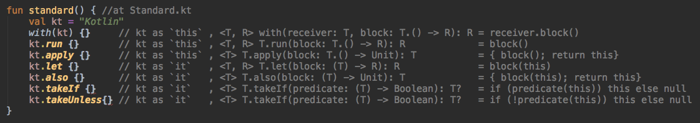
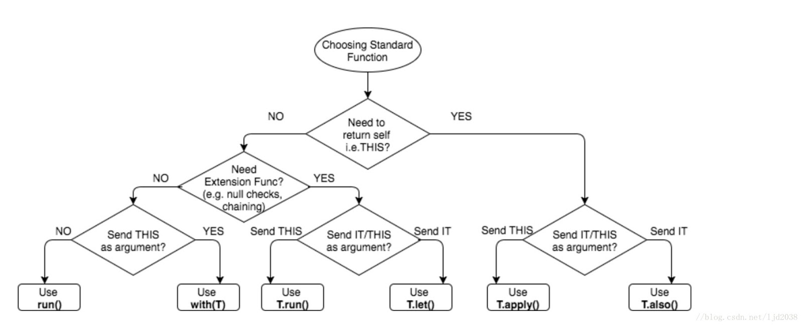

# Kotlin

[TOC]

# 语法简记

以下仅记录与java明显不同的地方

## 定义变量

* val和var

```kotlin
val a: Int = 1  // 立即赋值, 只能赋值一次，可以指定类型，也可以根据初始值自动推断
var x = 5 // 自动推断出 `Int` 类型, 可以多次赋值
```

* 权限标识符

  | kotlin标识符 | 对应java标识符         |
  | ------------ | ---------------------- |
  | public       | 无需声明，默认为public |
  | protected    | protected              |
  | internal     | default                |
  | private      | private                |

* 数据类型对应

  | kotlin类型 | 对应java类型 |
  | ---------- | ------------ |
  | Unit       | void，Void   |
  | Integer    | Int          |
  | Any        | Object       |

## 定义函数

使用fun定义函数，返回值写在后面

```java
private Integer x(String s)
```

转换为

```kotlin
private fun x(val s: String): Integer
```

## 条件表达式

```kotlin
val c = if (a > b) a else b
```

## 类型判断和转换

```kotlin
if (a is String) {
    return a.length() // 隐式转换
    return (a as String).length() // 显式转换
}
```

## when表达式

用于替代switch case控制流，可以对应赋值，也可以对应代码块

```kotlin
fun describe(obj: Any): String =
when (obj) {
    1          -> "One"
    "Hello"    -> "Greeting"
    is Long    -> "Long"
    !is String -> "Not a string"
    else       -> "Unknown"
}
```

## range区间

与Python的range类似，但是提供了更多变体

```kotlin
if (x in 1..y+1) {}
for (x in 1...y+1) {}
for (x in arr.indices) {}
for (x in 1...10 step 2) {}
```

## 字符串模板

```kotlin
var a = 1
// 模板中的简单名称：
val s1 = "a is $a" 

a = 2
// 模板中的任意表达式：
val s2 = "${s1.replace("is", "was")}, but now is $a"
```

## 空类型安全

kotlin最大的特点是默认不允许值为null，对应的java默认允许值为null

在编写代码时，以下代码将无法编译

```kotlin
var a: String = "abc"
a = null // 编译错误
```

### 安全调用

如果允许值为null，则需要添加`?`，该方式可以**链式调用**，过程中只要遇到接受者为null则会停止调用

```kotlin
var b: String? = "abc"
b = null // ok

bob?.department?.head?.name
```

### Elvis 操作符

以下代码

```kotlin
val l: Int = if (b != null) b.length else -1
```

等效于

```kotlin
val l = b?.length ?: -1
```

如果 `?:` 左侧表达式非空，elvis 操作符就返回其左侧表达式，否则返回右侧表达式。 请注意，当且仅当左侧为空时，才会对右侧表达式求值。

### `!!` 操作符

非空断言运算符（`!!`）将任何值转换为非空类型，若该值为空则抛出NPE异常

```kotlin
val l = b!!.length
```

### 安全的类型转换

如果对象不是目标类型，那么常规类型转换可能会导致 `ClassCastException`。 另一个选择是使用安全的类型转换，如果尝试转换不成功则返回 *null*：

```kotlin
val aInt: Int? = a as? Int
```

## 静态声明

java的static域

```java
class A {
    private static int a = 1;
    public static void b() {}
}

print(A.a);
A.b();
```

对应kotlin的companion域

```kotlin
companion object {
    private int a = 1;
    fun b() {}
}

print(A.Companion.a)
A.b()
```

## 自定义setter/getter

```kotlin
var stringRepresentation: String
    get() = this.toString()
    set(value) {
        setDataFromString(value) // 解析字符串并赋值给其他属性
    }
```

## 扩展已有类

```kotlin
fun String.myPrint() {}

class A {
    fun print() {
        "xx".myPrint()
    }
}
```

## 标准扩展函数





## override和open

与java不同，kotlin的方法默认不允许被override的，除非声明为open

```kotlin
class A {
    open fun a()
}

class B : A {
    override fun a()
}
```

[Kotlin语法参考](https://www.kotlincn.net/docs/reference/)