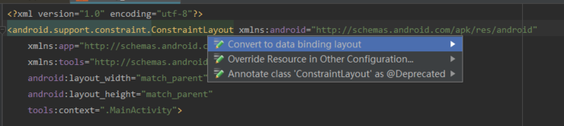
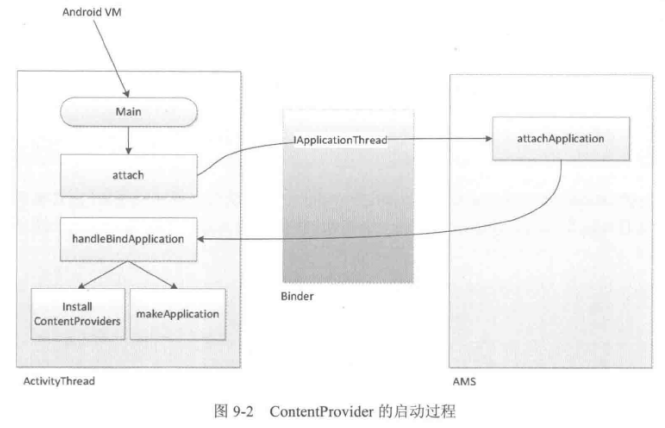
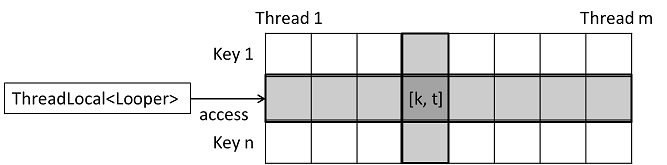
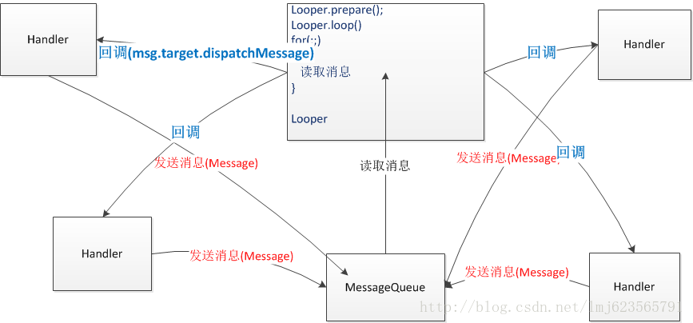

# MultiTask

[TOC]

# Binder

## 运行机制

Binder基于Client-Server通信模式，其中Client、Server和Service Manager运行在用户空间，Binder驱动程序运行内核空间

- Client进程：使用服务的进程
- Server进程：提供服务的进程
- ServiceManager进程：ServiceManager的作用是将**字符形式的Binder名字转化成Client中对该Binder的引用**，使得Client能够通过Binder名字获得对Server中Binder实体的引用
- Binder驱动：驱动负责进程之间Binder通信的建立，Binder在进程之间的传递，Binder引用计数管理，数据包在进程之间的传递和交互等一系列底层支持。





Server进程向Service Manager进程注册服务（可访问的方法接口），Client进程通过Binder驱动可以访问到Server进程提供的服务。Binder驱动管理着Binder之间的数据传递，这个数据的具体格式由Binder协议定义（可以类比为网络传输的TCP协议）。并且Binder驱动持有每个Server在内核中的Binder实体，并给Client进程提供Binder的引用

## 线程管理

每个Binder的Server进程会创建很多线程来处理Binder请求，可以简单的理解为创建了一个Binder的线程池（虽然实际上并不完全是这样简单的线程管理方式），而真正管理这些线程并不是由这个Server端来管理的，而是由Binder驱动进行管理的。

一个进程的Binder线程数默认最大是16，超过的请求会被阻塞等待空闲的Binder线程。理解这一点的话，你做进程间通信时处理并发问题就会有一个底，比如使用ContentProvider时（又一个使用Binder机制的组件），你就很清楚它的CRUD（创建、检索、更新和删除）方法只能同时有16个线程在跑

[Android面试一天一题（Day 35：神秘的Binder机制）](https://www.jianshu.com/p/c7bcb4c96b38)

# 进程

## 进程和线程的区别

### 宏观认识

进程，是并发执行的程序在执行过程中分配和管理资源的基本单位，是一个动态概念，竟争计算机系统资源的基本单位。每一个进程都有一个自己的地址空间，即进程空间。进程空间的大小 只与处理机的位数有关

线程，是进程的一部分，一个没有线程的进程可以被看作是单线程的。线程有时又被称为轻权进程或轻量级进程，也是 CPU 调度的一个基本单位

### 区别

进程拥有一个完整的虚拟地址空间，不依赖于线程而独立存在；反之，线程是进程的一部分，没有自己的地址空间，与进程内的其他线程一起共享分配给该进程的所有资源

### Android中的进程与线程

**进程：** 每个app运行时前首先创建一个进程，该进程是由Zygote fork出来的，用于承载App上运行的各种Activity/Service等组件。进程对于上层应用来说是完全透明的，这也是google有意为之，让App程序都是运行在Android Runtime。大多数情况一个App就运行在一个进程中，除非在AndroidManifest.xml中配置Android:process属性，或通过native代码fork进程

**线程：** 线程对应用来说非常常见，比如每次new Thread().start都会创建一个新的线程。该线程与App所在进程之间资源共享，从Linux角度来说进程与线程除了是否共享资源外，并没有本质的区别，都是一个task_struct结构体，**在CPU看来进程或线程无非就是一段可执行的代码，CPU采用CFS调度算法，保证每个task都尽可能公平的享有CPU时间片**

## 进程间通信方法（IPC）

### 必要性

多进程带来的问题：

1. 静态成员和单例模式失效
2. 线程同步机制失效
3. SharePreference可靠性下降
4. Application多次创建

### 序列化

#### 原因

当两个进程在进行远程通信时，彼此可以发送各种类型的数据。无论是何种类型的数据，都会以二进制序列的形式在网络上传送。

发送方，序列化：对象->字节序列

接收方，反序列化：字节序列->对象

序列化的目的就是为了跨进程传递格式化数据

#### Serializable

```java
public class User implements Serializable {
    private static final long serialVersionUID = 519067123721295773L;
}
```

serialVersionUID用于辅助序列化和反序列化，序列化后数据只有serialVersionUID和当前类serialVersionUID一致才可以序列化

相比不指定（自动生成）serialVersionUID，手动指定serialVersionUID可以避免由于类的改变，导致系统重新计算hash值并赋给serialVersionUID并反序列化失败

#### Parcelable

```java
public class User implements Parcelable {
    public int userId;
    public String userName;
    public boolean isMale;

    public Book book;

    public User() {
    }

    public User(int userId, String userName, boolean isMale) {
        this.userId = userId;
        this.userName = userName;
        this.isMale = isMale;
    }

    public int describeContents() {
        return 0;
    }

    public void writeToParcel(Parcel out, int flags) {
        out.writeInt(userId);
        out.writeString(userName);
        out.writeInt(isMale ? 1 : 0);
        out.writeParcelable(book, 0);
    }

    public static final Parcelable.Creator<User> CREATOR = new Parcelable.Creator<User>() {
        public User createFromParcel(Parcel in) {
            return new User(in);
        }

        public User[] newArray(int size) {
            return new User[size];
        }
    };

    private User(Parcel in) {
        userId = in.readInt();
        userName = in.readString();
        isMale = in.readInt() == 1;
        book = in.readParcelable(Thread.currentThread().getContextClassLoader());
    }
}
```

#### Serializable和Parcelable的区别

1. Serializable是JAVA中的序列化接口，虽然使用起来简单但是开销很大，序列化和反序列化过程都要大量的I/O操作。
2. Parcelable是Android中的序列化方式，更适合使用在Android平台上。它的缺点就是使用起来稍微麻烦一点，但是效率高。
3. Parcelable主要用在内存序列化上，Serializable主要用于将对象序列化到存储设备中或者通过网络传输

### 文件共享

两个进程通过读/写同一个文件来交换数据，比如A进程把数据写入文件，B进程通过读取这个文件来获取数据。

文件共享方式适合在对数据同步要求不高的进程之间进行通信，并且要妥善处理并发读/写的问题

> SharePreference在高并发读写时很不可靠，会丢失数据

### Bundle

四大组件中的三大组件（Activity,Service,Receiver）都是支持在Intent中传递Bundle数据的，由于Bundle实现了Parcelable接口，所以他可以方便地在不同的进程间传输。基于这一点，我们在一个进程中启动了另一个进程的时候，就可以在Bundle中附加我们需要传输的信息，并通过Intent传送出去。但是，传输的数据必须能够被序列化，比如基本类型、实现了Serializable/Parcelable的对象以及一些Android支持的特殊对象

```java
Intent intent = new Intent();    
intent.setClass(TestBundle.this, Target.class);    
Bundle mBundle = new Bundle();    
mBundle.putString("Data", "data from TestBundle"); 
intent.putExtras(mBundle);    
startActivity(intent);  
```

### AIDL

AIDL通过定义服务端暴露的接口，以提供给客户端来调用，AIDL使服务器可以并行处理，而Messenger封装了AIDL之后只能串行运行，所以Messenger一般用作消息传递

通过编写aidl文件来设计想要暴露的接口，编译后会自动生成响应的java文件，服务器将接口的具体实现写在Stub中，用IBinder对象传递给客户端，客户端bindService的时候，用asInterface的形式将IBinder还原成接口，再调用其中的方法

支持以下几种数据：

- 基本数据类型
- String和CharSequence
- List：只支持ArrayList，且里面的每个元素都必须被AIDL支持
- Map：只支持HashMap，且里面的每个元素都必须被AIDL支持
- 实现了Parcelable的对象（需要新建一个同名的AIDL文件，并声明为Parcelable类型）
- 其他AIDL接口

> Parcelable对象类型的参数上必须标上方向：in，out或inout
>
> 自定义的Parcelable对象或AIDL对象一定要显式地import进来，不管和当前AIDL文件在不在同一个包内

定义AIDL，新建一个`.aidl`文件

```java
package com.example.aidl;
interface IMyInterface {
    String getInfo(String s);
}
```

定义Service，用于接收并回复信息

```java
public class MyService extends Service { 
    public final static String TAG = "MyService";

    private IBinder binder = new IMyInterface.Stub() {

        @Override       
        public String getInfo(String s) throws RemoteException { 
            Log.i(TAG, s); 
            return "我是 Service 返回的字符串"; 
        }
    };

    @Override
    public void onCreate() {
        super.onCreate(); 
        Log.i(TAG, "onCreate");    
    }       

    @Override    
    public IBinder onBind(Intent intent) { 
        return binder;  
    }
}
```

定义`MyService`为一个新进程

```xml
<service
         android:name=".server.MyService"
         android:process=":remote" />
```

> “:”表示在当前进程名前附加包名，是一种简写

定义Activity，用于发送消息和接收回复

```java
public class MainActivity extends AppCompatActivity {
    public final static String TAG = "MainActivity";
    private IMyInterface myInterface;

    private ServiceConnection serviceConnection = new ServiceConnection() {

        @Override
        public void onServiceConnected(ComponentName name, IBinder service) {
            myInterface = IMyInterface.Stub.asInterface(service);
            Log.i(TAG, "连接Service 成功");
            try {
                String s = myInterface.getInfo("我是Activity传来的字符串");
                Log.i(TAG, "从Service得到的字符串：" + s);
            } catch (RemoteException e) {
                e.printStackTrace();
            }
        }

        @Override
        public void onServiceDisconnected(ComponentName name) {
            Log.e(TAG, "连接Service失败");
        }
    };

    @Override
    protected void onCreate(Bundle savedInstanceState) {
        super.onCreate(savedInstanceState);
        setContentView(R.layout.activity_main);
        startAndBindService();
    }

    private void startAndBindService() {
        Intent service = new Intent(MainActivity.this, MyService.class);
        startService(service);
        bindService(service, serviceConnection, Context.BIND_AUTO_CREATE);
    }
}
```

> 可以onBind或onTransact方法中进行权限验证，例如检查包名等

[Android的进阶学习(四)--AIDL的使用与理解](https://www.jianshu.com/p/4e38cdc016c9)

### Messenger

Messager实现IPC通信，底层是使用了AIDL方式。和AIDL方式不同的是，Messager方式是利用Handler形式处理，因此，它是线程安全的，这也表示它不支持并发处理。相反，AIDL方式是非线程安全的，支持并发处理。服务端（被动方）提供一个Service来处理客户端（主动方）连接，维护一个Handler来创建Messenger，在onBind时返回Messenger的binder。双方用Messenger来发送数据，用Handler来处理数据。Messenger处理数据依靠Handler，所以是串行的，也就是说，Handler接到多个message时，就要排队依次处理

> Message对象本身是无法被传递到进程B的，send(message)方法会使用一个Parcel对象对Message对象编集，再将Parcel对象传递到进程B中，然后解编集，得到一个和进程A中Message对象内容一样的对象），再把Message对象加入到进程B的消息队列里，Handler会去处理它
>
> Message对象的object字段不支持自定义的Parcelable对象

服务端

```java
public class RemoteService extends Service {
    private static final String TAG = "RemoteService"
        private final Messenger mMessenger = new Messenger(new Handler() {  
            @Override  
            public void handleMessage(Message msg) {  
                switch (msg.what) {
                    case Constants.MSG_FROM_CLIENT:
                        Log.i(TAG, "receive msg from client:" + msg.getData().getString("msg"));

                        // 回复消息
                        Messenger client = msg.replyTo;
                        Message replyMessage = Message.obtain(null, Constants.MSG_FROM_SERVICE);
                        Bundle data = new Bundle();
                        data.putString("reply", "reply message");
                        replyMessage.setData(data);
                        try {
                            client.send(replyMessage);
                        } catch (RemoteException e) {
                            e.printStackTrace();
                        }
                        break;
                    default:
                        super.handleMessage(msg);
                }
            }  
        });  

    @Override  
    public IBinder onBind(Intent intent) {  
        return mMessenger.getBinder();  
    }  
}  
```

客户端

```java
private Messenger mGetReplyMessenger = new Messenger(new Handler() {
    @Override  
    public void handleMessage(Message msg) {  
        switch (msg.what) {
            case Constants.MSG_FROM_SERVICE:
                // 接收服务器消息
                Log.i(TAG, "receive msg from service:" + msg.getData().getString("msg"));
                break;
            default:
                super.handleMessage(msg);
        }
    }  
});  

private Messenger mService;  

private ServiceConnection mConnection = new ServiceConnection() {  
    @Override  
    public void onServiceConnected(ComponentName name, IBinder service) {  
        mService = new Messenger(service);

        // 发送消息
        Message msg = Message.obtain(null, Constants.MSG_FROM_CLIENT);
        Bundle data = new Bundle();
        data.putString("msg", "message");
        msg.setData(data);
        msg.replyTo = mGetReplyMessenger; // 设置回复的Messenger
        try {
            mService.send(msg);
        } catch (RemoteException e) {
            e.printStackTrace();
        }
    }  

    @Override public void onServiceDisconnected(ComponentName name) {  
        mService = null;  
    } 
};
```

客户端绑定服务端的服务

```java
bindService(new Intent(this, RemoteService.class), mConnection, Context.BIND_AUTO_CREATE); 
```

[Android的进阶学习（五）--Messenger的使用和理解](https://www.jianshu.com/p/af8991c83fcb)

[Android IPC进程通信——Messager方式](http://blog.csdn.net/chenfeng0104/article/details/7010244)

### ContentProvider

系统四大组件之一，底层也是Binder实现，主要用来应用程序之间的数据共享，也就是说一个应用程序用ContentProvider将自己的数据暴露出来，其他应用程序通过ContentResolver来对其暴露出来的数据进行增删改查

Android内置的许多数据都是使用ContentProvider形式，供开发者调用的(如视频，音频，图片，通讯录等)

自定义的ContentProvider注册时要提供authorities属性，应用需要访问的时候将属性包装成Uri.parse("content://authorities")。还可以设置permission，readPermission，writePermission来设置权限。 ContentProvider有query，delete，insert等方法，看起来貌似是一个数据库管理类，但其实可以用文件，内存数据等等一切来充当数据源，query返回的是一个Cursor，可以自定义继承AbstractCursor的类来实现

#### 工作原理（非重点）

> ContentProvider所在的进程启动后，ContentProvider会被同时启动并发布到AMS中，onCreate优先于Application的onCreate执行





1. 应用启动时，从ActivityThread#main进入，创建ActivityThread实例并创建主线程消息队列
2. 在attach中远程调用AMS#attachApplication并将ApplicationThread（Binder，IApplicationThread）提供给AMS
3. 在attachApplication中调用ApplicationThread#bindApplication，通过ActivityThread的mH Handler切换到ActivityThread中执行，调用handleBindApplication
4. ActivityThread创建Application对象，加载ContentProvider，然后执行Application#onCreate

ContentProvider启动后就可以访问增删改查的四个接口，通过Binder调用。外界程序通过AMS根据Uri获取对应的Binder接口IContentProvider，再通过IContentProvider访问

一般来说，`android:multiprocess`都指定为false，表示ContentProvider为单实例

[Android之ContentProvider详解](http://blog.csdn.net/x605940745/article/details/16118939)

### Socket

Android不允许在主线程中请求网络，而且请求网络必须要注意声明相应的permission。然后，在服务器中定义ServerSocket来监听端口，客户端使用Socket来请求端口，连通后就可以进行通信

[Android：这是一份很详细的Socket使用攻略](http://blog.csdn.net/carson_ho/article/details/53366856)

### Binder连接池

#### 适用场景

大量业务都需要AIDL，AIDL需要在少数几个Service中集中管理

#### 原理

每个业务模块创建自己的AIDL接口并实现接口，业务之间不能有耦合，所有实现细节单独分开，向Service提供自己的唯一标识和其对应的Binder对象

服务端至少一个Service，提供queryBinder接口，根据业务特征返回相应的Binder对象，避免重复创建Service

#### 实现

创建2个AIDL接口

```java
// ISecurityCenter.aidl
package com.ryg.chapter_2.binderpool;

interface ISecurityCenter {
    String encrypt(String content);
    String decrypt(String password);
}

// ICompute.aidl
package com.ryg.chapter_2.binderpool;

interface ICompute {
    int add(int a, int b);
}
```

实现接口

```java
public class SecurityCenterImpl extends ISecurityCenter.Stub {}
public class ComputeImpl extends ICompute.Stub {}
```

创建BinderPool接口

```java
// IBinderPool.aidl
package com.ryg.chapter_2.binderpool;

interface IBinderPool {
    IBinder queryBinder(int binderCode);
}
```

实现BinderPoolImpl接口，queryBinder根据不同模块的标识即binderCode返回不同的Binder对象

```java
@Override
public IBinder queryBinder(int binderCode) throws RemoteException {
    IBinder binder = null;
    switch (binderCode) {
        case BINDER_SECURITY_CENTER: {
            binder = new SecurityCenterImpl();
            break;
        }
        case BINDER_COMPUTE: {
            binder = new ComputeImpl();
            break;
        }
        default:
            break;
    }

    return binder;
}
```

在远程BinderPoolService的onBind中返回BinderPool的实例

```java
private Binder mBinderPool = new BinderPool.BinderPoolImpl();

@Override
public IBinder onBind(Intent intent) {
    return mBinderPool;
}
```

实现BinderPool

```java
public class BinderPool {
    private static final String TAG = "BinderPool";
    public static final int BINDER_NONE = -1;
    public static final int BINDER_COMPUTE = 0;
    public static final int BINDER_SECURITY_CENTER = 1;

    private Context mContext;
    private IBinderPool mBinderPool;
    private static volatile BinderPool sInstance;
    private CountDownLatch mConnectBinderPoolCountDownLatch;

    private BinderPool(Context context) {
        mContext = context.getApplicationContext();
        connectBinderPoolService();
    }

    // 使用单例模式实现
    public static BinderPool getInsance(Context context) {
        if (sInstance == null) {
            synchronized (BinderPool.class) {
                if (sInstance == null) {
                    sInstance = new BinderPool(context);
                }
            }
        }
        return sInstance;
    }

    private synchronized void connectBinderPoolService() {
        // CountDownLatch类位于java.util.concurrent包下
        // 利用它可以实现类似计数器的功能。比如有一个任务A，它要等待其他4个任务执行完毕之后才能执行，
        // 此时就可以利用CountDownLatch来实现这种功能了
        mConnectBinderPoolCountDownLatch = new CountDownLatch(1);
        Intent service = new Intent(mContext, BinderPoolService.class);
        mContext.bindService(service, mBinderPoolConnection,
                             Context.BIND_AUTO_CREATE);
        try {
            // 调用await()方法的线程会被挂起，它会等待直到count值为0才继续执行
            mConnectBinderPoolCountDownLatch.await();
        } catch (InterruptedException e) {
            e.printStackTrace();
        }
    }

    /**
     * query binder by binderCode from binder pool
     * 
     * @param binderCode
     *            the unique token of binder
     * @return binder who's token is binderCode<br>
     *         return null when not found or BinderPoolService died.
     */
    public IBinder queryBinder(int binderCode) {
        IBinder binder = null;
        try {
            if (mBinderPool != null) {
                binder = mBinderPool.queryBinder(binderCode);
            }
        } catch (RemoteException e) {
            e.printStackTrace();
        }
        return binder;
    }

    private ServiceConnection mBinderPoolConnection = new ServiceConnection() {

        @Override
        public void onServiceDisconnected(ComponentName name) {
            // ignored.
        }

        @Override
        public void onServiceConnected(ComponentName name, IBinder service) {
            mBinderPool = IBinderPool.Stub.asInterface(service);
            try {
                mBinderPool.asBinder().linkToDeath(mBinderPoolDeathRecipient, 0);
            } catch (RemoteException e) {
                e.printStackTrace();
            }
            // 将count值减1
            // 相当于通知connectBinderPoolService从await处继续执行
            // 通过CountDownLatch将bindService这一异步操作转换为同步操作
            // 应避免在主线程中执行
            mConnectBinderPoolCountDownLatch.countDown();
        }
    };

    private IBinder.DeathRecipient mBinderPoolDeathRecipient = new IBinder.DeathRecipient() {
        @Override
        public void binderDied() {
            // 当binder意外死亡时重新连接
            Log.w(TAG, "binder died.");
            mBinderPool.asBinder().unlinkToDeath(mBinderPoolDeathRecipient, 0);
            mBinderPool = null;
            connectBinderPoolService();
        }
    };

    public static class BinderPoolImpl extends IBinderPool.Stub {
        //...
    }

}
```

# 消息机制

Handler运行机制及Handler附带的MessageQueue和Looper工作过程

Handler的主要作用是将一个任务切换到某个指定的线程中执行

> Android规定访问UI只能在主线程中进行，如果子线程访问则抛出异常。因为UI控件不是线程安全的，多线程并发访问可能会导致UI处于不可预期状态，而使用锁机制则会导致代码逻辑复杂，效率降低，所以采用单线程模型控制
>
> 通常在子线程中执行耗时操作，切换到主线程更新UI

## MessageQueue

单链表结构存储

`enqueueMessage`：向消息队列中插入一条消息

`next`：无限循环，直到从消息队列中取出一条消息并将其从消息队列中移除

## Looper

### 主要函数

`Looper`：构造方法，创建一个MessageQueue，并将当前线程对象保存

```java
private Looper(boolean quitAllowed) {
    mQueue = new MessageQueue(quitAllowed);
    mThread = Thread.currentThread();
}
```

`prepare`：为当前线程创建一个Looper

`loop`：开启消息循环

```java
public static void loop() {
    final Looper me = myLooper();
    final MessageQueue queue = me.mQueue();
    // ...
    for (;;) {
        Message msg = queue.next();
        if (msg == null) {
            // 如果next返回null则跳出循环
            return;
        }
        // ...
        msg.target.dispatchMessage(msg); // target为发送这条消息的Handler
        msg.recycle();
        // ...
    }
}
```

> 由于**msg.target指向的就是发送这个消息的Handler**，所以一个线程中只有一个Looper，因为Looper只有一个，MessageQueue也只有一个，但是**可以使用多个Handler，每个Handler会分别处理自己的消息**

`prepareMainLooper`：为主线程即ActivityThread创建Looper，本质也是通过prepare实现的

`getMainLooper`：获取主线程的Looper

`quit`：直接退出Looper

`quitSafely`：设定退出标记，等消息队列中已有消息处理完毕后退出

> 在子线程中，如果手动创建了Looper，在所有事情完成后应调用quit，否则线程会一直处于等待状态
>
> 退出Looper后，线程会立刻终止

### 线程唯一性

`Looper.prepare()`使用了ThreadLocal来保证一个线程只有一个Looper

ThreadLocal为每个线程存储当前线程的Looper，线程默认没有Looper，需要创建

> ThreadLocal实现了线程本地存储。所有线程共享同一个ThreadLocal对象，但不同线程仅能访问与其线程相关联的值，一个线程修改ThreadLocal对象对其他线程没有影响，而其他线程也无法获取该线程的数据
>
> 当使用ThreadLocal维护变量时，ThreadLocal为每个使用该变量的线程提供独立的变量副本，所以每一个线程都可以独立地改变自己的副本，而不会影响其它线程所对应的副本
>
> 不同线程访问同一个ThreadLocal的get方法，ThreadLocal内部会从各自的线程中取出一个数据，然后根据当前ThreadLocal的索引去查找对应的value，而不同线程的数据是不同的
>
> 
>
> ```java
> // java.lang.ThreadLocal
> /**
>  * Sets the current thread's copy of this thread-local variable
>  * to the specified value.  Most subclasses will have no need to
>  * override this method, relying solely on the {@link #initialValue}
>  * method to set the values of thread-locals.
>  *
>  * @param value the value to be stored in the current thread's copy of
>  *        this thread-local.
>  */
> public T get() {
>     //1. 获取当前的线程
>     Thread t = Thread.currentThread();
>     //2. 以当前线程为参数，获取一个 ThreadLocalMap 对象
>     ThreadLocalMap map = getMap(t);
>     if (map != null) {
>         //3. map 不为空，则以当前 ThreadLocal 对象实例作为key值，去map中取值，有找到直接返回
>         ThreadLocalMap.Entry e = map.getEntry(this);
>         if (e != null)
>             return (T)e.value;
>     }
>     //4. map 为空或者在map中取不到值，那么走这里，返回默认初始值
>     return setInitialValue();
> }
> 
> /**
>  * Returns the value in the current thread's copy of this
>  * thread-local variable.  If the variable has no value for the
>  * current thread, it is first initialized to the value returned
>  * by an invocation of the {@link #initialValue} method.
>  *
>  * @return the current thread's value of this thread-local
>  */
> public void set(T value) {
>     //1. 取当前线程对象
>     Thread t = Thread.currentThread();
>     //2. 取当前线程的数据存储容器
>     ThreadLocalMap map = getMap(t);
>     if (map != null)
>         //3. 以当前ThreadLocal实例对象为key，存值
>         map.set(this, value);
>     else
>         //4. 新建个当前线程的数据存储容器，并以当前ThreadLocal实例对象为key，存值
>         createMap(t, value);
> }
> ```

[Android如何保证一个线程最多只能有一个Looper？](http://blog.csdn.net/sun927/article/details/51031268)

[带你了解源码中的 ThreadLocal](https://www.jianshu.com/p/4167d7ff5ec1)

### 主线程消息循环——为什么主线程不会因为Looper.loop()方法造成阻塞

ActivityThread通过ApplicationThread和AMS进行进程间通信，AMS以进程间通信的方式完成ActivityThread的请求后回调ApplicationThread的Binder方法，然后ApplicationThread会向H发送消息，H收到消息后将ApplicationThread中的逻辑切换到ActivityThread中执行，即主线程

Android应用程序的主线程在进入消息循环过程前，会在内部创建一个Linux管道（Pipe），这个管道的作用是使得Android应用程序主线程在消息队列为空时可以进入空闲等待状态，并且使得当应用程序的消息队列有消息需要处理时唤醒应用程序的主线程

在代码`ActivityThread.main()`中

```java
public static void main(String[] args) {

    //创建Looper和MessageQueue对象，用于处理主线程的消息
    Looper.prepareMainLooper();

    //创建ActivityThread对象
    ActivityThread thread = new ActivityThread(); 

    //建立Binder通道 (创建新线程)
    thread.attach(false);

    Looper.loop(); //消息循环运行
    throw new RuntimeException("Main thread loop unexpectedly exited");
}
```

`thread.attach(false) `会创建一个Binder线程（具体是指ApplicationThread，Binder的服务端，用于接收系统服务AMS发送来的事件），该Binder线程通过Handler将Message发送给主线程

ActivityThread实际上并非线程，不像HandlerThread类，ActivityThread并没有真正继承Thread类，只是往往运行在主线程，该人以线程的感觉，其实承载ActivityThread的主线程就是由Zygote fork而创建的进程。ActivityThread的内部类H继承于Handler，代码如下：

```java
public void handleMessage(Message msg) {
    if (DEBUG_MESSAGES) Slog.v(TAG, ">>> handling: " + codeToString(msg.what));
    switch (msg.what) {
        case LAUNCH_ACTIVITY:
            //...
        case RELAUNCH_ACTIVITY:
            //...
        case PAUSE_ACTIVITY:
            //...
        case PAUSE_ACTIVITY_FINISHING:
            //...
        case STOP_ACTIVITY_SHOW:
            //...
        case STOP_ACTIVITY_HIDE:
            //...
        case SHOW_WINDOW:
            //...
        case HIDE_WINDOW:
            //...
        case RESUME_ACTIVITY:
            //...
        case SEND_RESULT:
            //...

            //...
    }
```

Activity的生命周期都是依靠主线程的`Looper.loop`，当收到不同Message时则采用相应措施：
在`H.handleMessage(msg)`方法中，根据App进程中的其他线程通过Handler发送给主线程的msg，执行相应的生命周期

[Android中为什么主线程不会因为Looper.loop()方法造成阻塞](http://blog.csdn.net/u013435893/article/details/50903082)

[Android中为什么主线程不会因为Looper.loop()里的死循环卡死](https://www.zhihu.com/question/34652589)

### 手动创建Looper

实现一个类似于HandlerThread的类，即具有Looper的Thread，同时提供管理Looper的功能

```java
class LooperThread extends Thread {
    private Looper mLooper;
    public LooperThread() {
        
    }
    
    @Override
    public void run() {
        Looper.prepare(); // 创建消息队列
        synchronized (this) {
            mLooper = Looper.myLooper();
            notifyAll();
        }
        Looper.loop(); // 开启消息循环
    }
    
    public Looper getLooper() {
        return mLooper;
    }
    
    public void stopLooper() {
        mLooper.quitSafely();
    }
} 
```

## Handler




### 常用函数

`Handler(Callback callback)`：使用特定Callback接口创建Handler，需要实现`handleMessage(Message msg)`

`Handler(Looper looper)`：使用特定Looper创建Handler

`sendMessage`：向消息队列中插入一条消息

`post`：向Handler的Looper中投入一个Runnable对象等待处理

`postDelayed`：向Handler的Looper中投入一个Runnable对象并在指定时延后处理

`dispatchMessage`：处理消息


### postDelayed的原理

#### 精确计时

在`MessageQueue.next()`中，如果头部的这个Message是有延迟而且延迟时间没到的（now < msg.when），会计算一下时间（保存为变量`nextPollTimeoutMillis`），然后在循环开始的时候判断如果这个Message有延迟，就调用`nativePollOnce(ptr, nextPollTimeoutMillis)`进行阻塞。`nativePollOnce()`的作用类似与`object.wait()`，只不过是使用了Native的方法对这个线程精确时间的唤醒

#### 多个带有时延Runnable的执行顺序

如果Message会阻塞MessageQueue的话，那么先postDelay10秒一个Runnable A，消息队列会一直阻塞，然后我再post一个Runnable B，B并不会等A执行完了再执行

调用过程如下：

1. `postDelay()`一个10秒钟的Runnable A、消息进队，MessageQueue调用`nativePollOnce()`阻塞，Looper阻塞；
2. 紧接着`post()`一个Runnable B、消息进队，判断现在A时间还没到、正在阻塞，把B插入消息队列的头部（A的前面），然后调用`nativeWake()`方法唤醒线程；
3. `MessageQueue.next()`方法被唤醒后，重新开始读取消息链表，第一个消息B无延时，直接返回给Looper；
4. Looper处理完这个消息再次调用`next()`方法，MessageQueue继续读取消息链表，第二个消息A还没到时间，计算一下剩余时间（假如还剩9秒）继续调用`nativePollOnce()`阻塞；
5. 直到阻塞时间到或者下一次有Message进队；

# 线程

## 线程间通信

### 共享内存

公共变量

### AsyncTask

Android提供的轻量级异步类，可以直接继承，封装了线程池和Handler，方便开发者在子线程中更新UI

AsyncTask定义了三种泛型类型*Params，Progress和Result*

- **Params**：在执行AsyncTask时需要传入的参数，可用于在后台任务中使用（`doInBackground`方法的参数类型）如HTTP请求的URL
- **Progress**：后台任务执行时，如果需要在界面上显示当前的进度，则指定进度类型
- **Result**：后台任务的返回结果类型

#### 使用

```java
class myAsync extends AsyncTask<Params, Progress, Result> {

    //下面这个方法在主线程中执行，在doInBackground函数执行前执行
    @Override
    protected void onPreExecute() {
        super.onPreExecute();
    }

    //下面这个方法在子线程中执行，用来处理耗时行为
    @Override
    protected String doInBackground(Params... arg0) {
        Result res;
        return res;
    }

    //下面这个方法在主线程中执行，用于显示子线程任务执行的进度
    @Override
    protected void onProgressUpdate(Progress... values) {
        super.onProgressUpdate(values);
    }

    //下面这个方法在主线程中执行，在doinBackground方法执行完后执行
    @Override
    protected void onPostExecute(Result result) {
        super.onPostExecute(result);
    }
}
```

[AsyncTask 实现Android的线程通信](http://blog.csdn.net/qq_15267341/article/details/79056947)

#### 限制

1. AsyncTask的类必须在主线程中加载
2. AsyncTask的对象必须在主线程中创建
3. `execute`方法必须在UI线程中调用
4. 不要直接调用`onPreExecute`，`onPostExecute`，`doInBackground`和`onProgressUpdate`
5. 一个AsyncTask对象只能执行一次`execute`，否则会报异常
6. AsyncTask默认采用串行执行任务，可以通过`executeOnExecutor(AsyncTask.THREAD_POOL_EXECUTOR, "")`并行执行任务

#### 原理（非重点）

1. `execute`，`executeOnExecutor`中，一个线程中所有的AsyncTask都在sDefaultExecutor串行线程池中执行

2. 排队执行过程

   1. AsyncTask的Params封装为FutureTask，是一个并发类，充当Runnable
   2. SerialExecutor的`execute`将FutureTask插入任务队列mTasks，如果当前没有正在活动的AsyncTask，则调用SerialExecutor的`scheduleNext`执行下一个AsyncTask任务，直到所有任务都被执行

3. SerialExecutor：串行线程池，用于任务排队

   THREAD_POOL_EXECUTOR：并行线程池，用于执行任务

   InternalHandler：用于将执行环境从线程池切换到主线程

### Handler

1. 主线程中创建一个Handler对象，并重写`handleMessage()`方法 
2. 当子线程需要进行UI操作时，就创建一个Message对象，并通过`handler.sendMessage()`将这条消息发送出去 ，或者通过post方法将一个Runnable投递到Handler内部的Looper中
3. 这条消息被添加到MessageQueue的队列中等待被处理 
4. Looper一直尝试从MessageQueue中提出待处理消息，分发到Handler的`handleMessage()`方法中，这样Handler中的业务逻辑就被切换到创建Handler的线程中了

> 使用runOnUIThread更新UI线程

[Android 异步消息处理机制 让你深入理解 Looper、Handler、Message三者关系](http://blog.csdn.net/lmj623565791/article/details/38377229)

## 线程池

1. 重用线程池中的线程，避免线程创建和销毁带来的性能开销
2. 有效控制最大并发数，避免大量线程抢占资源导致阻塞
3. 管理线程，提供定时执行、指定间隔执行等功能

### ThreadPoolExecutor

```java
ThreadPoolExecutor(int corePoolSize, // 核心线程数
                   int maximumPoolSize, //最大线程数
                   long keepAliveTime,  //非核心线程闲置的超时时长
                   TimeUnit unit, // keepAliveTime的时间单位，毫秒，秒，分钟等
                   BlockingQueue<Runnable> workQueue, // 任务队列，存储execute提交的Runnable
                   ThreadFactory threadFactory) // 线程工厂，创建新线程
```

### 执行规则

线程池的线程执行规则跟任务队列有很大的关系。

- 下面都假设任务队列没有大小限制：
  1. 如果线程数量<=核心线程数量，那么直接启动一个核心线程来执行任务，不会放入队列中。
  2. 如果线程数量>核心线程数，但<=最大线程数，并且任务队列是LinkedBlockingDeque的时候，超过核心线程数量的任务会放在任务队列中排队。
  3. 如果线程数量>核心线程数，但<=最大线程数，并且任务队列是SynchronousQueue的时候，线程池会创建新线程执行任务，这些任务也不会被放在任务队列中。这些线程属于非核心线程，在任务完成后，闲置时间达到了超时时间就会被清除。
  4. 如果线程数量>核心线程数，并且>最大线程数，当任务队列是LinkedBlockingDeque，会将超过核心线程的任务放在任务队列中排队。也就是当任务队列是LinkedBlockingDeque并且没有大小限制时，线程池的最大线程数设置是无效的，他的线程数最多不会超过核心线程数。
  5. 如果线程数量>核心线程数，并且>最大线程数，当任务队列是SynchronousQueue的时候，会因为线程池拒绝添加任务而抛出异常。
- 任务队列大小有限时
  1. 当LinkedBlockingDeque塞满时，新增的任务会直接创建新线程来执行，当创建的线程数量超过最大线程数量时会抛异常。
  2. SynchronousQueue没有数量限制。因为他根本不保持这些任务，而是直接交给线程池去执行。当任务数量超过最大线程数时会直接抛异常。

> 默认情况下，核心线程会在线程池中一直存活，即使处于闲置状态，也可以设定超时终止
>
> 非核心线程运行结束或超时后就会被回收
>
> AsyncTask的THREAD_POOL_EXECUTOR线程池配置：
>
> - 核心线程数：CPU核心数+1
> - 最大线程数：CPU核心数x2+1
> - 核心线程无超时，非核心线程闲置超时为1秒
> - 任务队列容量128

### 分类

| 名称                 | 功能                                                         |
| -------------------- | ------------------------------------------------------------ |
| FixedThreadPool      | 线程数量固定，只有核心线程，空闲不回收<br>可以更快响应外界请求 |
| CachedThreadPool     | 线程数量不定，只有非核心线程，超时60秒回收<br>执行大量耗时较少的任务 |
| ScheduledThreadPool  | 核心线程数量固定，非核心线程数量不定，闲置立刻回收<br>执行定时任务和具有固定周期任务 |
| SingleThreadExecutor | 只有一个核心线程<br>统一所有外界任务到一个线程中，避免同步问题 |

[Java多线程-线程池ThreadPoolExecutor构造方法和规则](https://blog.csdn.net/qq_25806863/article/details/71126867)

[深入理解java线程池—ThreadPoolExecutor](https://www.jianshu.com/p/ade771d2c9c0)

