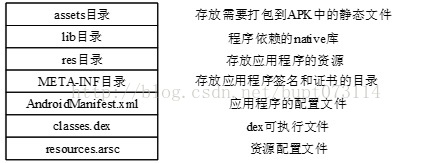
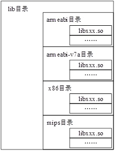
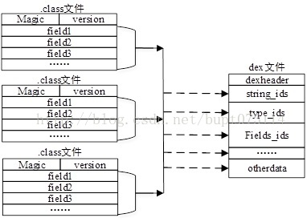
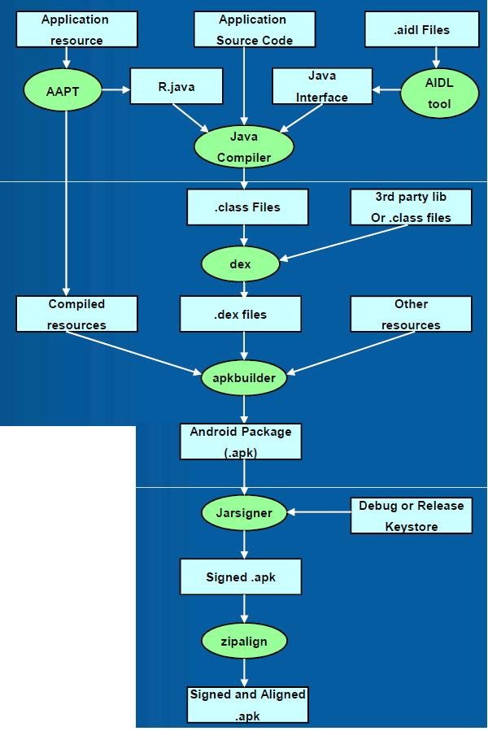
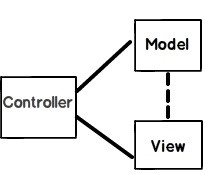
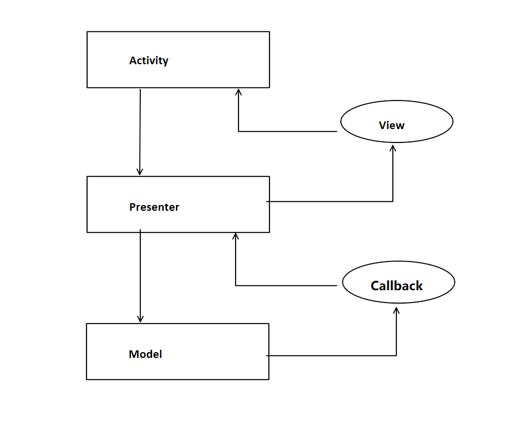

# Others

[TOC]

# APK



## 文件结构

### asset和res

1. 两者目录下的文件在打包后会原封不动的保存在apk包中，不会被编译成二进制

2. res/raw中的文件会被映射到R.Java文件中，访问的时候直接使用资源ID即R.id.filename；

   assets文件夹下的文件不会被映射到R.Java中，访问的时候需要AssetManager类

   ```java
   // 获得resource文件流
   InputStream is = getResources().openRawResource(R.id.filename);
   
   // 获得asset文件流
   AssetManager am = null;  
   am = getAssets();  
   InputStream is = am.open("filename");
   ```

3. res/raw不可以有目录结构，而assets则可以有目录结构，也就是assets目录下可以再建立文件夹

### lib

存放应用程序依赖的native库文件，一般是用C/C++编写，这里的lib库可能包含4中不同类型，根据CPU型号的不同，大体可以分为ARM，ARM-v7a，MIPS，X86，分别对应着ARM架构，ARM-V7架构，MIPS架构和X86架构，这些so库在APK包中的构成如下图



### META-INF

保存应用的签名信息，签名信息可以验证APK文件的完整性。AndroidSDK在打包APK时会计算APK包中所有文件的完整性，并且把这些完整性保存到META-INF文件夹下，应用程序在安装的时候首先会根据META-INF文件夹校验APK的完整性，这样就可以保证APK中的每一个文件都不能被篡改。以此来确保APK应用程序不被恶意修改或者病毒感染，有利于确保Android应用的完整性和系统的安全性。META-INF目录下包含的文件有CERT.RSA，CERT.DSA，CERT.SF和MANIFEST.MF，其中CERT.RSA是开发者利用私钥对APK进行签名的签名文件，CERT.SF，MANIFEST.MF记录了文件中文件的SHA-1哈希值

### AndroidManifest.xml

Android应用程序的配置文件，是一个用来描述Android应用“整体资讯”的设定文件，简单来说，相当于Android应用向Android系统“自我介绍”的配置文件，Android系统可以根据这个“自我介绍”完整地了解APK应用程序的资讯，每个Android应用程序都必须包含一个AndroidManifest.xml文件，且它的名字是固定的，不能修改。我们在开发Android应用程序的时候，一般都把代码中的每一个Activity，Service，Provider和Receiver在AndroidManifest.xml中注册，只有这样系统才能启动对应的组件，另外这个文件还包含一些权限声明以及使用的SDK版本信息等等。程序打包时，会把AndroidManifest.xml进行简单的编译，便于Android系统识别，编译之后的格式是AXML格式，如下图


### classes.dex

传统的Java程序，首先先把Java文件编译成class文件，字节码都保存在了class文件中，Java虚拟机可以通过解释执行这些class文件。而Dalvik虚拟机是在Java虚拟机进行了优化，执行的是Dalvik字节码，而这些Dalvik字节码是由Java字节码转换而来，一般情况下，Android应用在打包时通过AndroidSDK中的dx工具将Java字节码转换为Dalvik字节码。dx工具可以对多个class文件进行合并，重组，优化，可以达到减小体积，缩短运行时间的目的。dx工具的转换过程如图



## 打包过程





1. 打包资源文件，生成R.java文件：aapt
2. 处理AIDL文件，生成java文件：aidl
3. 编译java文件，生成class文件：javac
4. 将class文件转化为Davik VM支持的dex文件：dx
5. 打包生成未签名的apk文件：apkbuilder
6. 对未签名的apk进行签名：jarsigner
7. 对签名后的apk进行对齐处理：zipalign

[Android应用程序（APK）的编译打包过程](http://www.cnblogs.com/sjm19910902/p/6416022.html)

## 安装过程

Adroid的应用安装涉及到如下几个目录：

`/data/app`：存放用户安装的APK的目录，安装时，把APK拷贝于此。

`/data/data`：应用安装完成后，在/data/data目录下自动生成和APK包名（packagename）一样的文件夹，用于存放应用程序的数据。

`/data/dalvik-cache`：存放APK的odex文件，便于应用启动时直接执行。

具体安装过程如下：

首先，复制APK安装包到/data/app下，然后校验APK的签名是否正确，检查APK的结构是否正常，进而解压并且校验APK中的dex文件，确定dex文件没有被损坏后，再把dex优化成odex，使得应用程序启动时间加快，同时在/data/data目录下建立于APK包名相同的文件夹，如果APK中有lib库，系统会判断这些so库的名字，查看是否以lib开头，是否以.so结尾，再根据CPU的架构解压对应的so库到/data/data/packagename/lib下。

APK安装的时候会把DEX文件解压并且优化为odex，odex的格式如图所示：


odex在原来的dex文件头添加了一些数据，在文件尾部添加了程序运行时需要的依赖库和辅助数据，使得程序运行速度更快

[APK文件结构和安装过程](https://blog.csdn.net/bupt073114/article/details/42298337)

# Crash

crash发生时，系统会回调`UncaughtExceptionHandler#uncaughtException`，其中可以获得异常信息，可以选择将异常信息存到本地或上传，通过对话框告知用户

```java
public class CrashHandler implements UncaughtExceptionHandler {
    private static CrashHandler sInstance = new CrashHandler();
    private UncaughtExceptionHandler mDefaultCrashHandler;
    private Context mContext;

    private CrashHandler() {
    }

    public static CrashHandler getInstance() {
        return sInstance;
    }

    public void init(Context context) {
        mDefaultCrashHandler = Thread.getDefaultUncaughtExceptionHandler();
        Thread.setDefaultUncaughtExceptionHandler(this);
        mContext = context.getApplicationContext();
    }

    /**
     * 这个是最关键的函数，当程序中有未被捕获的异常，系统将会自动调用#uncaughtException方法
     * thread为出现未捕获异常的线程，ex为未捕获的异常，有了这个ex，我们就可以得到异常信息。
     */
    @Override
    public void uncaughtException(Thread thread, Throwable ex) {
        try {
            //导出异常信息到SD卡中
            dumpExceptionToSDCard(ex);
            uploadExceptionToServer();
            //这里可以通过网络上传异常信息到服务器，便于开发人员分析日志从而解决bug
        } catch (IOException e) {
            e.printStackTrace();
        }

        ex.printStackTrace();

        //如果系统提供了默认的异常处理器，则交给系统去结束我们的程序，否则就由我们自己结束自己
        if (mDefaultCrashHandler != null) {
            mDefaultCrashHandler.uncaughtException(thread, ex);
        } else {
            Process.killProcess(Process.myPid());
        }

    }

    private void dumpExceptionToSDCard(Throwable ex) throws IOException {
        //如果SD卡不存在或无法使用，则无法把异常信息写入SD卡
    }

    private void uploadExceptionToServer() {
        //TODO Upload Exception Message To Your Web Server
    }

}
```

在Application初始化时使用

```java
public class TestApp extends Application {
    @Override
    public void onCreate() {
        super.onCreate();

        //在这里为应用设置异常处理程序，然后我们的程序才能捕获未处理的异常
        CrashHandler crashHandler = CrashHandler.getInstance();
        crashHandler.init(this);
    }
}
```

# 动态加载

## 基础性问题

### 资源访问

插件中以R开头的资源都不能访问，因为宿主程序中没有插件的资源

解决方法：

Activity通过ContextImpl管理，而Context中通过`getAssets`和`getResources`两个方法获取资源，只要覆写这两个方法就可以解决资源问题

```java
/** Return an AssetManager instance for your application's package. */
public abstract AssetManager getAssets();
/** Return a Resources instance for your application's package. */
public abstract Resources getResources();
```

```java
protected void loadResources() {  
    try {  
        AssetManager assetManager = AssetManager.class.newInstance();  
        Method addAssetPath = assetManager.getClass().getMethod("addAssetPath", String.class);  
        addAssetPath.invoke(assetManager, mDexPath);  
        mAssetManager = assetManager;  
    } catch (Exception e) {  
        e.printStackTrace();  
    }  
    Resources superRes = super.getResources();  
    mResources = new Resources(mAssetManager, superRes.getDisplayMetrics(),  
                               superRes.getConfiguration());  
    mTheme = mResources.newTheme();  
    mTheme.setTo(super.getTheme());  
}
```

```java
@Override  
public AssetManager getAssets() {  
    return mAssetManager == null ? super.getAssets() : mAssetManager;  
}  

@Override  
public Resources getResources() {  
    return mResources == null ? super.getResources() : mResources;  
}
```

> 加载的方法是通过反射，通过调用AssetManager中的addAssetPath方法，我们可以将一个apk中的资源加载到Resources中，由于addAssetPath是隐藏api我们无法直接调用，所以只能通过反射，下面是它的声明，通过注释我们可以看出，传递的路径可以是zip文件也可以是一个资源目录，而apk就是一个zip，所以直接将apk的路径传给它，资源就加载到AssetManager中了，然后再通过AssetManager来创建一个新的Resources对象，这个对象就是我们可以使用的apk中的资源了，这样我们的问题就解决了
>
> ```java
> /** 
>  * Add an additional set of assets to the asset manager.  This can be 
>  * either a directory or ZIP file.  Not for use by applications.  Returns 
>  * the cookie of the added asset, or 0 on failure. 
>  * {@hide} 
>  */  
> public final int addAssetPath(String path) {  
>     int res = addAssetPathNative(path);  
>     return res;  
> }
> ```

### Activity生命周期管理

#### 反射方式

获取Activity的各种生命周期方法，然后在代理Activity中调用插件Activity的生命周期方法

1. 代码复杂
2. 性能开销大
3. 由于apk中的activity不是真正意义上的activity（没有在宿主程序中注册且没有完全初始化），所以onCreate，onStart等这几个生命周期的方法系统就不会去自动调用了

> Fragment既有类似于Activity的生命周期，又有类似于View的界面，将Fragment加入到Activity中，activity会自动管理Fragment的生命周期，apk中的activity是通过宿主程序中的代理activity启动的，将Fragment加入到代理activity内部，其生命周期将完全由代理activity来管理，但是采用这种方法，就要求apk尽量采用Fragment来实现，还有就是在做页面跳转的时候有点麻烦

#### 接口方式

将activity的大部分生命周期方法提取出来作为一个接口（DLPlugin），然后通过代理activity（DLProxyActivity）去调用插件activity实现的生命周期方法，这样就完成了插件activity的生命周期管理，并且没有采用反射，当我们想增加一个新的生命周期方法的时候，只需要在接口中声明一下同时在代理activity中实现一下即可

```java
public interface DLPlugin {
    public void onStart();
    public void onRestart();
    //...
}
```

```java
@Override
protected void onStart() {
    mRemoteActivity.onStart();
    super.onStart();
}

@Override
protected void onRestart() {
    mRemoteActivity.onRestart();
    super.onRestart();
}
//...
```

### ClassLoader管理

将不同插件的ClassLoader存储在一个HashMap中，可以保证不同插件中的类彼此互不干扰，避免了多个ClassLoader加载同一个类时引起的类型转换问题

```java
public class DLClassLoader extends DexClassLoader {

    private static final String TAG = DLClassLoader.class.getSimpleName();

    private static final Map<String, DLClassLoader> mPluginClassLoaders = new ConcurrentHashMap<String, DLClassLoader>();

    protected DLClassLoader(String dexPath, String optimizedDirectory, String libraryPath, ClassLoader parent) {
        super(dexPath, optimizedDirectory, libraryPath, parent);
    }

    public static DLClassLoader getClassLoader(String dexPath, Context context, ClassLoader parentLoader) {
        Log.d(TAG, "DLClassLoader.getClassLoader(), dexPath=" + dexPath);
        DLClassLoader dLClassLoader = mPluginClassLoaders.get(dexPath);
        if (dLClassLoader != null) return dLClassLoader;

        File dexOutputDir = context.getDir("dex", Context.MODE_PRIVATE);
        if (dexOutputDir == null || !dexOutputDir.exists()) {
            return null;
        }
        final String dexOutputPath = dexOutputDir.getAbsolutePath();
        dLClassLoader = new DLClassLoader(dexPath, dexOutputPath, null, parentLoader);
        mPluginClassLoaders.put(dexPath, dLClassLoader);

        return dLClassLoader;
    }
}
```

[DL : Apk动态加载框架](https://github.com/singwhatiwanna/dynamic-load-apk)

## 示例

实际项目中碰到的场景，需要远程下载class文件并使用自定义classloader加载

定义接口或抽象类，例如TestInterface

```java
public interface TestInterface {
    String test();
}
```

实现TestClass类并实现TestInterface，并编译成TestClass.class文件

```java
package com.example;
public class TestClass implements TestInterface {
    @Override
    public String test() {
        return "test"
    }
}
```

```shell
javac com/example/TestClass.java # 生成TestClass.class
```

自定义的classloader

```java
public class WebClassLoader extends ClassLoader {

    private byte[] bclazz;

    public WebClassLoader(ClassLoader parent, byte[] bclazz){
        super(parent);
        this.bclazz = bclazz;
    }

    @Override
    protected Class<?> findClass(String name) throws ClassNotFoundException {
        return defineClass(name, bclazz, 0, bclazz.length);
    }
}
```

通过网络下载class文件后，直接读取字节流并保存为`byte[]`

```java
protected byte[] module = null;
public synchronized int getModule(String url){
    try {
        if (module == null) {
            module = httpsRequest.doGet(url);
        }
    } catch (Exception e) {
        e.printStackTrace();
        return -1;
    }
    return 0;
}
```

使用反射或接口调用class中的方法

```java
WebClassLoader loader = new WebClassLoader(MyApplication.getContext().getClassLoader(), module);
Class clazz = loader.loadClass("com.example.TestClass");

// 使用接口调用方法
TestInterface ti = clazz.newInstance();
ti.test();

// 或者使用反射调用方法
Object o = clazz.newInstance();
Method m = clazz.getDeclaredMethod("test");
result = (String) m.invoke(o);
```

[在运行时刻从文件中调入Class(defineClass 的使用)](https://blog.csdn.net/u013344397/article/details/53002240)

# 断点续传

## 关键点

1. 终端知道当前的文件和上一次加载的文件是不是内容发生了变化，如果有变化，需要重新从offset 0 的位置开始下载
2. 终端记录好上次成功下载到的offset，告诉server端,server端支持从特定的offset 开始吐数据

## 原理

常规下载请求和响应

```
GET /down.zip HTTP/1.1 
Accept: image/gif, image/x-xbitmap, image/jpeg, image/pjpeg, application/vnd.ms- 
excel, application/msword, application/vnd.ms-powerpoint, */* 
Accept-Language: zh-cn 
Accept-Encoding: gzip, deflate 
User-Agent: Mozilla/4.0 (compatible; MSIE 5.01; Windows NT 5.0) 
Connection: Keep-Alive 

```

```
200 
Content-Length=106786028 
Accept-Ranges=bytes 
Date=Mon, 30 Apr 2001 12:56:11 GMT 
ETag=W/"02ca57e173c11:95b" 
Content-Type=application/octet-stream 
Server=Microsoft-IIS/5.0 
Last-Modified=Mon, 30 Apr 2001 12:56:11 GMT 

```

断点续传请求和响应

```
GET /down.zip HTTP/1.0 
User-Agent: NetFox 
RANGE: bytes=2000070- //此处指定传输的起点和终点
Accept: text/html, image/gif, image/jpeg, *; q=.2, */*; q=.2 

```

```
206 // 表示续传
Content-Length=106786028 
Content-Range=bytes 2000070-106786027/106786028 //表示从2000070开始传输 
Date=Mon, 30 Apr 2001 12:55:20 GMT 
ETag=W/"02ca57e173c11:95b" 
Content-Type=application/octet-stream 
Server=Microsoft-IIS/5.0 
Last-Modified=Mon, 30 Apr 2001 12:55:20 GMT 

```

对比之下可以发现，断点续传的请求增加了`RANGE ` ，同时返回码变成了206，在Android中对应`HttpStatus.SC_PARTIAL_CONTENT` 。

## 实现

1. 通过数据库等方式记录已下载文件的长度

2. 设置下载位置

   ```java
   urlConnection.setRequestProperty("Range","bytes=" + start + "-");
   ```

3. 设置文件写入位置

   ```java
   File file = new File(DOWNLOAD_PATH,FILE_NAME);  
   RandomAccessFile randomFile = new RandomAccessFile(file, "rwd");  
   randomFile.seek(start); 
   ```

4. 判断响应条件

   ```java
   if (urlConnection.getResponseCode() == HttpStatus.SC_PARTIAL_CONTENT) {// 即206
   ```

5. 写入文件并记录文件长度

   ```java
   inputStream = urlConnection.getInputStream();  
   byte[] buffer = new byte[512];  
   int len = -1;
   while ((len = inputStream.read(buffer))!= -1){   
       randomFile.write(buffer,0,len);
       // 记录文件长度信息
   }
   ```

[断点续传的原理](http://blog.csdn.net/lu1024188315/article/details/51803471)

[Android开发——断点续传原理以及实现](http://blog.csdn.net/SEU_Calvin/article/details/53749776)

# JSON

## 基础结构

1. “名称/值”对的集合（A collection of name/value pairs）。不同的语言中，它被理解为对象（object），记录（record），结构（struct），字典（dictionary），哈希表（hash table），有键列表（keyed list），或者关联数组 （associative array）。
2. 值的有序列表（An ordered list of values）。在大部分语言中，它被理解为数组（array）。

例如

```json
{ "people": [
    { "firstName": "Brett", "lastName":"McLaughlin", "email": "aaaa" },
    { "firstName": "Jason", "lastName":"Hunter", "email": "bbbb"},
    { "firstName": "Elliotte", "lastName":"Harold", "email": "cccc" }
]}
```

## fromJSON原理

```java
Gson gson = new Gson();
Object obj = gson.fromJson(String, Object.class);
```

Gson反序列化的过程本质上是一个递归过程。当对其中一个字段进行解析时，其值如果是花括号保存的对象，则递归解析该对象；其值如果是数组，则处理数组后递归解析数组中的各个值。递归的终止条件是反序列的字段类型是java的基本类型信息

1. 解析对象类型，缓存对象字段信息 
2. 解析json，获得json中的键值对信息 
3. 根据json中的键名寻找对象中对应的字段 
4. 如果字段是非基本类型，则回到流程1处理该字段信息和json中的值，否则继续5 
5. 字段是基本类型，则把值信息转化为基本类型返回 
6. 反射赋值：所以需要Class对象

# MarsDaemon

MarsDaemon是一个轻量级的开源库，配置简单，在6.0及其以下的系统中拥有出色的保活能力

[源码地址]([https://github.com/Marswin/MarsDaemon](https://link.jianshu.com/?t=https://github.com/Marswin/MarsDaemon))

## 配置

1. 从github导入项目，并修改gradle

   ```
   dependencies {
       compile fileTree(include: ['*.jar'], dir: 'libs')
       testCompile 'junit:junit:4.12'
       compile project(':LibMarsdaemon')
   }
   ```
   


2. 明确自己需要常驻的进程service，创建一个和他同进程的receiver，然后在另外一个进程中创建一个service和一个receiver，并写在Manifest中。进程名可以自定义

   ```xml
   <service android:name=".Service1" android:process=":process1"/>
   <receiver android:name=".Receiver1" android:process=":process1"/>
   <service android:name=".Service2" android:process=":process2"/>
   <receiver android:name=".Receiver2" android:process=":process2"/>
   ```

   service1是应用中有业务逻辑的需要常驻进程的service，其他三个组件都是额外创建的，里面不要做任何事情，都是空实现就好了

3. 用你的Application继承`DaemonApplication`，然后在回调方法`getDaemonConfigurations`中返回一个配置，将刚才注册的进程名，service类名，receiver类名传进来

   ```java
   public class MyApplication1 extends DaemonApplication {
   
       /**
        * you can override this method instead of {@link android.app.Application attachBaseContext}
        * @param base
        */
       @Override
       public void attachBaseContextByDaemon(Context base) {
           super.attachBaseContextByDaemon(base);
       }
          /* give the configuration to lib in this callback
       	* @return
       	*/
      @Override
      protected DaemonConfigurations getDaemonConfigurations() {
          DaemonConfigurations.DaemonConfiguration configuration1 = new DaemonConfigurations.DaemonConfiguration(
              "com.marswin89.marsdaemon.demo:process1",
              Service1.class.getCanonicalName(),
              Receiver1.class.getCanonicalName());
   
          DaemonConfigurations.DaemonConfiguration configuration2 = new DaemonConfigurations.DaemonConfiguration(
              "com.marswin89.marsdaemon.demo:process2",
              Service2.class.getCanonicalName(),
              Receiver2.class.getCanonicalName());
   
          DaemonConfigurations.DaemonListener listener = new MyDaemonListener();
          //return new DaemonConfigurations(configuration1, configuration2);//listener can be null
          return new DaemonConfigurations(configuration1, configuration2, listener);
      }
   
      class MyDaemonListener implements DaemonConfigurations.DaemonListener{
          @Override
          public void onPersistentStart(Context context) {
          }
    
          @Override
          public void onDaemonAssistantStart(Context context) {
          }
    
          @Override
          public void onWatchDaemonDaed() {
          }
      }
   ```

   此时如果你想在自己的application里面复写`attachBaseContext`方法的话，发现他已经被写为final，因为我们需要抢时间，所以必须保证进程进入先加载Marsdaemon，如果你想在`attchBaseContext`中做一些事情的话，可以复写`attachBaseContextByDaemon`方法

4. 如果你的Application已经继承了其他的Application类，那么可以参考Appliation2，在Application的`attachBaseContex`t的时候初始化一个`DaemonClient`，然后调用他的`onAttachBaseContext`同样可以实现，当然了，他同样需要一个配置来告诉他我们刚才在manifest中配的信息

   ```java
   public class MyApplication2 extends Application {

       private DaemonClient mDaemonClient;

       @Override
       protected void attachBaseContext(Context base) {
           super.attachBaseContext(base);
           mDaemonClient = new DaemonClient(createDaemonConfigurations());
           mDaemonClient.onAttachBaseContext(base);
       }

       private DaemonConfigurations createDaemonConfigurations(){
           DaemonConfigurations.DaemonConfiguration configuration1 = new DaemonConfigurations.DaemonConfiguration(
               "com.marswin89.marsdaemon.demo:process1",
               Service1.class.getCanonicalName(),
               Receiver1.class.getCanonicalName());
           DaemonConfigurations.DaemonConfiguration configuration2 = new DaemonConfigurations.DaemonConfiguration(
               "com.marswin89.marsdaemon.demo:process2",
               Service2.class.getCanonicalName(),
               Receiver2.class.getCanonicalName());
           DaemonConfigurations.DaemonListener listener = new MyDaemonListener();
           //return new DaemonConfigurations(configuration1, configuration2);//listener can be null
           return new DaemonConfigurations(configuration1, configuration2, listener);
       }

       class MyDaemonListener implements DaemonConfigurations.DaemonListener{
           @Override
           public void onPersistentStart(Context context) {
           }
    
           @Override
           public void onDaemonAssistantStart(Context context) {
           }
    
           @Override
           public void onWatchDaemonDaed() {
           }
       }
   }
   ```

[Android 使用MarsDaemon进程常驻](https://www.jianshu.com/p/70d45a79456a)

# MVC和MVP

## MVC

### 定义

MVC是一个架构模式，它分离了表现与交互。它被分为三个核心部件：模型、视图、控制器





* 逻辑模型（M）：负责定义封装信息的数据结构。
* 视图模型（V）：负责将Model中的信息展示给用户。
* 控制器（C）：用于控制Model中信息在View中的展示方式

**Android中最典型MVC是ListView**

* Model：封装的信息，例如array
* View：ListView，
* Controller：Adapter控制数据怎样在ListView中显示

### 优势

* **耦合性低**：view和control分离，允许更改view，却不用修改model和control，很容易改变应用层的数据层和业务规则
* **可维护性**：分离view和control使得应用更容易维护和修改(分工明确，逻辑清晰)

### 控制流程

* 所有的终端用户请求被发送到控制器。
* 控制器依赖请求去选择加载哪个模型，并把模型附加到对应的视图。
* 附加了模型数据的最终视图做为响应发送给终端用户。

## MVP

在MVP里，Presenter完全把Model和View进行了分离，主要的程序逻辑在Presenter里实现。而且，Presenter与具体的View是没有直接关联的，而是通过定义好的接口进行交互，从而使得在变更View时候可以保持Presenter的不变

* Model：数据源
* View：Activity或Fragment等
* Presenter：业务处理层，能调用View也能调用Model，纯Java类不涉及Android API

调用顺序：View->Presenter->Model，不可反向调用





作为一种新的模式，MVP与MVC有着一个重大的区别：在MVP中View并不直接使用Model，它们之间的通信是通过Presenter (MVC中的Controller)来进行的，所有的交互都发生在Presenter内部，而在MVC中View会直接从Model中读取数据而不是通过 Controller。

MVP 模式将Activity 中的业务逻辑全部分离出来，让Activity 只做 UI 逻辑的处理，所有跟Android API无关的业务逻辑由 Presenter 层来完成。

将业务处理分离出来后最明显的好处就是管理方便，但是缺点就是增加了代码量

> 在MVC里，View是可以直接访问Model的！从而，View里会包含Model信息，不可避免的还要包括一些业务逻辑。 在MVC模型里，更关注的Model的不变，而同时有多个对Model的不同显示，即View。所以，在MVC模型里，Model不依赖于View，但是View是依赖于Model的。不仅如此，因为有一些业务逻辑在View里实现了，导致要更改View也是比较困难的，至少那些业务逻辑是无法重用的。
>
> 虽然 MVC 中的 View的确“可以”访问Model，但是我们不建议在 View 中依赖Model，而是要求尽可能把所有业务逻辑都放在 Controller 中处理，而 View 只和 Controller 交互
>
> 日常开发中的Activity，Fragment和XML界面就相当于是一个 MVC 的架构模式，Activity中不仅要处理各种 UI 操作还要请求数据以及解析。
>
> 这种开发方式的缺点就是业务量大的时候一个Activity 文件分分钟飙到上千行代码，想要改一处业务逻辑光是去找就要费半天劲，而且有点地方逻辑处理是一样的无奈是不同的 Activity 就没办法很好的写成通用方法

[Android MVP架构搭建](http://www.jcodecraeer.com/a/anzhuokaifa/2017/1020/8625.html?1508484926)

### 优势

1. 模型与视图完全分离，我们可以修改视图而不影响模型 
2. 可以更高效地使用模型，因为所有的交互都发生在一个地方：Presenter内部 
3. 我们可以将一个Presenter用于多个视图，而不需要改变Presenter的逻辑。这个特性非常的有用，因为视图的变化总是比模型的变化频繁。 
4. 如果我们把逻辑放在Presenter中，那么我们就可以脱离用户接口来测试这些逻辑（单元测试）

[MVC面试问题与答案](http://www.cnblogs.com/Hackson/p/7055695.html)

[每日一面试题--MVC思想是什么？](http://blog.csdn.net/qq_34986769/article/details/52594804)

# multidex

## 使用场景

Android中单个dex所能包含的最大方法数为65536：

* 如果方法数超过65536，编译器就会无法完成编译工作，抛出`DexIndexOverflowException`异常
* 有时方法数较多但未超过65536，在应用安装时，方法数超过了低版本Android的dexopt的缓冲区，会导致安装失败

## 使用

### 修改gradle

```gradle
android {
    ...
    defaultConfig {
        ...
        multiDexEnabled true
    }
}

dependencies {
    compile 'com.android.support:multidex:1.0.0'
}
```

### 修改代码

有3种方案可选

* 修改manifest

  ```xml
  <application
               android:name="android.support.multidex.MultiDexApplication"
               ...
  />
  ```

* 修改Application继承MultiDexApplication

  ```java
  public class TestApplication extends MultiDexApplication
  ```

* 修改Application的`attachBaseContext`，此方法先于`onCreate`执行

  ```java
  public class TestApplication extends Application {
  
      @Override
      protected void attachBaseContext(Context base) {
          super.attachBaseContext(base);
          MultiDex.install(this);
      }
  
  }
  ```


# 性能优化

Android程序不可能无限制地使用内存和CPU资源，过多地使用内存会导致程序内存溢出，即OOM。而过多地使用CPU资源，一般是指做大量的耗时任务，会导致手机变得卡顿甚至出现程序无法响应的情况，即ANR.

一些有效的性能优化方法：布局优化、绘制优化、内存泄漏优化、响应速度优化、ListView优化、Bitmap优化、线程优化

## 布局优化

### 减少布局文件层级

* 删除布局中无用的控件和层级，其次有选择地使用性能较低的ViewGroup，比如RelativeLayout。尽量使用性能较高的ViewGroup如LinearLayout

* 采用\<include\>和\<merge\>标签和ViewStub。\<include\>标签主要用于布局重用，\<include\>标签和\<merge\>标签配合使用，降低减少布局的层级。而ViewStub则提供了按需加载功能，提高了程序的初始化效率

> include标签只支持android:layout开头的属性，除了`android:id`
>
> 如果include指定了`android:layout_*`，那么必须同时指定`android:layout_width`和`android_layout_height`

### ViewStub

* ViewStub是一个轻量级的View，用于延迟加载布局和视图，避免资源的浪费，减少渲染时间
* 不可见时不占布局位置，所占资源非常少。当可见时或调用ViewStub.inflate时它所指向的布局才会初始化
* ViewStub只能被inflate一次
* ViewStub只能用来inflate一个布局，不能inflate一个具体的View

## 绘制优化

绘制优化是指View的onDraw方法要避免执行大量的操作。主要体现在两个方面： 

1. onDraw中不要创建新的局部对象。 
2. onDraw中不要做耗时的任务，不要执行超过千次的循环

## 内存泄露优化

### 原理

**长生命周期的对象持有了短生命周期的对象，短生命周期对象无法释放，导致堆内存直升不降**

内存泄漏也称作“存储渗漏”，用动态存储分配函数动态开辟的空间，在使用完毕后未释放，结果导致一直占据该内存单元。直到程序结束。即所谓内存泄漏

简单地说就是申请了一块内存空间，使用完毕后没有释放掉。它的一般表现方式是程序运行时间越长，占用内存越多，最终用尽全部内存，整个系统崩溃。由程序申请的一块内存，且没有任何一个指针指向它，那么这块内存就泄露了

内存泄漏的堆积，这会最终消耗尽系统所有的内存。从这个角度来说，一次性内存泄漏并没有什么危害，因为它不会堆积，而隐式内存泄漏危害性则非常大，因为较之于常发性和偶发性内存泄漏它更难被检测到

### 常见内存泄露实例

1. 静态变量导致内存泄露

   sContext或sView持有了当前Activity，导致Activity无法被释放

   ```java
   public class MainActivity extends Activity {
       private static Context sContext;
       private static View sView;

       @Override
       protected void onCreate(Bundle savedInstanceState) {
           super.onCreate(savedInstanceState);
           setContentView(R.layout.activity_main);
           sContext = this; 
           // 或sView = new View(this);
       }
   }
   ```

2. 单例模式导致内存泄露

   如下是一个单例模式的TestManager，可以接收外部注册并将外部监听器存储起来

   ```java
   public class TestManager {

       private List<OnDataArrivedListener> mOnDataArrivedListeners = new ArrayList<OnDataArrivedListener>();

       private static class SingletonHolder {
           public static final TestManager INSTANCE = new TestManager();
       }

       private TestManager() {
       }

       public static TestManager getInstance() {
           return SingletonHolder.INSTANCE;
       }

       public synchronized void registerListener(OnDataArrivedListener listener) {
           if (!mOnDataArrivedListeners.contains(listener)) {
               mOnDataArrivedListeners.add(listener);
           }
       }

       public synchronized void unregisterListener(OnDataArrivedListener listener) {
           mOnDataArrivedListeners.remove(listener);
       }

       public interface OnDataArrivedListener {
           public void onDataArrived(Object data);
       }
   }
   ```

   如果Activity实现`OnDataArrivedListener`并向TestManager注册监听，并缺少解注册过程，则会引起内存泄露。因为Activity被单例TestManager持有，而单例模式生命周期与Application一致，因此Activity无法被释放

   ```java
   public class MainActivity extends Activity implements OnDataArrivedListener {
       protected void onCreate(Bundle savedInstanceState) {
           super.onCreate(savedInstanceState);
           setContentView(R.layout.activity_main);
           TestManager.getInstance().registerListener(this);
       }
   }
   ```

3. 属性动画导致内存泄露

   属性动画中有一类无限循环的动画，如果在Activity中播放此类动画且没有在onDestroy中停止，则View会被动画持有，而View持有Activity，则Activity无法被释放

   ```java
   ObjectAnimator animator = ObjectAnimator.ofFloat(mButton, "rotation", 0, 360).setDuration(2000);
   animator.setRepeatCount(ValueAnimator.INFINITE);
   animator.start();
   ```


4. 非静态内部类的静态实例容易造成内存泄漏

   ```java
   public class MainActivity extends Activity {  
       static Demo sInstance = null;  

       @Override  
       public void onCreate(BundlesavedInstanceState) {  
           super.onCreate(savedInstanceState);  
           setContentView(R.layout.activity_main);  
           if (sInstance == null) {  
               sInstance = new Demo();  
           }  
       }  
       class Demo {  
           void doSomething() {  
               System.out.print("dosth.");  
           }  
       }  
   } 
   ```

   非静态内部类的静态实例会持有宿主类的强引用this，导致宿主类实例无法释放

5. Activity使用静态成员

   ```java
   private static Drawable sBackground;    
   @Override    
   protected void onCreate(Bundle state) {    
       super.onCreate(state);    

       TextView label = new TextView(this);    
       label.setText("Leaks are bad");    

       if (sBackground == null) {    
           sBackground = getDrawable(R.drawable.large_bitmap);    
       }    
       label.setBackgroundDrawable(sBackground);    

       setContentView(label);    
   }   
   ```

   `label .setBackgroundDrawable`函数调用会将label赋值给sBackground的成员变量mCallback。上面代码意味着：sBackground（GC Root）会持有TextView对象，而TextView持有Activity对象。所以导致Activity对象无法被系统回收

6. 使用handler时的内存问题

   Handler通过发送Message与主线程交互，Message发出之后是存储在MessageQueue中的，有些Message也不是马上就被处理的。在Message中存在一个 target，是Handler的一个引用，如果Message在Queue中存在的时间过长，就会导致Handler无法被回收。如果Handler是非静态的，则会导致Activity或者Service不会被回收。 所以正确处理Handler等之类的内部类，应该将自己的Handler定义为静态内部类。

7. 注册某个对象后未反注册

   虽然有些系统程序，它本身好像是可以自动取消注册的(当然不及时)，但是我们还是应该在我们的程序中明确的取消注册，程序结束时应该把所有的注册都取消掉

   假设我们希望在锁屏界面(LockScreen)中，监听系统中的电话服务以获取一些信息(如信号强度等)，则可以在LockScreen中定义一个PhoneStateListener的对象，同时将它注册到TelephonyManager服务中。对于LockScreen对象，当需要显示锁屏界面的时候就会创建一个LockScreen对象，而当锁屏界面消失的时候LockScreen对象就会被释放掉。

   但是如果在释放LockScreen对象的时候忘记取消我们之前注册的PhoneStateListener对象，则会导致LockScreen无法被GC回收。如果不断的使锁屏界面显示和消失，则最终会由于大量的LockScreen对象没有办法被回收而引起OutOfMemory,使得system_process进程挂掉

8. 集合中对象没清理造成的内存泄露

   我们通常把一些对象的引用加入到了集合中，当我们不需要该对象时，如果没有把它的引用从集合中清理掉，这样这个集合就会越来越大。如果这个集合是static的话，那情况就更严重了

9. 资源对象没关闭造成的内存泄露

   资源性对象比如(Cursor，File文件等)往往都用了一些缓冲，我们在不使用的时候，应该及时关闭它们，以便它们的缓冲及时回收内存。它们的缓冲不仅存在于Java虚拟机内，还存在于Java虚拟机外。如果我们仅仅是把它的引用设置为null,而不关闭它们，往往会造成内存泄露

10. 一些不良代码成内存压力

  * 构造Adapter时，没有使用 convertView 重用 
  * Bitmap对象不再使用时，调用recycle()释放内存 
  * 对象被生命周期长的对象引用，如activity被静态集合引用导致activity不能释放

### 内存泄露的调试

1. 内存监测工具 DDMS --> Heap
2. 内存分析工具 MAT(Memory Analyzer Tool) 

[Android 内存泄露原理和检测](http://blog.csdn.net/gao878280390/article/details/55252732)

## 响应速度优化——避免ANR

### 概念

应用无响应，生成/data/anr/traces.txt

* Activity 5秒内无法响应屏幕触摸事件或键盘输入事件
* BroadcastReceiver 10秒内未执行完操作
* Service 20秒内未执行完操作

### 调试

1. DDMS输出的LOG可以判断ANR发生在哪个类，但无法确定在类中哪个位置
2. 在/data/anr/traces.txt文件中保存了ANR发生时的代码调用栈，可以跟踪到发生ANR的所有代码段
3. 使用TraceView测量函数耗时，使用Hierarchy Viewer查看View布局层次和每个View的刷新加载时间                

### 避免

任何在主线程中运行的耗时操作都会引发ANR

* 避免在Activity的onCreate等生命周期方法中做耗时操作
* 避免在onReceive中做耗时操作，例如启动一个Activity
* 尽量使用Handler等机制处理UI交互

## 线程优化

采用线程池，避免程序中存在大量的Thread。

线程池可以重用内部线程，从而避免了线程的创建和销毁所带来的性能开销，同时线程池还能有效地控制线程池的最大并发数，避免大量的线程因为相互抢占系统资源从而导致阻塞现象的发生

## 防止内存溢出（OOM）

### 获取内存限制

```java
ActivityManager am = (ActivityManager) context.getSystemService(Context.ACTIVITY_SERVICE);
System.out.println(am.getMemoryClass());
```

### 原因

1. 资源未得到及时释放：比如Context，Cursor等资源使用后未及时释放
2. 对象内存过大：Bitmap，xml等耗用内存较大
3. static修饰的静态成员过多，生命周期过长

### 解决

1. 及时释放资源，避免加载过大资源，比如图片进行采样加载，及时使用`recycle()`释放资源
2. 使用弱代替强引用
3. 减少static关键字使用
4. 对于不可控的线程，尽量使用静态内部类，防止非静态内部类拥有外部类的强引用造成内存泄露
5. 避免使用Enum，使用ArrayMap/SparseMap等代替HashMap，减少内存占用
6. 增加对象重复利用，利用对象池技术
7. 避免在onDraw中创建对象
8. 使用TraceView，heap工具，allocation tracker等工具进行筛查
9. 缓解办法：在manifest中加入`android:largeHeap="true"`

[Android性能优化(一)--关于内存溢出](https://blog.csdn.net/checkiming/article/details/60480773)

## 防止内存抖动

内存抖动是指在短时间内有大量的对象被创建或者被回收的现象

### 表现

* 在Memory Monitor里面查看到短时间发生了多次内存的涨跌
* 通过Allocation Tracker来查看在短时间内，同一个栈中不断进出的相同对象

### 原理

核心：大量的对象被创建又在短时间内马上被释放

瞬间产生大量的对象会严重占用Young Generation的内存区域，当达到阀值，剩余空间不够的时候，也会触发GC。即使每次分配的对象占用了很少的内存，但是他们叠加在一起会增加Heap的压力，从而触发更多其他类型的GC。这个操作有可能会影响到帧率，并使得用户感知到性能问题

> 1. 最近刚分配的对象会放在Young Generation区域，这个区域的对象通常都是会快速被创建并且很快被销毁回收的，同时这个区域的GC操作速度也是比Old Generation区域的GC操作速度更快的
>
> 2. 执行GC操作的时候，任何线程的任何操作都会需要暂停，等待GC操作完成之后，其他操作才能够继续运行（所以垃圾回收运行的次数越少，对性能的影响就越少）
>
>    通常来说，单个的GC并不会占用太多时间，但是大量不停的GC操作则会显著占用帧间隔时间(16ms)。如果在帧间隔时间里面做了过多的GC操作，那么自然其他类似计算，渲染等操作的可用时间就变得少了

### 避免

1. 避免在for循环里面分配对象占用内存，需要尝试把对象的创建移到循环体之外
2. 每次屏幕发生绘制以及动画执行过程中，onDraw方法都会被调用到，避免在onDraw方法里面执行复杂的操作，避免创建对象。
3. 对于无法避免需要创建对象的情况，通过对象池来解决频繁创建与销毁的问题，但是这里需要注意结束使用之后，需要手动释放对象池中的对象

> 通过GenericObjectPool\<T>构建对象池模型
>
> 对象池技术基本原理的核心有两点：缓存和共享，即对于那些被频繁使用的对象，在使用完后，不立即将它们释放，而是将它们缓存起来，以供后续的应用程序重复使用，从而减少创建对象和释放对象的次数，进而改善应用程序的性能。事实上，由于对象池技术将对象限制在一定的数量，也有效地减少了应用程序内存上的开销。

[Android App解决卡顿慢之内存抖动及内存泄漏（发现和定位）](https://blog.csdn.net/huang_rong12/article/details/51628264)

[Java对象池](https://blog.csdn.net/shimiso/article/details/9814917)

## 其他

* 避免创建过多地对象
* 不要过多使用枚举，枚举占用的内存空间要比整形大
* 常量请使用static final来修饰
* 使用一些Android特有的数据结构
* 适当使用软引用和弱引用
* 采用内存缓存和磁盘缓存
* 尽量采用静态内部类，这样可以避免潜在的由于内部类而导致的内存泄漏

# 系统架构


