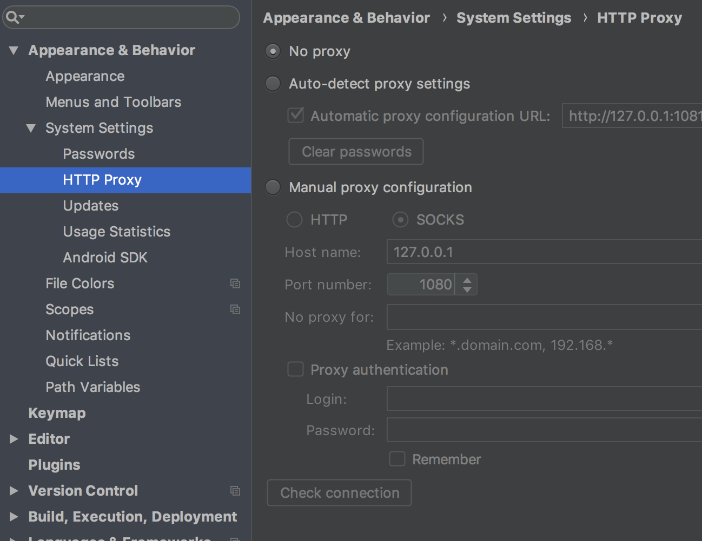
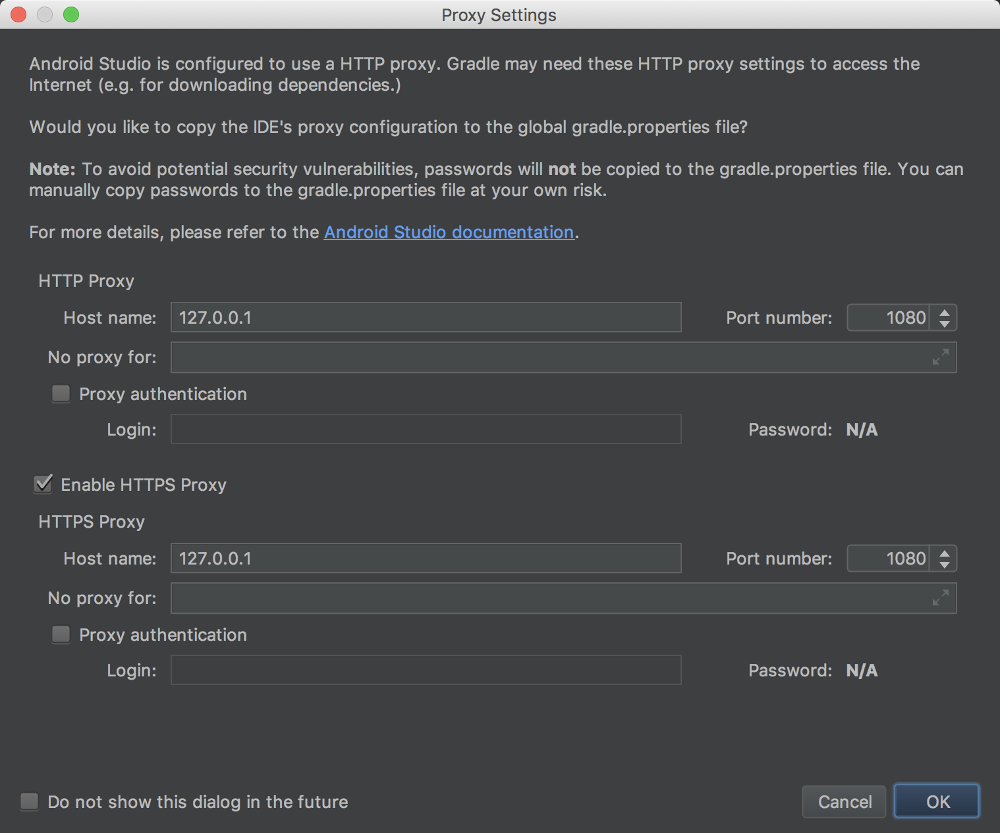
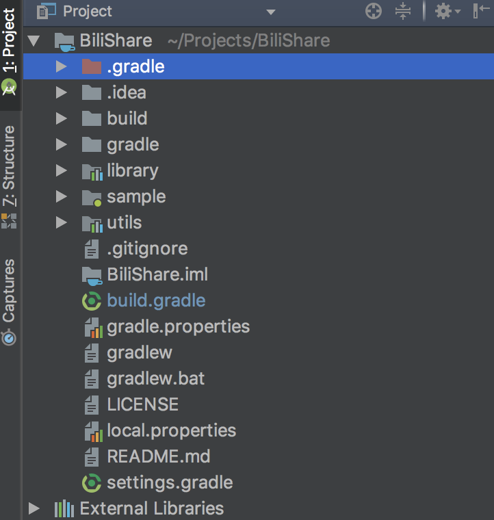
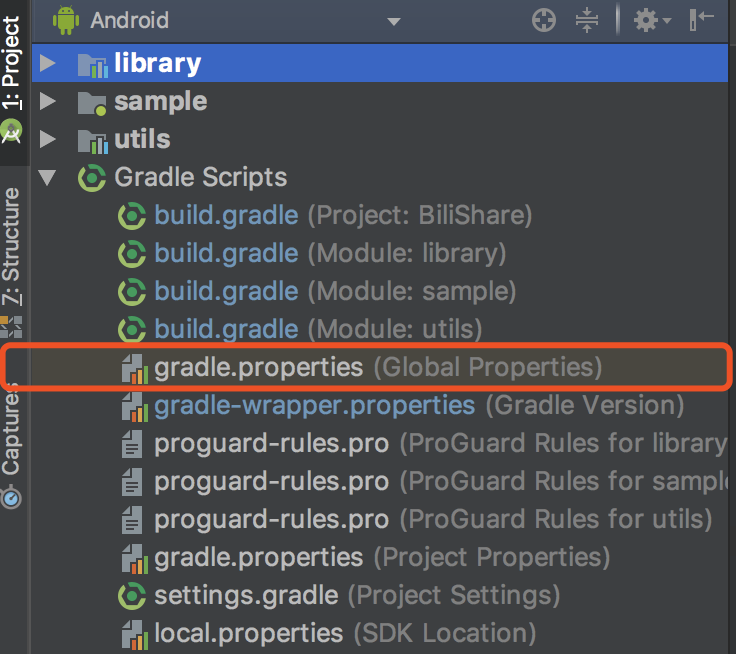
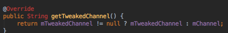

# Tips

[TOC]

# Android Studio代理问题 (20180523)

有时会碰到无法拉取某个库的情况，这时候可以考虑使用shadowsocks代理解决



但是在开始Build前，可能会弹出如下一个窗口让设置http和https的代理。



官方文档只提到了设置Studio和项目的代理，并没有提到这个窗口的作用，其实这个窗口的作用是设置一个全局gradle的配置文件，位置在`~/.gradle/gradle.properties`，即使在Studio关闭代理后，该文件的内容没有任何变化，会导致其他项目也莫名地走了代理，很多网上的帖子包括[官方文档](https://developer.android.com/studio/intro/studio-config?hl=zh-cn#proxy)都没有明显提到该文件的具体路径。而且在Project窗口中根本看不到该文件，甚至可能误以为那个`gradle.properties`就是文档中提到的文件



其实只要把上面的选项卡切换成Android就可以看到该文件了



# sync后java类失效问题（20180625-0627）

## 问题描述

切换到release分支再sync后，出现所有java类都不识别的问题



，执行run提示需要指定sdk

## 临时解决办法

1. 切换到没有出问题的其他分支后sync，然后再切换回问题分支即可
2. 有时可能是某一个库拉取失败但是没有中断sync，影响到了sdk的解析，可以尝试以下方式重新sync
   1. 连接shadowsocks后重试
   2. 等待网络正常后重试

## 根治办法

彻底删除并重新拉取工程后恢复正常，猜测是由idea相关文件引起，可以采取以下措施

1. 修改iml文件，一般是因为缺乏这句话引起

   ```xml
   <orderEntry type="jdk" jdkName="Android API 27 Platform" jdkType="Android SDK" />
   ```

2. 先invalidate工程，然后close project，再重新导入工程，参考[Android Studio运行app时提示Please select Android SDK](https://www.jianshu.com/p/5809e061f31d)

# 定义id问题

一般情况下需要一个id用于动态创建fragment，不能直接指定一个整数值，否则可能会与其他id重复，出现崩溃

修改`res/values/values.xml`

```xml
<?xml version="1.0" encoding="UTF-8"?>
<resources>
  <item name="my_view" type="id"/>
</resources>
```

在java代码中获得该id

```java
int myViewId = R.id.my_view;
```

