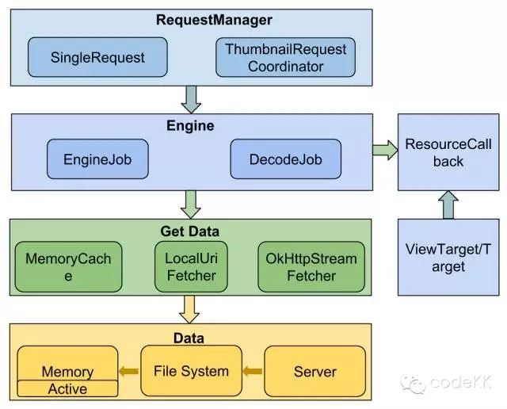
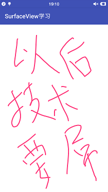
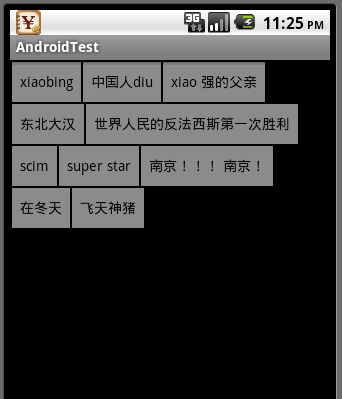

# View

[TOC]

# Bitmap加载

## 图片加载

> 由于Bitmap的特殊性以及Android对单个应用所施加的内存限制，比如16MB，这导致加载Bitmap的时候容易出现内存溢出

核心思想就是采用BitmapFactory.Options来加载所需尺寸的图片

通过BitmapFactory.Options来缩放图片，主要用到了它的inSampleSize参数，即采样率。当其为1时不缩放，为2时，即采样后的图片其宽、高均为原图的1/2，而像素为原图的1/4，所以占的内存也为原图的1/4.（采样率小于1没效果，相当于1）

inSampleSize的取值应该总是为2的指数，如果不为2的指数，系统会向下取整并选择一个最近的2的指数来代替。比如3，系统会使用2来代替

**采样过程：** 

1. 将BitmapFactory.Options的inJustDecodeBounds参数设为true并加载图像 
2. 从BitmapFactory.Options中取出图片的原始宽高信息，他们对应于outWidth和outHeight参数 
3. 根据采样率的规则并结合目标View的所需大小计算出采样率inSampleSize. 
4. 将BitmapFactory.Options的inJustDecodeBounds参数设为false，然后重新加载图片。

> inJustDecodeBounds为true时，BitmapFactory只会解析图片的原始宽高信息，并不会真正去加载图片。

## 缓存策略

当程序第一次从网上加载图片后，就将其缓存到存储设备上，这样下次使用这张图片就不会再从网上下载了。

很多时候为了提高应用的用户体验，往往还会把图片在内存中也缓存一份，这样当应用打算从网络上请求一张图片时，程序会首先从内存中取获取，然后再从存储中获取，如果都没有最后才从网络下载。这样既提高了程序的效率又节约了不必要的流量开销。

在使用缓存时，要为其指定一个最大容量。当容量满了以后，采用LRU(Least Recently Used)近期最少使用算法来移除缓存内容

### LruCache

内部采用LinkedHashMap以强引用的方式存储外界缓存对象，提供get和put方法完成缓存的获取和添加，缓存满时移除较早使用的缓存对象

创建时需要提供缓存的总容量大小并重写`sizeOf`，`sizeOf`用于计算缓存对象的大小，单位需要与总容量单位一致

```java
int maxMemory = (int) (Runtime.getRuntime().maxMemory() / 1024);
int cacheSize = maxMemory / 8;
mMemoryCache = new LruCache<String, Bitmap>(cacheSize) {
    @Override
    protected int sizeOf(String key, Bitmap bitmap) {
        return bitmap.getRowBytes() * bitmap.getHeight() / 1024; // 每行的Byte数x行高
    }
};
```

### DiskLruCache

[源码](https://link.jianshu.com/?t=https://android.googlesource.com/platform/libcore/+/android-4.1.1_r1/luni/src/main/java/libcore/io/DiskLruCache.java)

| 方法                                                         | 备注                                                         |
| ------------------------------------------------------------ | ------------------------------------------------------------ |
| DiskLruCache open(File directory, int appVersion, int valueCount, long maxSize) | 打开一个缓存目录，如果没有则首先创建它，**directory：**指定数据缓存地址 **appVersion：**APP版本号，当版本号改变时，缓存数据会被清除 **valueCount：**同一个key可以对应多少文件 **maxSize：**最大可以缓存的数据量 |
| Editor edit(String key)                                      | 通过key可以获得一个DiskLruCache.Editor，通过Editor可以得到一个输出流，进而缓存到本地存储上 |
| void flush()                                                 | 强制缓冲文件保存到文件系统                                   |
| Snapshot get(String key)                                     | 通过key值来获得一个Snapshot，如果Snapshot存在，则移动到LRU队列的头部来，通过Snapshot可以得到一个输入流InputStream |
| long size()                                                  | 缓存数据的大小，单位是byte                                   |
| boolean remove(String key)                                   | 根据key值来删除对应的数据，如果该数据正在被编辑，则不能删除  |
| void delete()                                                | 关闭缓存并且删除目录下所有的缓存数据，即使有的数据不是由DiskLruCache 缓存到本目录的 |
| void close()                                                 | 关闭DiskLruCache，缓存数据会保留在外存中                     |
| boolean isClosed()                                           | 判断DiskLruCache是否关闭，返回true表示已关闭                 |
| File getDirectory()                                          | 缓存数据的目录                                               |

## 优化列表卡顿

核心思想：不要在主线程中做太耗时的操作即可。

1. 不要在getView中执行耗时操作。必须使用异步的方式来处理。
2. 控制异步任务的执行频率。以照片墙为例，如果用户频繁的上下滑动，必定带来大量UI更新，所以解决思路就是：在滑动时停止加载图片，等列表停下来以后再加载图片。
3. 通过开启硬件加速解决卡顿。

## ImageLoader设计

### 基本功能

加载方式：同步和异步

缓存：内存和磁盘

图片压缩，网络拉取

### 代码设计

图片压缩

```java
public class ImageResizer {
    private static final String TAG = "ImageResizer";

    public ImageResizer() {
    }

    public Bitmap decodeSampledBitmapFromResource(Resources res, int resId, int reqWidth, int reqHeight) {
        // 根据Resource加载bitmap
        // First decode with inJustDecodeBounds=true to check dimensions
        final BitmapFactory.Options options = new BitmapFactory.Options();
        options.inJustDecodeBounds = true;
        BitmapFactory.decodeResource(res, resId, options);
        // Calculate inSampleSize
        options.inSampleSize = calculateInSampleSize(options, reqWidth,
                                                     reqHeight);
        // Decode bitmap with inSampleSize set
        options.inJustDecodeBounds = false;
        return BitmapFactory.decodeResource(res, resId, options);
    }

    public Bitmap decodeSampledBitmapFromFileDescriptor(FileDescriptor fd, int reqWidth, int reqHeight) {
        // 根据文件描述符加载bitmap
    }
}
```

缓存创建

```java
private LruCache<String, Bitmap> mMemoryCache;
private DiskLruCache mDiskLruCache;

private ImageLoader(Context context) {
    mContext = context.getApplicationContext();
    int maxMemory = (int) (Runtime.getRuntime().maxMemory() / 1024);
    int cacheSize = maxMemory / 8;
    mMemoryCache = new LruCache<String, Bitmap>(cacheSize) {
        @Override
        protected int sizeOf(String key, Bitmap bitmap) {
            return bitmap.getRowBytes() * bitmap.getHeight() / 1024;
        }
    };
    File diskCacheDir = getDiskCacheDir(mContext, "bitmap");
    if (!diskCacheDir.exists()) {
        diskCacheDir.mkdirs();
    }
    if (getUsableSpace(diskCacheDir) > DISK_CACHE_SIZE) {
        try {
            mDiskLruCache = DiskLruCache.open(diskCacheDir, 1, 1,
                                              DISK_CACHE_SIZE);
            mIsDiskLruCacheCreated = true;
        } catch (IOException e) {
            e.printStackTrace();
        }
    }
}

private void addBitmapToMemoryCache(String key, Bitmap bitmap) {
    if (getBitmapFromMemCache(key) == null) {
        mMemoryCache.put(key, bitmap);
    }
}

private Bitmap getBitmapFromMemCache(String key) {
    return mMemoryCache.get(key);
}
```

缓存添加和获取

- 通过DiskLruCache.Snapshot获得磁盘缓存对象对应的FileInputStream，但FileInputStream无法便捷地压缩，所以通过FileDescriptor加载压缩后图片

```java
private Bitmap loadBitmapFromHttp(String url, int reqWidth, int reqHeight) throws IOException {
    if (Looper.myLooper() == Looper.getMainLooper()) {
        throw new RuntimeException("can not visit network from UI Thread.");
    }
    if (mDiskLruCache == null) {
        return null;
    }

    String key = hashKeyFormUrl(url);
    DiskLruCache.Editor editor = mDiskLruCache.edit(key);
    if (editor != null) {
        OutputStream outputStream = editor.newOutputStream(DISK_CACHE_INDEX); // 默认为0
        if (downloadUrlToStream(url, outputStream)) {
            editor.commit();
        } else {
            editor.abort();
        }
        mDiskLruCache.flush();
    }
    return loadBitmapFromDiskCache(url, reqWidth, reqHeight);
}

private Bitmap loadBitmapFromDiskCache(String url, int reqWidth,
                                       int reqHeight) throws IOException {
    if (Looper.myLooper() == Looper.getMainLooper()) {
        Log.w(TAG, "load bitmap from UI Thread, it's not recommended!");
    }
    if (mDiskLruCache == null) {
        return null;
    }

    Bitmap bitmap = null;
    String key = hashKeyFormUrl(url);
    DiskLruCache.Snapshot snapShot = mDiskLruCache.get(key);
    if (snapShot != null) {
        FileInputStream fileInputStream = (FileInputStream)snapShot.getInputStream(DISK_CACHE_INDEX);
        FileDescriptor fileDescriptor = fileInputStream.getFD();
        // 默认DiskLruCache中存储的是文件数据不能直接通过Bitmap加载，可以利用Snapshot转换为字节流，再转换为文件描述符加载
        bitmap = mImageResizer.decodeSampledBitmapFromFileDescriptor(fileDescriptor,
                                                                     reqWidth, reqHeight);
        if (bitmap != null) {
            addBitmapToMemoryCache(key, bitmap);
        }
    }

    return bitmap;
}
```

同步加载

- 从内存加载
- 从磁盘缓存加载
- 从网络拉取

```java
public Bitmap loadBitmap(String uri, int reqWidth, int reqHeight) {
    Bitmap bitmap = loadBitmapFromMemCache(uri);
    if (bitmap != null) {
        Log.d(TAG, "loadBitmapFromMemCache,url:" + uri);
        return bitmap;
    }

    try {
        bitmap = loadBitmapFromDiskCache(uri, reqWidth, reqHeight);
        if (bitmap != null) {
            Log.d(TAG, "loadBitmapFromDisk,url:" + uri);
            return bitmap;
        }
        bitmap = loadBitmapFromHttp(uri, reqWidth, reqHeight);
        Log.d(TAG, "loadBitmapFromHttp,url:" + uri);
    } catch (IOException e) {
        e.printStackTrace();
    }

    if (bitmap == null && !mIsDiskLruCacheCreated) {
        Log.w(TAG, "encounter error, DiskLruCache is not created.");
        bitmap = downloadBitmapFromUrl(uri);
    }

    return bitmap;
}
```

异步加载

- 从内存缓存读取图片
- 从线程池中调用loadBitmap，加载成功则返回LoaderResult对象，通过handler发送到主线程进行更新

```java
public void bindBitmap(final String uri, final ImageView imageView) {
    bindBitmap(uri, imageView, 0, 0);
}

public void bindBitmap(final String uri, final ImageView imageView,
                       final int reqWidth, final int reqHeight) {
    imageView.setTag(TAG_KEY_URI, uri);
    Bitmap bitmap = loadBitmapFromMemCache(uri);
    if (bitmap != null) {
        imageView.setImageBitmap(bitmap);
        return;
    }

    Runnable loadBitmapTask = new Runnable() {

        @Override
        public void run() {
            Bitmap bitmap = loadBitmap(uri, reqWidth, reqHeight);
            if (bitmap != null) {
                LoaderResult result = new LoaderResult(imageView, uri, bitmap);
                mMainHandler.obtainMessage(MESSAGE_POST_RESULT, result).sendToTarget();
            }
        }
    };
    THREAD_POOL_EXECUTOR.execute(loadBitmapTask);
}

private static class LoaderResult {
    public ImageView imageView;
    public String uri;
    public Bitmap bitmap;

    public LoaderResult(ImageView imageView, String uri, Bitmap bitmap) {
        this.imageView = imageView;
        this.uri = uri;
        this.bitmap = bitmap;
    }
}

private Handler mMainHandler = new Handler(Looper.getMainLooper()) {
    @Override
    public void handleMessage(Message msg) {
        LoaderResult result = (LoaderResult) msg.obj;
        ImageView imageView = result.imageView;
        String uri = (String) imageView.getTag(TAG_KEY_URI);
        if (uri.equals(result.uri)) {
            imageView.setImageBitmap(result.bitmap);
        } else {
            Log.w(TAG, "set image bitmap,but url has changed, ignored!");
        }
    };
};
```

> 如果采用普通线程去加载图片，随着列表滑动可能产生大量线程，不利于整体效率提升
>
> AsyncTask在3.0以上不支持并发，同样不适合
>
> Handler直接采用主线程Looper，使得在非主线程中可以构造ImageLoader
>
> 通过检查url是否改变，如果改变则不设置图片，解决列表错位问题

使用

```java
public class MainActivity extends Activity implements OnScrollListener {
    private class ImageAdapter extends BaseAdapter {
        @Override
        public View getView(int position, View convertView, ViewGroup parent) {
            ViewHolder holder = null;
            if (convertView == null) {
                convertView = mInflater.inflate(R.layout.image_list_item,parent, false);
                holder = new ViewHolder();
                holder.imageView = (ImageView) convertView.findViewById(R.id.image);
                convertView.setTag(holder);
            } else {
                holder = (ViewHolder) convertView.getTag();
            }
            ImageView imageView = holder.imageView;
            final String tag = (String) imageView.getTag();
            final String uri = getItem(position);
            if (!uri.equals(tag)) {
                // url和tag不对应时加载默认图片
                imageView.setImageDrawable(mDefaultBitmapDrawable);
            }
            if (mIsGridViewIdle && mCanGetBitmapFromNetWork) {
                // 列表不滚动时设置tag，异步加载图片
                imageView.setTag(uri);
                mImageLoader.bindBitmap(uri, imageView, mImageWidth, mImageWidth);
            }
            return convertView;
        }
    }

    @Override
    public void onScrollStateChanged(AbsListView view, int scrollState) {
        if (scrollState == OnScrollListener.SCROLL_STATE_IDLE) {
            mIsGridViewIdle = true;
            mImageAdapter.notifyDataSetChanged();
        } else {
            mIsGridViewIdle = false;
        }
    }
}
```

# Drawable

一种可以在Canvas上进行绘制的抽象概念

- 使用简单，比自定义View成本低
- 非图片Drawable占用空间小，有利于减小apk大小

## 分类

### BitmapDrawable

表示图片

```xml
<bitmap xmlns:android="http://schemas.android.com/apk/res/android"
        android:src="@drawable/image1"
        android:tileMode="repeat"
        />
```

NinePatchDrawable：自动根据宽高进行相应缩放并保证不失真

### ShapeDrawable

通过颜色构造图形，纯色或渐变

```xml
<shape xmlns:android="http://schemas.android.com/apk/res/android"
       android:shape="rectangle" >

    <solid android:color="#ff0000" />

    <corners
             android:bottomLeftRadius="0dp"
             android:bottomRightRadius="15dp"
             android:topLeftRadius="10dp"
             android:topRightRadius="15dp" />

</shape>
```

### LayerDrawable

层次化的Drawable集合，通过将不同Drawable放在不同层达到叠加效果

下面的item会覆盖上面的item

```xml
<layer-list xmlns:android="http://schemas.android.com/apk/res/android" >
    <item>
        <shape android:shape="rectangle" >
            <solid android:color="#0ac39e" />
        </shape>
    </item>

    <item android:bottom="6dp">
        <shape android:shape="rectangle" >
            <solid android:color="#ffffff" />
        </shape>
    </item>

    <item
          android:bottom="1dp"
          android:left="1dp"
          android:right="1dp">
        <shape android:shape="rectangle" >
            <solid android:color="#ffffff" />
        </shape>
    </item>

</layer-list>
```

### StateListDrawable

根据View状态，从Drawable集合中顺序查找，选择匹配的显示

默认的item应放在最后，且不附带状态

```xml
<selector xmlns:android="http://schemas.android.com/apk/res/android">   
    <!-- 触摸时并且当前窗口处于交互状态 -->    
    <item android:state_pressed="true" android:state_window_focused="true" android:drawable= "@drawable/pic1" />  
    <!--  触摸时并且没有获得焦点状态 -->    
    <item android:state_pressed="true" android:state_focused="false" android:drawable="@drawable/pic2" />    
    <!--选中时的图片背景-->    
    <item android:state_selected="true" android:drawable="@drawable/pic3" />     
    <!--获得焦点时的图片背景-->    
    <item android:state_focused="true" android:drawable="@drawable/pic4" />    
    <!-- 窗口没有处于交互时的背景图片 -->    
    <item android:drawable="@drawable/pic5" />   
</selector>  
```

### LevelListDrawable

表示Drawable集合，每个Drawable都有一个level，根据不同level切换Drawable

```xml
<level-list xmlns:android="http://schemas.android.com/apk/res/android"> 
    <item
          android:drawable="@drawable/drawable_resource"
          android:maxLevel="integer"
          android:minLevel="integer"
          />
</level-list>
```

### TransitionDrawable

实现两个Drawable之间的淡入淡出

```xml
<transition xmlns:android="http://schemas.android.com/apk/res/android" >

    <item android:drawable="@drawable/shape_drawable_gradient_linear"/>
    <item android:drawable="@drawable/shape_drawable_gradient_radius"/>

</transition>
```

### InsetDrawable

将其他Drawable内嵌到自己中，并在四周留出一定间距

```xml
<inset xmlns:android="http://schemas.android.com/apk/res/android"
       android:insetBottom="15dp"
       android:insetLeft="15dp"
       android:insetRight="15dp"
       android:insetTop="15dp" >

    <shape android:shape="rectangle" >
        <solid android:color="#ff0000" />
    </shape>
</inset>
```

### ScaleDrawable

根据自己的等级将指定Drawable缩放一定比例

```xml
<scale xmlns:android="http://schemas.android.com/apk/res/android"
       android:drawable="@drawable/image1"
       android:scaleHeight="70%"
       android:scaleWidth="70%"
       android:scaleGravity="center" />
```

### ClipDrawable

根据自己的等级裁剪另一个Drawable

```xml
<clip xmlns:android="http://schemas.android.com/apk/res/android"
      android:clipOrientation="vertical"
      android:drawable="@drawable/image1"
      android:gravity="bottom" />
```

## 自定义Drawable

通过重写Drawable的draw方法自定义

```java
public class CustomDrawable extends Drawable {
    private Paint mPaint;

    public CustomDrawable(int color) {
        mPaint = new Paint(Paint.ANTI_ALIAS_FLAG);
        mPaint.setColor(color);
    }

    @Override
    public void draw(Canvas canvas) {
        final Rect r = getBounds();
        float cx = r.exactCenterX();
        float cy = r.exactCenterY();
        canvas.drawCircle(cx, cy, Math.min(cx, cy), mPaint);
    }

    @Override
    public void setAlpha(int alpha) {
        mPaint.setAlpha(alpha);
        invalidateSelf();

    }

    @Override
    public void setColorFilter(ColorFilter cf) {
        mPaint.setColorFilter(cf);
        invalidateSelf();
    }

    @Override
    public int getOpacity() {
        // not sure, so be safe
        return PixelFormat.TRANSLUCENT;
    }

}
```

# 动画

## View动画

通过对场景的对象不断做图像变换（平移，缩放，旋转，透明度）从而产生动画效果

**只是在视图层实现了动画效果，并没有真正改变View的属性。view的实际位置还是移动前的位置**

### 种类

| 名称   | 标签         | 子类               | 效果           |
| ------ | ------------ | ------------------ | -------------- |
| 平移   | \<translate> | TranslateAnimation | 移动View       |
| 缩放   | \<scale>     | ScaleAnimation     | 放大或缩小View |
| 透明度 | \<alpha>     | AlphaAnimation     | 改变View透明度 |
| 旋转   | \<rotate>    | RotateAnimation    | 旋转View       |

### 使用

#### 使用xml定义

```xml
<set xmlns:android="http://schemas.android.com/apk/res/android"
     android:duration="300"
     android:interpolator="@android:anim/accelerate_interpolator"
     android:shareInterpolator="true" >

    <alpha
           android:fromAlpha="0.0"
           android:toAlpha="1.0" />

    <translate
               android:fromXDelta="500"
               android:toXDelta="0" />

</set>
```

```java
Animation animation = AnimationUtils.loadAnimation(this, R.anim.anim_item);
mButton.startAnimation(animation);
```

#### 使用代码定义

```java
AlphaAnimation alphaAnimation = new AlphaAnimation(0, 1);
alphaAnimation.setDuration(300);
mButton.startAnimation(alphaAnimation);
```

### 自定义View动画

继承Animation类并重写initialize和applyTransformation方法

initialize中进行初始化工作

```java
@Override
public void initialize(int width, int height, int parentWidth, int parentHeight) {
    super.initialize(width, height, parentWidth, parentHeight);
}
```

applyTransformation中进行相应矩阵变换

```java
protected void applyTransformation(float interpolatedTime, Transformation t) {  
    super.applyTransformation(interpolatedTime, t);  
}  
```

应用

```java
Rotate3dAnimation rotate3dAnimation = new Rotate3dAnimation(0, 360, iv_content.getWidth()/2, 0, 0, true, Rotate3dAnimation.DIRECTION.Y);  
rotate3dAnimation.setDuration(3000);  
iv_content.setAnimation(rotate3dAnimation);  
rotate3dAnimation.start();  
```

### 其他场景

#### LayoutAnimation

为ViewGroup指定一个动画，当它的子元素出现时都会有这种动画效果，常用于ListView

使用xml指定

```xml
<layoutAnimation
                 xmlns:android="http://schemas.android.com/apk/res/android"
                 android:delay="0.5"
                 android:animationOrder="reverse"
                 android:animation="@anim/anim_item"/>
```

```xml
<ListView
          android:id="@+id/list"
          android:layout_width="match_parent"
          android:layout_height="match_parent"
          android:layoutAnimation="@anim/anim_layout" />
```

或使用代码指定

```java
Animation animation = AnimationUtils.loadAnimation(this, R.anim.anim_item);
LayoutAnimationController controller = new LayoutAnimationController(animation);
controller.setDelay(0.5f);
controller.setOrder(LayoutAnimationController.ORDER_NORMAL);
listView.setLayoutAnimation(controller);
```

#### 修改Activity切换效果

在startActivity或finish后调用，同样适用于Fragment

```java
Intent intent = new Intent(this, TestActivity.class);
startActivity(intent);
overridePendingTransition(R.anim.enter_anim, R.anim.exit_anim);
```

## 帧动画

通过顺序播放一系列图像产生动画效果，容易引起OOM，应尽量避免使用过多大尺寸图片

通过XML定义一个AnimationDrawable

```xml
<!--res/drawable/frame_animation.xml-->
<animation-list xmlns:android="http://schemas.android.com/apk/res/android"
                android:oneshot="false" >

    <item
          android:drawable="@drawable/light01"
          android:duration="50"/>
    <item
          android:drawable="@drawable/light02"
          android:duration="50"/>
    <item
          android:drawable="@drawable/light03"
          android:duration="50"/>

</animation-list>
```

将上述Drawable作为View的背景并通过Drawable来播放

```java
mButton.setBackgroundResource(R.drawable.frame_animation)
Animation drawable = (AnimationDrawable) mButton.getBackground();  
//开始动画
drawable.start();  
```

## 属性动画

动态改变对象属性达到动画效果

默认时间300ms，10ms/帧，在一个时间间隔内完成对象从一个属性值到另一个属性值的改变

在API 11之前的系统上可以使用nineoldandroids实现属性动画

### 原理

对object的属性abc做动画，需要满足以下条件

1. object必须提供setAbc方法，如果动画时没有传递初始值，还要提供getAbc方法，因为系统要去取abc属性的初始值，否则crash
2. object的setAbc对属性abc所做的改变必须能够通过某种方法反映出来，比如会带来UI改变，程序不一定crash但会无效果

属性动画要求object提供set和get方法，根据提供的初始值和最终值，以动画的效果多次调用set方法

### 使用

#### 使用代码定义

常用的动画类：ValueAnimator，ObjectAnimator，AnimatorSet

改变myObject的tranlationY属性，让其沿Y轴向上平移一段距离

```java
ObjectAnimator.ofFloat(myObject, "translationY", -myObject.getHeight()).start();
```

改变背景色

```java
ValueAnimator colorAnim = ObjectAnimator.ofInt(this, "backgroundColor", 0xFFFF8080, 0xFF8080FF);
colorAnim.setDuration(3000);
colorAnim.setEvaluator(new ArgbEvaluator());
colorAnim.setRepeatCount(ValueAnimator.INFINITE);
colorAnim.setRepeatMode(ValueAnimator.REVERSE);
colorAnim.start();
```

动画集合

```java
AnimatorSet set = new Animator();
set.playTogether(
    ObjectAnimator.ofFloat(myView, "rotationX", 0, 360),
    ObjectAnimator.ofFloat(myView, "translationX", 0, 90)
);
set.setDuration(5 * 1000).start();
```

#### 使用XML定义

定义在res/animator/下

```xml
<set xmlns:android="http://schemas.android.com/apk/res/android"
     android:ordering="sequentially" >
    <!-- 
  表示Set集合内的动画按顺序进行
  ordering的属性值:sequentially & together
  sequentially:表示set中的动画，按照先后顺序逐步进行（a 完成之后进行 b ）
  together:表示set中的动画，在同一时间同时进行,为默认值-->

    <set android:ordering="together" >
        <!--下面的动画同时进行-->
        <objectAnimator
                        android:duration="2000"
                        android:propertyName="translationX"
                        android:valueFrom="0"
                        android:valueTo="300"
                        android:valueType="floatType" >
        </objectAnimator>

        <objectAnimator
                        android:duration="3000"
                        android:propertyName="rotation"
                        android:valueFrom="0"
                        android:valueTo="360"
                        android:valueType="floatType" >
        </objectAnimator>
    </set>

    <set android:ordering="sequentially" >
        <!--下面的动画按序进行-->
        <objectAnimator
                        android:duration="1500"
                        android:propertyName="alpha"
                        android:valueFrom="1"
                        android:valueTo="0"
                        android:valueType="floatType" >
        </objectAnimator>
        <objectAnimator
                        android:duration="1500"
                        android:propertyName="alpha"
                        android:valueFrom="0"
                        android:valueTo="1"
                        android:valueType="floatType" >
        </objectAnimator>
    </set>

</set>
```

### 监听器

AnimatorListener可以监听动画的开始，结束，取消以及重复播放

AnimatorUpdateListener可以监听整个动画过程，每播放一帧就会被调用一次、

### 对任意属性做动画

1. 给对象加上set和get方法

   通常没有权限修改SDK，不可行

2. 用一个类包装对象，提供set和get方法

   ```java
   private static class ViewWrapper {
       private View mTarget;
       public ViewWrapper(View target) {
           mTarget = target;
       }
   
       public int getWidth() {
           return mTarget.getLayoutParams().width;
       }
   
       public void setWidth(int width) {
           mTarget.getLayoutParams().width = width;
           mTarget.requestLayout();
       }
   }
   ```

3. 采用ValueAnimator，监听动画过程，实现属性改变

   ```java
   private void performAnimate(final View target, final int start, final int end) {
       ValueAnimator valueAnimator = ValueAnimator.ofInt(1, 100);
       valueAnimator.addUpdateListener(new AnimatorUpdateListener() {
   
           // 持有一个IntEvaluator对象，方便下面估值的时候使用
           private IntEvaluator mEvaluator = new IntEvaluator();
   
           @Override
           public void onAnimationUpdate(ValueAnimator animator) {
               // 获得当前动画的进度值，整型，1-100之间
               int currentValue = (Integer) animator.getAnimatedValue();
               Log.d(TAG, "current value: " + currentValue);
   
               // 获得当前进度占整个动画过程的比例，浮点型，0-1之间
               float fraction = animator.getAnimatedFraction();
               // 直接调用整型估值器通过比例计算出宽度，然后再设给Button
               target.getLayoutParams().width = mEvaluator.evaluate(fraction, start, end);
               target.requestLayout();
           }
       });
   
       valueAnimator.setDuration(5000).start();
   }
   
   @Override
   public void onClick(View v) {
       if (v == button) {
           performAnimate(button, button.getWidth(), 500);
       }
   }
   ```

## 常见问题

1. OOM：主要出现在帧动画中，图片数量较多且尺寸较大时一出现
2. 内存泄漏：如果使用无限循环的动画需要在Activity退出时及时停止，否则将导致Activity无法释放出现内存泄露，View动画不存在此类问题
3. 兼容性问题：动画在3.0以下系统上有兼容性问题
4. View动画问题：View动画是对View的影像做动画，可能出现动画完成后View无法隐藏的现象，只要调用view.clearAnimation()消除View动画即可
5. 不要使用px：尽量使用dp，保持在不同设备上的一致性
6. 动画元素交互：3.0以后，属性动画单击事件触发位置在移动后位置，View动画仍在原位置
7. 硬件加速：建议开启，提高流畅性

# Glide图片加载

## 准备

在app/build.gradle文件当中添加如下依赖

```
dependencies {  
    compile 'com.github.bumptech.glide:glide:3.6.1'  
}

```

Glide中需要用到网络功能，因此还得在AndroidManifest.xml中声明一下网络权限

```xml
<uses-permission android:name="android.permission.INTERNET" />
```

## 使用

### 基本用法

在layout中添加ImageView

```xml
<ImageView
           android:id="@+id/image_view"
           android:layout_width="match_parent"
           android:layout_height="match_parent" />
```

Context可以是Activity,Fragment等。它默认的Bitmap的格式RGB_565，同时他还可以指定图片大小；默认使用HttpUrlConnection下载图片，可以配置为OkHttp或者Volley下载，也可以自定义下载方式

```java
Glide.with(context)  
    .load("http://xxx.jpg")  
    .into(ImageView); 
```

- with()方法可以接收Context、Activity，Fragment类型或当前应用程序的ApplicationContext

> 如果传入的是Activity或者Fragment的实例，那么当这个Activity或Fragment被销毁的时候，图片加载也会停止。如果传入的是ApplicationContext，那么只有当应用程序被杀掉的时候，图片加载才会停止

- load()方法用于指定待加载的图片资源，包括网络图片、本地图片、应用资源、二进制流、Uri对象等
- into()方法接收ImageView类型的参数

### 缓存

Glide支持图片磁盘缓存，默认是内部存储。Glide默认缓存的是跟ImageView尺寸相同的。

缓存多种尺寸： `diskCacheStrategy(DiskCacheStrategy.ALL) `

这样不仅可以缓存ImageView大小尺寸还可以缓存其他尺寸。下次再加载ImageView的图片时，全尺寸的图片将会从缓存中取出，重新调整大小，然后再次缓存。这样加载图片显示会很快

禁用缓存： `diskCacheStrategy(DiskCacheStrategy.NONE)`

### 占位图

占位图就是指在图片的加载过程中，我们先显示一张临时的图片，等图片加载出来了再替换成要加载的图片

```java
Glide.with(this)
    .load(url)
    .placeholder(R.drawable.loading) // 加载过程中显示的图片
    .error(R.drawable.error) // 加载失败显示的图片
    .into(imageView);
```

### 指定图片格式和大小

`asBitmap()` 只允许加载静态图片

`asGif()` 只允许加载动态图片

`override(x, y)` 指定图片为x * y像素的尺寸

## 原理

Glide 收到加载及显示资源的任务，创建 Request 并将它交给RequestManager，Request 启动 Engine 去数据源获取资源(通过 Fetcher )，获取到后 Transformation 处理后交给 Target





### 资源获取组件

- Model: 原始资源，比如Url，AndroidResourceId, File等
- Data: 中间资源，比如Stream，ParcelFileDescriptor等
- Resource：直接使用的资源，包括Bitmap，Drawable等

> ParcelFileDescriptor：ContentProvider共享文件时比较常用，其实就是操作系统的文件描述符的，里面有in out err三个取值。也有人说是链接建立好之后的句柄。

### 资源复用

Android的内存申请几乎都在new的时候发生，而new较大对象（比如Bitmap时），更加容易触发GC_FOR_ALLOW。所以Glide尽量的复用资源来防止不必要的GC_FOR_ALLOC引起卡顿。

LruResourceCache：第一次从网络或者磁盘上读取到Resource时，并不会保存到LruCache当中，当Resource被release时，也就是View不在需要此Resource时，才会进入LruCache当中

BitmapPool：Glide会尽量用图片池来获取到可以复用的图片，获取不到才会new，而当LruCache触发Evicted时会把从LruCache中淘汰下来的Bitmap回收，也会把transform时用到的中间Bitmap加以复用及回收

### 图片池

4.4以前是Bitmap复用必须长宽相等才可以复用
4.4及以后是Size>=所需就可以复用，只不过需要调用reconfigure来调整尺寸
Glide用AttributeStategy和SizeStrategy来实现两种策略
图片池在收到传来的Bitmap之后，通过长宽或者Size来从KeyPool中获取Key(对象复用到了极致，连Key都用到了Pool)，然后再每个Key对应一个双向链表结构来存储。每个Key下可能有很多个待用Bitmap
取出后要减少图片池中记录的当前Size等，并对Bitmap进行eraseColor(Color.TRANSPAENT)操作确保可用

### 加载流程

**with()**：调用单例RequestManagerRetriever的静态get()方法得到一个RequestManagerRetriever对象，负责管理当前context的所有Request

当传入Fragment、Activity时，当前页面对应的Activity的生命周期可以被RequestManager监控到，从而可以控制Request的pause、resume、clear。这其中采用的监控方法就是在当前activity中添加一个没有view的fragment，这样在activity发生onStart onStop onDestroy的时候，会触发此fragment的onStart onStop onDestroy

RequestManager用来跟踪众多当前页面的Request的是RequestTracker类，用弱引用来保存运行中的Request，用强引用来保存暂停需要恢复的Request

**load()**：创建需要的Request，Glide加载图片的执行单位

例如在加载图片url的RequestManager中，fromString()方法会返回一个DrawableTypeRequest对象，然后调用这个对象的load()方法，把图片的URL地址传进去

**into()**：调用Request的begin方法开始执行

> 如果并没有事先调用override(width, height)来指定所需要宽高，Glide则会尝试去获取imageview的宽和高，如果当前imageview并没有初始化完毕取不到高宽，Glide会通过view的ViewTreeObserver来等View初始化完毕之后再获取宽高再进行下一步

### 资源加载

- GlideBuilder在初始化Glide时，会生成一个执行机Engine，包含LruCache缓存及一个当前正在使用的active资源Cache（弱引用）
- activeCache辅助LruCache，当Resource从LruCache中取出使用时，会从LruCache中remove并进入acticeCache当中
- Cache优先级LruCache>activeCache
- Engine在初始化时要传入两个ExecutorService，即会有两个线程池，一个用来从DiskCache获取resource，另一个用来从Source中获取（通常是下载）
- 线程的封装单位是EngineJob，有两个顺序状态，先是CacheState，在此状态先进入DiskCacheService中执行获取，如果没找到则进入SourceState，进到SourceService中执行下载

[Glide加载图片原理----转载](http://blog.csdn.net/ss8860524/article/details/50668118)

[Android图片加载框架最全解析（一），Glide的基本用法](http://blog.csdn.net/guolin_blog/article/details/53759439)

[Android图片加载框架最全解析（二），从源码的角度理解Glide的执行流程](http://blog.csdn.net/guolin_blog/article/details/53939176)

# RemoteViews

在其他进程中显示并更新View界面

由于没有提供findViewById方法，无法访问内部的View元素，必须通过一系列set方法来完成

主要用于通知栏和小部件

## 原理

1. NotificationManagerService和AppWidgetService运行在SystemServer进程中
2. RemoteViews会通过Binder传输到SystemServer进程中
3. 系统根据RemoteViews的信息得到应用资源，用LayoutInflater加载布局文件
4. 通过一系列set方法执行界面更新
5. 将View操作封装成Action对象（Parcelable），传输到远程进程并依次执行


# SurfaceView

SurfaceView继承之View，但拥有**独立的绘制表面**，即它**不与其宿主窗口共享同一个绘图表面**，可以**单独在一个线程进行绘制，并不会占用主线程的资源**。这样，绘制就会比较高效，游戏，视频播放，还有最近热门的直播，都可以用SurfaceView

## 和View的区别

|            | SurfaceView              | View             |
| ---------- | ------------------------ | ---------------- |
| 适用场景   | 被动更新，例如频繁地刷新 | 主动更新         |
| 刷新方式   | 子线程中刷新页面         | 主线程中刷新页面 |
| 双缓冲机制 | 底层实现                 | 无               |

## 创建和初始化SurfaceView

创建一个自定义的SurfaceViewL，继承之SurfaceView，并实现两个接口SurfaceHolder.CallBack和Runnable

```java
public class SurfaceViewL extends SurfaceView implements SurfaceHolder.Callback,Runnable{
    // SurfaceHolder,控制SurfaceView的大小，格式，监控或者改变SurfaceView
    private SurfaceHolder mSurfaceHolder;
    // 画布
    private Canvas mCanvas;
    // 子线程标志位，用来控制子线程
    private boolean isDrawing;

    public SurfaceViewL(Context context, AttributeSet attrs) {
        super(context, attrs);
        init();
    }

    @Override
    public void surfaceCreated(SurfaceHolder holder) {//创建
    }

    @Override
    public void surfaceChanged(SurfaceHolder holder, int format, int width, int height) {//改变
    }

    @Override
    public void surfaceDestroyed(SurfaceHolder holder) {//销毁
    }

    @Override
    public void run() {
    }

    private void init() {
        mSurfaceHolder = getHolder();//得到SurfaceHolder对象
        mSurfaceHolder.addCallback(this);//注册SurfaceHolder
        setFocusable(true);
        setFocusableInTouchMode(true); // 能否获得焦点
        this.setKeepScreenOn(true);//保持屏幕长亮
    }
}
```

> SurfaceHolder.CallBack还有一个子Callback2接口，里面添加了一个surfaceRedrawNeeded (SurfaceHolder holder)方法，当需要重绘SurfaceView中的内容时，可以使用这个接口。

## 使用SurfaceView

利用mSurfaceHolder对象，通过lockCanvas()方法获得当前的Canvas

> lockCanvas()获取到的Canvas对象还是上次的Canvas对象，并不是一个新的对象。之前的绘图都将被保留，如果需要擦除，可以在绘制之前通过drawColor()方法来进行清屏

绘制要充分利用SurfaceView的三个回调方法，在`surfaceCreate()`方法中开启子线程进行绘制。在子线程中，使用一个`while(isDrawing)`循环来不停地绘制。具体的绘制过程，由`lockCanvas()`方法进行绘制，并通过`unlockCanvasAndPost(mCanvas)`进行画布内容的提交

## 画图板示例



```java
public class SurfaceViewL extends SurfaceView implements SurfaceHolder.Callback, Runnable {
    // SurfaceHolder
    private SurfaceHolder mSurfaceHolder;
    // 画布
    private Canvas mCanvas;
    // 子线程标志位
    private boolean isDrawing;
    // 画笔
    Paint mPaint;
    // 路径
    Path mPath;
    private float mLastX, mLastY;//上次的坐标

    public SurfaceViewL(Context context, AttributeSet attrs) {
        super(context, attrs);
        init();
    }

    /**
     * 初始化
     */
    private void init() {
        //初始化 SurfaceHolder mSurfaceHolder
        mSurfaceHolder = getHolder();
        mSurfaceHolder.addCallback(this);

        setFocusable(true);
        setFocusableInTouchMode(true);
        this.setKeepScreenOn(true);
        //画笔
        mPaint = new Paint(Paint.ANTI_ALIAS_FLAG | Paint.DITHER_FLAG);
        mPaint.setStrokeWidth(10f);
        mPaint.setColor(Color.parseColor("#FF4081"));
        mPaint.setStyle(Paint.Style.STROKE);
        mPaint.setStrokeJoin(Paint.Join.ROUND);
        mPaint.setStrokeCap(Paint.Cap.ROUND);
        //路径
        mPath = new Path();
    }

    @Override
    public void surfaceCreated(SurfaceHolder holder) {//创建
        Log.e("surfaceCreated","--"+isDrawing);
        drawing();
    }

    @Override
    public void surfaceChanged(SurfaceHolder holder, int format, int width, int height) {//改变

    }

    @Override
    public void surfaceDestroyed(SurfaceHolder holder) {//销毁
        isDrawing = false;
        Log.e("surfaceDestroyed","--"+isDrawing);
    }

    @Override
    public void run() {
        while (isDrawing) {
            drawing();
        }
    }

    /**
     * 绘制
     */
    private void drawing() {
        try {
            mCanvas = mSurfaceHolder.lockCanvas();
            mCanvas.drawColor(Color.WHITE);
            mCanvas.drawPath(mPath, mPaint);
        } finally {
            if (mCanvas != null) {
                mSurfaceHolder.unlockCanvasAndPost(mCanvas);
            }
        }
    }

    @Override
    public boolean onTouchEvent(MotionEvent event) {
        float x = event.getX();
        float y = event.getY();
        switch (event.getAction()) {
            case MotionEvent.ACTION_DOWN:
                isDrawing = true ;//每次开始将标记设置为ture
                new Thread(this).start();//开启线程
                mLastX = x;
                mLastY = y;
                mPath.moveTo(mLastX, mLastY);
                break;

            case MotionEvent.ACTION_MOVE:
                float dx = Math.abs(x - mLastX);
                float dy = Math.abs(y - mLastY);
                if (dx >= 3 || dy >= 3) {
                    mPath.quadTo(mLastX, mLastY, (mLastX + x) / 2, (mLastY + y) / 2);
                }
                mLastX = x;
                mLastY = y;
                break;

            case MotionEvent.ACTION_UP:
                isDrawing = false;
                break;
        }
        return true;
    }

    /**
     * 测量
     */
    @Override
    protected void onMeasure(int widthMeasureSpec, int heightMeasureSpec) {
        super.onMeasure(widthMeasureSpec, heightMeasureSpec);
        int wSpecMode = MeasureSpec.getMode(widthMeasureSpec);
        int wSpecSize = MeasureSpec.getSize(widthMeasureSpec);
        int hSpecMode = MeasureSpec.getMode(heightMeasureSpec);
        int hSpecSize = MeasureSpec.getSize(heightMeasureSpec);

        if (wSpecMode == MeasureSpec.AT_MOST && hSpecMode == MeasureSpec.AT_MOST) {
            setMeasuredDimension(300, 300);
        } else if (wSpecMode == MeasureSpec.AT_MOST) {
            setMeasuredDimension(300, hSpecSize);
        } else if (hSpecMode == MeasureSpec.AT_MOST) {
            setMeasuredDimension(wSpecSize, 300);
        }
    }
}
```

[Android SurfaceView入门学习](https://www.jianshu.com/p/15060fc9ef18)

# View工作原理

## DecorView和ViewRoot

### DecorView


DecorView是一个应用窗口的根容器，它本质上是一个FrameLayout。DecorView有唯一一个子View，它是一个垂直LinearLayout，包含两个子元素，一个是TitleView（ActionBar的容器），另一个是ContentView（窗口内容的容器）。关于ContentView，它是一个FrameLayout（android.R.id.content)，我们平常用的setContentView就是设置它的子View。上图还表达了每个Activity都与一个Window（具体来说是PhoneWindow）相关联，用户界面则由Window所承载

### ViewRoot

View的绘制是由ViewRoot来负责的。每个应用程序窗口的decorView都有一个与之关联的ViewRoot对象，这种关联关系是由WindowManager来维护的。Activity启动时，`ActivityThread.handleResumeActivity()`方法中建立了ViewRoot和decorView的关联关系。

当建立好了decorView与ViewRoot的关联后，ViewRoot类的`requestLayout()`方法会被调用，以完成应用程序用户界面的初次布局。实际被调用的是ViewRootImpl类的`requestLayout()`方法

```java
@Override
public void requestLayout() {
    if (!mHandlingLayoutInLayoutRequest) {
        // 检查发起布局请求的线程是否为主线程 
        checkThread();
        mLayoutRequested = true;
        scheduleTraversals();
    }
}
```

上面的方法中调用了`scheduleTraversals()`方法来调度一次完成的绘制流程，该方法会向主线程发送一个“遍历”消息，最终会导致ViewRootImpl的`performTraversals()`方法被调用，开始View绘制的以下三个阶段

## MeasureSpec和LayoutParams

### 概念

MeasureSpec代表一个32位的int值，用于决定View的宽高

- 高2位代表SpecMode：测量模式
- 低30位代表SpecSize：某种测量模式下的规格大小

SpecMode有3类：

- UNSPECIFIED：父容器不对View有任何限制，一般用于系统内部，表示一种测量状态
- EXACTLY：父容器已经检测出View所需的精确大小，即SpecSize指定的值，对应于LayoutParams中的match_parent和具体数值两种模式
- AT_MOST：父容器指定了一个可用大小即SpecSize，View大小不能大于这个值，对应于LayoutParams的wrap_content

### MeasureSpec和LayoutParams的关系

- 对于顶级View，MeasureSpec由窗口尺寸和自身的LayoutParams共同决定
- 对于普通View，MeasureSpec由父容器的MeasureSpec和自身的LayoutParams共同决定

### 普通View的MeasureSpec创建规则

| childLayoutParams\parentSpecMode | EXACTLY               | AT_MOST               | UNSPECIFILED         |
| -------------------------------- | --------------------- | --------------------- | -------------------- |
| dp/px                            | EXACTLY<br>childSize  | EXACTLY<br>childSize  | EXACTLY<br>childSize |
| match_parent                     | EXACTLY<br>parentSize | AT_MOST<br>parentSize | UNSPECIFILED<br>0    |
| wrap_content                     | AT_MOST<br>parentSize | AT_MOST<br>parentSize | UNSPECIFILED<br>0    |

## View的绘制过程

View的工作流程主要是指measure、layout、draw这三大流程，即测量、布局和绘制，其中measure确定View的测量宽/高，layout确定View的最终宽/高和四个顶点的位置，而draw则将View绘制到屏幕上


### measure

计算出控件树中的各个控件要显示其内容的话，需要多大尺寸

#### View的measure过程

直接继承View的自定义控件需要重写`onMeasure方法`并设置wrap_content时的自身大小，否则使用wrap_content相当于match_parent

> 如果View在不居中使用wrap_content，那么它的SpecMode是AT_MOST模式，在这种模式下，它的宽高等于specSize，即此时就相当于parentSize，也就是父容器当前剩余的大小

解决方法是给View指定一个默认的内部宽高（mWidth和mHeight），并在wrap_content时设置此宽高。对于非wrap_content的情形，沿用系统的测量值。

```java
@Override
protected void onMeasure(int widthMeasureSpec, int heightMeasureSpec) {
    super.onMeasure(widthMeasureSpec, heightMeasureSpec);
    int widthSpecMode = MeasureSpec.getMode(widthMeasureSpec);
    int widthSpecSize = MeasureSpec.getSize(widthMeasureSpec);
    int heightSpecMode = MeasureSpec.getMode(heightMeasureSpec);
    int heightSpecSize = MeasureSpec.getSize(heightMeasureSpec);
    if (widthSpecMode == MeasureSpec.AT_MOST
        && heightSpecMode == MeasureSpec.AT_MOST) {
        setMeasuredDimension(mWidth, mHeight);
    } else if (widthSpecMode == MeasureSpec.AT_MOST) {
        setMeasuredDimension(mWidth, heightSpecSize);
    } else if (heightSpecMode == MeasureSpec.AT_MOST) {
        setMeasuredDimension(widthSpecSize, mHeight);
    }
}
```

#### ViewGroup的measure过程

除了完成自己的测量过程外，还会遍历去调用所有子元素的measure方法，各个子元素再递归去执行这个流程

#### Activity实时获取View的宽高

在onCreate，onStart，onResume中均无法正确获取某个View的宽高，因为View的measure过程和Activity的生命周期方法不是同步执行的，因此无法保证Activity执行了onCreate，onStart，onResume时某个View已经测量完毕，如果还没有测量完毕，获取的宽高就是0

解决方法

- `Activity/View#onWindowFocusChanged`：此时View已经初始化完毕，宽高已经准备好，一定能获取到
- `View.post(runnable)`：通过post可以将一个runnable投递到消息队列的尾部，然后等待Looper调用此runnable时，View也已经初始化好了
- `ViewTreeObserver`：比如使用ViewTreeObserver的onGlobalLayoutListener回调方法，当View树状态改变或View树内部View可见性改变时，onGlobalLayout将被回调，此时可以获取View的宽高
- `view.measure()`：手动对View进行measure，根据View的LayoutParams分情况处理
  - match_parent：直接放弃，此种方法需要知道父容器parentSize，而此时无法知道
  - 具体数值或wrap_content：可行

### layout

layout的作用是ViewGroup用来确定子元素的位置，当ViewGroup的位置被确定为后，它在onLayout中会遍历所有的子元素并调用其layout方法

layout方法的大致流程如下：首先通过setFrame方法来设定View的四个顶点的位置，即初始化mLeft、mTop、mRight和mBottom四个参数，这四个参数描述了View相对其父View的位置。在setFrame()方法中会判断View的位置是否发生了改变，若发生了改变，则需要对子View进行重新布局，对子View的局部是通过onLayout()方法实现了

### draw

将View绘制到屏幕上面

绘制过程的传递是通过`dispatchDraw`实现的，dispatchDraw会遍历调用所有子元素的`draw`方法

```java
public void draw(Canvas canvas) {
    // ...
    // 绘制背景，只有dirtyOpaque为false时才进行绘制，下同
    if (!dirtyOpaque) {
        drawBackground(canvas);
    }

    // ...

    // 绘制自身内容
    if (!dirtyOpaque) onDraw(canvas);

    // 绘制子View
    dispatchDraw(canvas);

    // ...
    // 绘制滚动条等装饰
    onDrawForeground(canvas);

}
```

默认情况下ViewGroup不启用setWillNotDraw，不绘制任何内容，系统可以进行相应的优化。如果需要绘制，需要显式关闭WILL_NOT_DRAW标记位

### View为什么会执行2次onMeasure和onLayout

`ViewRootImpl#performTraversals()`中，会调用一次`schedualTraversals`，从而整体上执行了2次`performTraversals`

```java
//1.由于第一次执行newSurface必定为true，需要先创建Surface
//为true则会执行else语句，所以第一次执行并不会执行 performDraw方法，即View的onDraw方法不会得到调用
//第二次执行则为false，并未创建新的Surface，第二次才会执行 performDraw方法
if (!cancelDraw && !newSurface) {
    if (!skipDraw || mReportNextDraw) {
        if (mPendingTransitions != null && mPendingTransitions.size() > 0) {
            for (int i = 0; i < mPendingTransitions.size(); ++i) {
                mPendingTransitions.get(i).startChangingAnimations();
            }
            mPendingTransitions.clear();
        }

        performDraw();
    }
} else {
    //2.viewVisibility是wm.add的那个View的属性，View的默认值都是可见的
    if (viewVisibility == View.VISIBLE) {
        // Try again
        //3.再执行一次 scheduleTraversals，也就是会再执行一次performTraversals
        scheduleTraversals();
    } else if (mPendingTransitions != null && mPendingTransitions.size() > 0) {
        for (int i = 0; i < mPendingTransitions.size(); ++i) {
            mPendingTransitions.get(i).endChangingAnimations();
        }
        mPendingTransitions.clear();
    }
}
```

> measure方法的2级测量优化：
>
> 1. 如果flag不为forceLayout或者与上次测量规格（MeasureSpec）相比未改变，那么将不会进行重新测量（执行onMeasure方法），直接使用上次的测量值；
> 2. 如果满足非强制测量的条件，即前后二次测量规格不一致，会先根据目前测量规格生成的key索引缓存数据，索引到就无需进行重新测量;如果targetSDK小于API 20则二级测量优化无效，依旧会重新测量，不会采用缓存测量值。

第一次`performTranversals`会执行2次`performMeasure`，而未采用测量优化策略，因为前2次`performMeasure`并未经过`performLayout`，也即forceLayout的标志位一直为true，自然不会取缓存优化

在API24-25上，第三次测量经过第一次performTranversals中的performLayout，强制layout的flag应该为false，即第二次performTranversals并不会导致View的onMeasure方法的调用，由于未调用onMeasure方法，也不会调用onLayout方法，即只会执行2次onMeasure、一次onLayout、一次onDraw

总结：

**API25-24：**执行2次onMeasure、2次onLayout、1次onDraw，理论上执行三次测量，但由于测量优化策略，第三次不会执行onMeasure。

**API23-21：**执行3次onMeasure、2次onLayout、1次onDraw，forceLayout标志位被置为true，导致无测量优化。

**API19-16：**执行2次onMeasure、2次onLayout、1次onDraw，原因第一次performTranversals中只会1次执行measureHierarchy中的performMeasure，forceLayout标志位被置为true，导致无测量优化

[View为什么会至少进行2次onMeasure、onLayout](https://www.jianshu.com/p/733c7e9fb284)

## 自定义View

### 通常情况

1. 继承View重写onDraw：如果想控制View在屏幕上的渲染效果，就在重写`onDraw()`方法，在里面进行相应的处理，如处理wrap_content和padding；
2. 继承ViewGroup实现自定义布局：重点处理onMeasure和onLayout过程
3. 继承特定View：扩展已有View的功能，例如TextView，一般不需要处理wrap_content和padding
4. 继承特定ViewGroup：扩展已有ViewGroup功能

**关键点：**

1. 让View支持wrap_content和padding
2. 尽量不要在View中使用Handler
3. View中如果有线程或动画，需要在`onDetachFromWindow`中及时停止，否则可能导致内存泄漏
4. 处理好滑动冲突

**其他方面：**

1. 如果想要控制用户同View之间的交互操作，则在onTouchEvent()方法中对手势进行控制处理。
2. 如果想要控制View中内容在屏幕上显示的尺寸大小，就重写onMeasure()方法中进行处理。
3. 在 XML文件中设置自定义View的XML属性。
4. 如果想避免失去View的相关状态参数的话，就在`onSaveInstanceState() `和` onRestoreInstanceState()`方法中保存有关View的状态信息。

### 自定义属性

1. 在values目录下创建自定义属性的XML，如attrs.xml

   例如指定格式为`color`的属性`circle_color`

   ```xml
   <?xml version="1.0" encoding="utf-8"?>
   <resources>
       <declare-styleable name="CircleView">
           <attr name="circle_color" format="color"/>
       </declare-styleable>
   </resources>
   ```

2. 在View的构造方法中解析自定义属性的值并做相应处理

   首先接在自定义属性集合CircleView，接着解析其中的`circle_color` 属性，id为`R.styleable.CircleView_circle_color` ，选取红色作为默认值

   ```java
   public CircleView(Context context, AttributeSet attrs, int defStyleAttr) {
       super(context, attrs, defStyleAttr);
       TypedArray a = context.obtainStyledAttributes(attrs, R.styleable.CircleView);
       mColor = a.getColor(R.styleable.CircleView_circle_color, Color.RED);
       a.recycle();
       init();
   }
   ```

3. 在布局文件中使用自定义属性

   ```xml
   app:circle_color="@color/light_green"
   ```

> 为了使用自定义属性，必须在布局文件中添加schemas声明：`xmlns:app=http://schemas.android.com/apk/res-auto` 。在这个声明中，app是自定义属性的前缀，可以换成其他名字，但必须和CircleView中的自定义属性前缀保持一致

## 实例：实现自动换行的ViewGroup





自定义一个viewgroup，在onlayout里面自动检测view的右边缘的横坐标值，判断是否换行显示view就可以了

```java
public class AutoLinefeedLayout extends ViewGroup {  

    public AutoLinefeedLayout(Context context, AttributeSet attrs, int defStyle) {  
        super(context, attrs, defStyle);  
    }  

    public AutoLinefeedLayout(Context context, AttributeSet attrs) {  
        this(context, attrs, 0);  
    }  

    public AutoLinefeedLayout(Context context) {  
        this(context, null);  
    }  

    @Override  
    protected void onLayout(boolean changed, int l, int t, int r, int b) {  
        layoutHorizontal();  
    }  

    private void layoutHorizontal() {  
        final int count = getChildCount();  
        final int lineWidth = getMeasuredWidth() - getPaddingLeft()  
            - getPaddingRight();  
        int paddingTop = getPaddingTop();  
        int childTop = 0;  
        int childLeft = getPaddingLeft();  

        int availableLineWidth = lineWidth;  
        int maxLineHight = 0;  

        for (int i = 0; i < count; i++) {  
            final View child = getChildAt(i);  
            if (child == null) {  
                continue;  
            } else if (child.getVisibility() != GONE) {  
                final int childWidth = child.getMeasuredWidth();  
                final int childHeight = child.getMeasuredHeight();  

                if (availableLineWidth < childWidth) {  
                    availableLineWidth = lineWidth;  
                    paddingTop = paddingTop + maxLineHight;  
                    childLeft = getPaddingLeft();  
                    maxLineHight = 0;  
                }  
                childTop = paddingTop;  
                setChildFrame(child, childLeft, childTop, childWidth,  
                              childHeight);  
                childLeft += childWidth;  
                availableLineWidth = availableLineWidth - childWidth;  
                maxLineHight = Math.max(maxLineHight, childHeight);  
            }  
        }  
    }  

    private void setChildFrame(View child, int left, int top, int width,  
                               int height) {  
        child.layout(left, top, left + width, top + height);  
    }  

    @Override  
    protected void onMeasure(int widthMeasureSpec, int heightMeasureSpec) {  
        final int heightMode = MeasureSpec.getMode(heightMeasureSpec);  
        int count = getChildCount();  
        for (int i = 0; i < count; i++) {  
            measureChild(getChildAt(i), widthMeasureSpec, heightMeasureSpec);  
        }  
        if (heightMode == MeasureSpec.AT_MOST||heightMode == MeasureSpec.UNSPECIFIED) {  
            final int width = MeasureSpec.getSize(widthMeasureSpec);  
            super.onMeasure(widthMeasureSpec, MeasureSpec.makeMeasureSpec(  
                getDesiredHeight(width), MeasureSpec.EXACTLY));  
        } else {  
            super.onMeasure(widthMeasureSpec, heightMeasureSpec);  
        }  
    }  

    private int getDesiredHeight(int width) {  
        final int lineWidth = width - getPaddingLeft() - getPaddingRight();  
        int availableLineWidth = lineWidth;  
        int totalHeight = getPaddingTop() + getPaddingBottom();  
        int lineHeight = 0;  
        for (int i = 0; i < getChildCount(); i++) {  
            View child = getChildAt(i);  
            final int childWidth = child.getMeasuredWidth();  
            final int childHeight = child.getMeasuredHeight();  
            if (availableLineWidth < childWidth) {  
                availableLineWidth = lineWidth;  
                totalHeight = totalHeight + lineHeight;  
                lineHeight = 0;  
            }  
            availableLineWidth = availableLineWidth - childWidth;  
            lineHeight = Math.max(childHeight, lineHeight);  
        }  
        totalHeight = totalHeight + lineHeight;  
        return totalHeight;  
    }  

}  
```

[教你搞定Android自定义View](https://www.jianshu.com/p/84cee705b0d3)

[Android自定义View的三种实现方式](https://www.cnblogs.com/jiayongji/p/5560806.html)

[自定义View，有这一篇就够了](https://www.jianshu.com/p/c84693096e41)

[Android 自动换行的LinearLayout](http://blog.csdn.net/sun_leilei/article/details/49740575)

[android之自定义ViewGroup实现自动换行布局](http://www.jcodecraeer.com/a/anzhuokaifa/androidkaifa/2013/0305/969.html)

[Android最简洁的自动换行布局组件](http://blog.csdn.net/u011192530/article/details/53019212)

## View的刷新

### 不使用多线程和双缓冲

一般来说，如果View确定自身不再适合当前区域，比如说它的LayoutParams发生了改变，需要父布局对其进行重新测量、布局、绘制这三个流程，往往使用requestLayout。而invalidate则是刷新当前View，使当前View进行重绘，不会进行测量、布局流程，因此如果View只需要重绘而不需要测量，布局的时候，使用invalidate方法往往比requestLayout方法更高效

#### requestLayout()

子View调用requestLayout方法，会标记当前View及父容器，同时逐层向上提交，直到ViewRootImpl处理该事件，ViewRootImpl会调用三大流程，从measure开始，对于每一个含有标记位的view及其子View都会进行测量、布局、绘制

在requestLayout方法中，首先先判断当前View树是否正在布局流程，接着为当前子View设置标记位，该标记位的作用就是标记了当前的View是需要进行重新布局的，接着调用mParent.requestLayout方法，这个十分重要，因为这里是向父容器请求布局，即调用父容器的requestLayout方法，为父容器添加PFLAG_FORCE_LAYOUT标记位，而父容器又会调用它的父容器的requestLayout方法，即requestLayout事件层层向上传递，直到DecorView，即根View，而根View又会传递给ViewRootImpl，也即是说子View的requestLayout事件，最终会被ViewRootImpl接收并得到处理。纵观这个向上传递的流程，其实是采用了责任链模式，即不断向上传递该事件，直到找到能处理该事件的上级，在这里，只有ViewRootImpl能够处理requestLayout事件

在这里，调用了scheduleTraversals方法，这个方法是一个异步方法，最终会调用到**ViewRootImpl#performTraversals**方法，这也是View工作流程的核心方法，在这个方法内部，分别调用measure、layout、draw方法来进行View的三大工作流程

#### invalidate()

当子View调用了invalidate方法后，会为该View添加一个标记位，同时不断向父容器请求刷新，父容器通过计算得出自身需要重绘的区域，直到传递到ViewRootImpl中，最终触发performTraversals方法，进行开始View树重绘流程(只绘制需要重绘的视图)

#### postInvalidate()

这个方法与invalidate方法的作用是一样的，都是使View树重绘，但两者的使用条件不同，postInvalidate是在非UI线程中调用，invalidate则是在UI线程中调用


[Android View 深度分析requestLayout、invalidate与postInvalidate](https://blog.csdn.net/a553181867/article/details/51583060)

### 使用多线程但不使用双缓冲

此时适合使用Handler通知主线程进行页面更新

### 使用多线程和双缓冲

定义子类继承SurfaceView并实现SurfaceHolder.Callback接口

# View事件体系

## 基础概念

### 坐标

相对父容器的坐标

- left，top：View左上角的坐标
- right，bottom：View右下角坐标

其他坐标

- translationX，translationY是View左上角相对于父容器的偏移量，默认值为0，提供了get/set方法

- x，y是View左上角的坐标

  x = left + translationX，y = top + translationY

### 事件类型

- ACTION_DOWN：刚接触屏幕
- ACTION_UP：从屏幕上松开的一瞬间
- ACTION_MOVE：在屏幕上滑动

典型事件序列：DOWN->MOVE->...->MOVE->UP

### TouchSlop

系统可以识别的最小滑动距离：`ViewConfiguration.get(getContext()).getScaledTouchSlop()`

## View的滑动

- scrollTo/scrollBy：操作简单，适合滑动View内容
- 动画：操作简单，适合没有交互的View和实现复杂的动画效果
- 改变布局参数：操作复杂，适合有交互的View

### 使用scrollTo/scrollBy

```java
public void scrollTo(int x, int y);
public void scrollBy(int x, int y);
```

scrollBy实际上也是调用了scrollTo，以下只讨论scrollTo

scrollTo只能改变View内容的位置而不能改变View在布局中的位置

左->右：x为负值

上->下：y为负值

### 使用动画

通过动画让一个View平移，主要是操作View的tranlationX和translationY属性

例如，让一个View在100ms内从原始位置向右平移100像素

```java
ObjectAnimator.ofFloat(targetView, "translationX", 0, 100).setDuration(100).start();
```

View动画是对View的影像做操作，不能真正改变VIew的位置参数，设置fillAfter属性为true可以保存动画后状态。使用属性动画不存在这个问题

### 改变布局参数

即改变LayoutParams，例如将一个Button向右平移100像素

```java
MarginLayoutParams params = (MarginLayoutParams) mButton.getLayoutParams();
params.width += 100;
params.leftMargin += 100;
mButton.requestLayout();
// 或mButton.setLayoutParams(params);
```

### 弹性滑动

将一次大的滑动分成若干次小的滑动并在一段时间内完成

- 使用Scroller：配合View的computeScroll，不断让View重绘，而每一次重绘距离滑动起始时间会有一个时间间隔，Scroller通过这个时间间隔获得View当前的滑动位置，知道了位置就可以通过scrollTo方法完成View的滑动
- 使用动画：在动画的每一帧到来时获取动画完成的比例，根据比例计算出当前View要滑动的距离
- 使用延时策略：通过发送一系列延时消息从而达到渐进式效果，可以使用Handler或View的postDelayed，也可以使用线程的sleep

## 事件分发机制

### 核心方法

- `dispatchTouchEvent(MotionEvent ev)`：用来进行事件分发
  - 如果事件能传递给当前View则一定会被调用
  - 返回结果受当前View的`onTouchEvent`和下级View的`dispatchTouchEvent`影响，表示是否消耗当前事件
- `onInterceptTouchEvent(MotionEvent ev)`：判断是否拦截某个事件
  - 在`dispatchTouchEvent`中调用
  - 如果当前View拦截了某个事件，在同一事件序列中不会被再次调用
  - 返回结果表示是否拦截事件
- `onTouchEvent(MotionEvent ev)`：处理点击事件
  - 在`dispatchTouchEvent`中调用
  - 返回结果表示是否消耗当前事件，如果不消耗，当前View无法再次接收到事件

三者的关系（伪代码）

```java
public boolean dispatchTouchEvent(MotionEvent ev) {
    boolean consume = false;
    if (onInterceptTouchEvent(ev)) {
        consume = onTouchEvent(ev);
    } else {
        consume = child.dispatchTouchEvent(ev);
    }
    return consume;
}
```


### 原理

事件分发流程图分为3层，从上往下依次是Activity、ViewGroup、View


- 事件从左上角开始，由Activity的`dispatchTouchEvent`做分发
- 箭头的上面字代表方法返回值，（return true、return false、return super.xxxxx(),super 的意思是调用父类实现）
- `dispatchTouchEvent`和 `onTouchEvent`的框里有个【**true---->消费**】的字，表示的意思是如果方法返回true，那么代表事件就此消费，不会继续往别的地方传了，事件终止
- 目前图中的事件是仅仅针对ACTION_DOWN的
- 只有`return super.dispatchTouchEvent(ev) `才是往下走，返回true 或者 false 事件就被消费了（终止传递）

### 关键点

- 默认实现流程
  - 整个事件流向应该是从Activity---->ViewGroup--->View 从上往下调用`dispatchTouchEvent`方法，一直到叶子节点（View）的时候，再由View--->ViewGroup--->Activity从下往上调用`onTouchEvent`方法
  - ViewGroup 和View的这些方法的默认实现就是会让整个事件安装U型完整走完，所以` return super.xxxxxx() `就会让事件依照U型的方向的完整走完整个事件流动路径）
- `dispatchTouchEvent`，`onTouchEvent`的返回值
  - true：终结事件传递
  - false：回溯到父View的`onTouchEvent`方法
- 拦截器`onInterceptTouchEvent`
  - ViewGroup 把事件分发给自己的`onTouchEvent`，需要拦截器`onInterceptTouchEvent`方法return true 把事件拦截下来。
  - ViewGroup 的拦截器`onInterceptTouchEvent `默认不拦截，即return false；
  - View 没有拦截器，为了让View可以把事件分发给自己的`onTouchEvent`，View的`dispatchTouchEvent`默认实现（super）就是把事件分发给自己的`onTouchEvent`。
- 正常情况下，一个事件序列只能被一个View拦截且消耗
  - ACTION_DOWN事件
    - 在`dispatchTouchEvent`消费：事件到此为止停止传递
    - 在`onTouchEvent`消费：把ACTION_MOVE或ACTION_UP事件传给该View的`onTouchEvent`处理并结束传递
    - 没有被消耗：同一事件序列的其他事件都不会再交给该View
  - View的`onTouchEvent`默认都会消耗事件，除非clickable和longClickable同时为false，enable属性不影响
  - View可以通过`requestDisallowInterceptTouchEvent`干预父元素的事件分发，但是ACTION_DOWN除外
- `onTouchListene`r的优先级比`onTouchEvent`要高，其中会调用`onTouch`方法，并屏蔽`onTouchEvent`

[图解 Android 事件分发机制](https://www.jianshu.com/p/e99b5e8bd67b)

## 滑动冲突处理

### 常见场景

1. 外部滑动方向和内部滑动方向不一致

   例如：可以通过左右滑动切换页面，而每个页面内部又是ListView

   根据滑动特征解决，即根据水平滑动还是竖直滑动判断该由谁拦截事件

2. 外部滑动方向和内部滑动方向一致

   例如：内外两层都是上下滑动

   根据业务特点判断

3. 上述两种情况的嵌套，同样根据业务特点判断

### 外部拦截

特点：子View代码无需修改，符合View事件分发机制

操作：需要在父ViewGroup，重写`onInterceptTouchEvent`方法，根据业务需要，判断哪些事件是父Viewgroup需要的，需要的话就对该事件进行拦截，然后交由`onTouchEvent`方法处理，若不需要，则不拦截，然后传递给子View或子ViewGroup

```java
public boolean onInterceptTouchEvent(MotionEvent ev) {
    boolean isIntercept = false;
    int x = (int) ev.getX();
    int y = (int) ev.getY();

    switch (ev.getAction()){
        case MotionEvent.ACTION_DOWN:
            // 必须返回false，否则事件无法传递给子容器
            isIntercept = false;

            // 如果用户正在水平滑动，但在水平滑动停止之前进行了竖直滑动，
            // 则会导致界面在水平方向无法滑动到终点，
            // 因此需要父容器拦截，从而优化滑动体验
            if (!mScroller.isFinished()) {
                mScroller.abortAnimation();
                isIntercept = true;
            }
            break;
        case MotionEvent.ACTION_MOVE:
            if (父容器需要当前事件) {
                isIntercept = true;
            } else {
                isIntercept = false;
            }
            break;
        case MotionEvent.ACTION_UP:
            isIntercept = false;
            break;
    }
    mLastXIntercept = x;
    mLastYIntercept = y;
    return isIntercept;         //返回true表示拦截，返回false表示不拦截
}
```

### 内部拦截

特点：父Viewgroup需要重写`onInterceptTouchEvent`，不符合View事件分发机制

操作：在子`View`中拦截事件，父ViewGroup默认是不拦截任何事件的，所以，当事件传递到子View时， 子View根据自己的实际情况来，如果该事件是需要子View来处理的，那么子view就自己消耗处理，如果该事件不需要由子View来处理，那么就调用`getParent().requestDisallowInterceptTouchEvent()`方法来通知父Viewgroup来拦截这个事件，也就是说，叫父容器来处理这个事件，这刚好和View的分发机制相反

子View

```java
public boolean dispatchTouchEvent(MotionEvent ev) {
    int x = (int) ev.getX();
    int y = (int) ev.getY();
    switch (ev.getAction()) {
        case MotionEvent.ACTION_DOWN:
            getParent().requestDisallowInterceptTouchEvent(true);
            break;
        case MotionEvent.ACTION_MOVE:
            int deltaX = x - mLastX;
            int deltaY = y - mLastY;

            if (父容器需要此类事件) {
                getParent().requestDisallowInterceptTouchEvent(false);
            }
            break;
        case MotionEvent.ACTION_UP:
            break;
    }
    mLastX = x;
    mLastY = y;
    return super.dispatchTouchEvent(ev);
}
```

或

```java
public boolean onTouch(View v, MotionEvent event) {
    switch (event.getAction()) {
        case MotionEvent.ACTION_MOVE:
            pager.requestDisallowInterceptTouchEvent(true);
            break;
        case MotionEvent.ACTION_UP:
        case MotionEvent.ACTION_CANCEL:
            pager.requestDisallowInterceptTouchEvent(false);
            break;
    }
}
```

> 例如：ViewPager来实现左右滑动切换tab，如果tab的某一项中嵌入了水平可滑动的View就会让你有些不爽，比如想滑动tab项中的可水平滑动的控件，却导致tab切换。
>
> 因为Android事件机制是从父View传向子View的，可以去检测你当前子View是不是在有可滑动控件等，决定事件是否拦截，但是这个比较麻烦，而且并不能解决所有的问题（必须检测触摸点是否在这个控件上面），其实有比较简单的方法，在你嵌套的控件中注入ViewPager实例（调用控件的getParent()方法），然后在onTouchEvent，onInterceptTouchEvent，dispatchTouchEvent里面告诉父View，也就是ViewPager不要拦截该控件上的触摸事件

父ViewGroup

```java
public boolean onInterceptTouchEvent(MotionEvent ev) {
    if (ev.getAction() == MotionEvent.ACTION_DOWN){
        if (!mScroller.isFinished()) {
            mScroller.abortAnimation();
            isIntercept = true;
        }
        return false;
    } else {
        return true;
    }
}
```

[View滑动冲突处理方法（外部拦截法、内部拦截法）](http://blog.csdn.net/z_l_p/article/details/53488085)

[Android事件冲突场景分析及一般解决思路](https://www.jianshu.com/p/c62fb2f25057)

[用requestDisallowInterceptTouchEvent()方法防止viewpager和子view冲突](http://www.jcodecraeer.com/a/anzhuokaifa/androidkaifa/2013/0803/1500.html)

# 像素单位

px：像素点，如1920x1080

dpi：像素密度，即像素/英寸

dp：设备独立像素，dpi / 160

px = dp * (dpi / 160)，在每英寸160像素点的屏幕上，1dp = 1px