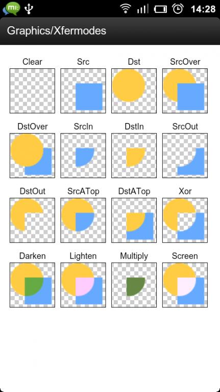

# Webview

[TOC]

# 圆角

webview作为一个特殊的view，其内容是由内部的网页内容所决定的，所以它的圆角展示与否直接受到其内容的影响，现在总结一下网上流传的几个webview圆角方案

## Drawable方案

一种常见的给view设置圆角的方案，是设置一个带圆角的shape Drawable，这种方案的好处是简单易懂，不需要修改java代码，但是给webview其实并**不能生效**，尤其是webview的背景色不确定时

```xml
<RelativeLayout
                android:layout_width="match_parent"
                android:layout_height="match_parent"
                android:padding="3dp" // 关键
                android:background="@drawable/webview_bg"> // 带圆角的一个shape
    <WebView
             android:layout_width="match_parent"
             android:layout_height="match_parent"/>
</RelativeLayout>
```

```xml
<?xml version="1.0" encoding="utf-8"?>
<shape xmlns:android="http://schemas.android.com/apk/res/android">
    <corners android:radius="10dp" />
    <solid android:color="#ffffff" />
</shape>
```

## PorterDuffXfermode遮罩方案

这种方案利用了Android提供的DstOut遮罩方案，改变canvas轮廓，只对当前绘制的操作有效，目前来说是



```java
public class CircleWebview {
    public CircleWebview(Context context) {
        this(context, null);
    }
    public CircleWebview(Context context, AttributeSet attrs) {
        this(context, attrs, 0);
    }

    public CircleWebview(Context context, AttributeSet attrs, int defStyleAttr) {
        super(context, attrs, defStyleAttr);
        init(context);
    }

    private float vRadius=4;
    private int vWidth;
    private int vHeight;
    private int x;
    private int y;
    private Paint paint1;
    private Paint paint2;

    private void init(Context context) {
        paint1 = new Paint();
        paint1.setColor(Color.WHITE);
        paint1.setAntiAlias(true);
        paint1.setXfermode(new PorterDuffXfermode(PorterDuff.Mode.DST_OUT));
        paint2 = new Paint();
        paint2.setXfermode(null);
    }

    public void setRadius(float radius) {
        vRadius = radius;
    }

    @Override
    protected void onMeasure(int widthMeasureSpec, int heightMeasureSpec) {
        super.onMeasure(widthMeasureSpec, heightMeasureSpec);
        vWidth = getMeasuredWidth();
        vHeight = getMeasuredHeight();
    }

    @Override
    public void draw(Canvas canvas) {
        canvas.saveLayer(new RectF(0, 0, canvas.getWidth(), canvas.getHeight()), paint2,Canvas.ALL_SAVE_FLAG);
        super.draw(canvas);
        drawLeftUp(canvas);
        drawLeftDown(canvas);
        drawRightUp(canvas);
        drawRightDown(canvas);
        canvas.restore();
    }

    private void drawLeftUp(Canvas canvas) {
        Path path = new Path();
        path.moveTo(x, vRadius);
        path.lineTo(x, y);
        path.lineTo(vRadius, y);
        path.arcTo(new RectF(x, y, x + vRadius * 2, y + vRadius * 2), -90, -90);
        path.close();
        canvas.drawPath(path, paint1);
    }


    private void drawLeftDown(Canvas canvas) {
        Path path = new Path();
        path.moveTo(x, y + vHeight - vRadius);
        path.lineTo(x, y + vHeight);
        path.lineTo(x + vRadius, y + vHeight);
        path.arcTo(new RectF(x, y + vHeight - vRadius * 2,
                             x + vRadius * 2, y + vHeight), 90, 90);
        path.close();
        canvas.drawPath(path, paint1);
    }


    private void drawRightDown(Canvas canvas) {
        Path path = new Path();
        path.moveTo(x + vWidth - vRadius, y + vHeight);
        path.lineTo(x + vWidth, y + vHeight);
        path.lineTo(x + vWidth, y + vHeight - vRadius);
        path.arcTo(new RectF(x + vWidth - vRadius * 2, y + vHeight
                             - vRadius * 2, x + vWidth, y + vHeight), 0, 90);
        path.close();
        canvas.drawPath(path, paint1);
    }


    private void drawRightUp(Canvas canvas) {
        Path path = new Path();
        path.moveTo(x + vWidth, y + vRadius);
        path.lineTo(x + vWidth, y);
        path.lineTo(x + vWidth - vRadius, y);
        path.arcTo(new RectF(x + vWidth - vRadius * 2, y, x + vWidth,
                             y + vRadius * 2), -90, 90);
        path.close();
        canvas.drawPath(path, paint1);
    }
}
```

## 剪切方案

对canvas进行剪切以改变轮廓，相比遮罩方案代码量更少，更清晰简洁，但是由于**cavas.clipPath不支持硬件加速**，存在兼容性问题，在某些机型上存在花屏，闪屏的问题

```java
public class CornersWebView extends WebView {
    private float top_left = 0;
    private float top_right = 0;
    private float bottom_left = 0;
    private float bottom_right = 0;
    private int vWidth;
    private int vHeight;
    private int x;
    private int y;
    private Paint paint1;
    private Paint paint2;

    private float[] radiusArray = {0f, 0f, 0f, 0f, 0f, 0f, 0f, 0f};


    public CornersWebView(Context context, AttributeSet attrs) {
        super(context, attrs);
        init(context, attrs);
    }

    public CornersWebView(Context context, AttributeSet attrs, int defStyle) {
        super(context, attrs, defStyle);
        init(context, attrs);
    }

    private void init(Context context, AttributeSet attrs) {
        paint1 = new Paint();
        paint1.setColor(Color.WHITE);
        paint1.setAntiAlias(true);
        paint1.setXfermode(new PorterDuffXfermode(PorterDuff.Mode.DST_OUT));

        paint2 = new Paint();
        paint2.setXfermode(null);

        final TypedArray a = context.obtainStyledAttributes(attrs, R.styleable.cornersWebView); // 读取xml styleable，attrs是xml属性的集合

        top_left = a.getDimension(R.styleable.cornersWebView_top_left, 0);
        top_right = a.getDimension(R.styleable.cornersWebView_top_right, 0);
        bottom_left = a.getDimension(R.styleable.cornersWebView_bottom_left, 0);
        bottom_right = a.getDimension(R.styleable.cornersWebView_bottom_right, 0);

        setRadius(top_left, top_right, bottom_right, bottom_left);
    }

    /**
     * 设置四个角的圆角半径
     */
    public void setRadius(float leftTop, float rightTop, float rightBottom, float leftBottom) {
        radiusArray[0] = leftTop;
        radiusArray[1] = leftTop;
        radiusArray[2] = rightTop;
        radiusArray[3] = rightTop;
        radiusArray[4] = rightBottom;
        radiusArray[5] = rightBottom;
        radiusArray[6] = leftBottom;
        radiusArray[7] = leftBottom;
    }

    @Override
    protected void onMeasure(int widthMeasureSpec, int heightMeasureSpec) {
        super.onMeasure(widthMeasureSpec, heightMeasureSpec);
        vWidth = getMeasuredWidth();
        vHeight = getMeasuredHeight();
    }


    @Override
    public void onDraw(Canvas canvas) {
        x = this.getScrollX();
        y = this.getScrollY();
        Path path = new Path();
        path.addRoundRect(new RectF(0, y, x + vWidth, y + vHeight), radiusArray, Path.Direction.CW);        // 使用半角的方式，性能比较好
        canvas.clipPath(path);
        super.onDraw(canvas);
    }
}
```

# 监听回调问题

WebviewClient的有这么几个回调函数，可以注册并监听加载状态，以下以一份示例代码说明

```java
public class MyWebView extends WebViewClient {
    private boolean isLoadStarted = false;
    private boolean isLoadFinished = false;
    private boolean isLoadError = false;

    @Override
    public void onPageStarted() {
        isLoadStarted = true;
    }

    @Override
    public void onPageFinished() {
        // 可能被调用多次，无论加载成功与否，不可靠，不能仅仅依据isLoadFinished判断是否加载成功
        if (isLoadStarted) {
            
        }
        isLoadFinished = true;
    }

    /**
     * 6.0以下会调用
     */
    @Override
    public void onPageReceivedError(int errorCode) {
        isLoadError = true;
    }

    /**
     * 6.0及以上调用
     * 凡是有404就会被调用，误报率高
     */
    @TargetApi(android.os.Build.VERSION_CODES.M)
    @Override
    public void onReceivedHttpError(WebResourceResponse errorResponse) {
        isLoadError = true;
    }
    
    public boolean isHasPageLoadSuccess() {
        return isLoadFinished && !isLoadError;
    }
}
```

# Css注入

```java
WebView webView;

@Override
protected void onCreate(Bundle savedInstanceState) {
    super.onCreate(savedInstanceState);

    webView = new WebView(this);
    setContentView(webView);

    // Enable Javascript
    webView.getSettings().setJavaScriptEnabled(true);

    // Add a WebViewClient
    webView.setWebViewClient(new WebViewClient() {
        @Override
        public void onPageFinished(WebView view, String url) {

            // Inject CSS when page is done loading
            injectCSS();
            super.onPageFinished(view, url);
        }
    });

    // Load a webpage
    webView.loadUrl("https://www.google.com");
}

// Inject CSS method: read style.css from assets folder
// Append stylesheet to document head
private void injectCSS() {
    try {
        InputStream inputStream = getAssets().open("style.css");
        byte[] buffer = new byte[inputStream.available()];
        inputStream.read(buffer);
        inputStream.close();
        String encoded = Base64.encodeToString(buffer, Base64.NO_WRAP);
        webView.loadUrl("javascript:(function() {" +
                        "var parent = document.getElementsByTagName('head').item(0);" +
                        "var style = document.createElement('style');" +
                        "style.type = 'text/css';" +
                        // Tell the browser to BASE64-decode the string into your script !!!
                        "style.innerHTML = window.atob('" + encoded + "');" +
                        "parent.appendChild(style)" +
                        "})()");
    } catch (Exception e) {
        e.printStackTrace();
    }
}
```

[inject CSS to a site with webview in android](https://stackoverflow.com/questions/30018540/inject-css-to-a-site-with-webview-in-android)

# 硬件加速兼容问题

WebView在硬件加速状态下可能出现一些兼容性问题，可能包括：白屏、黑屏、花屏等现象，可以通过关闭硬件加速解决

1. 可以在xml中设置`android:layerType="software"`，不推荐
2. 在代码中设置`webView.setLayerType(View.LAYER_TYPE_SOFTWARE, null)`

## 设置大小问题

需要在webview执行loadUrl前设置大小，否则可能会出现截断