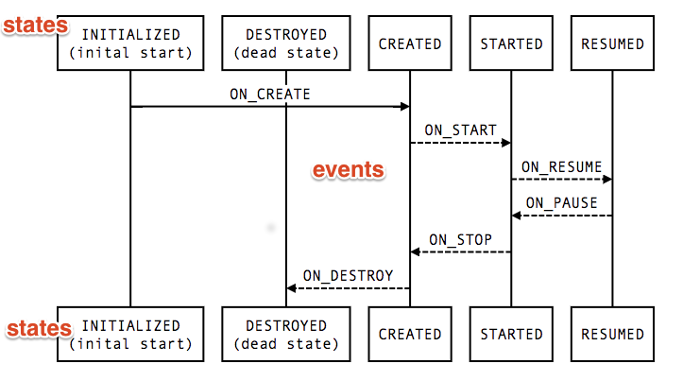
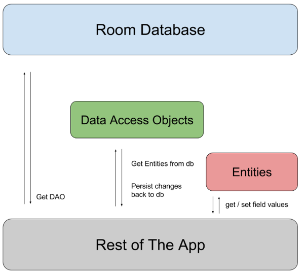
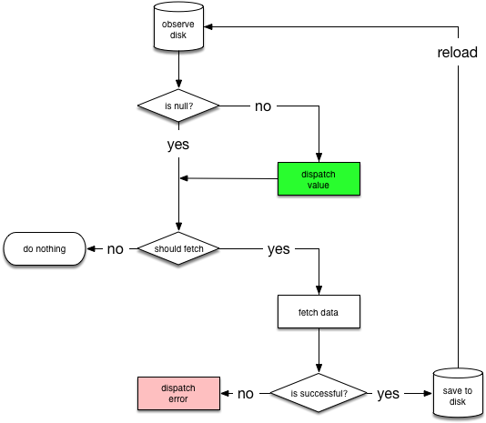
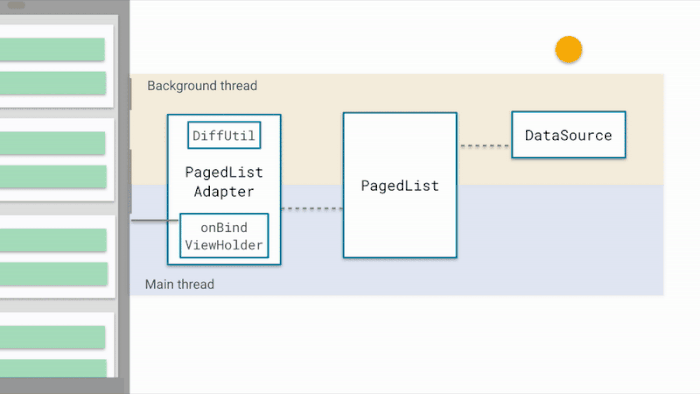

# Android Architecture Components

[TOC]

# 概念

## 作用

针对**不能在系统组件（例如Activity）中保存App 的数据和状态**并且这些系统组件间也不能出现相互依赖的状况

* 传统保存恢复数据
  * `onSaveInstanceState()`保存数据
  * `onCreate()`或`onRestoreInstanceState`恢复数据
* LifeCycle方式
  * LifeCycle可以管理组件（如Activity或Fragment）的生命周期，并且允许其他示例去观测状态
  * 当 LiveData 所持有的数据改变时，它会通知相应的界面代码进行更新，不用手动控制生命周期，不会产生内存泄漏
  * ViewModel将视图的数据和逻辑从具有生命周期特性的实体（如 Activity 和 Fragment）中剥离开来

## 设计App架构的原则

* Soc，即[Separation of concerns 分离关注点原则](https://link.jianshu.com/?t=https://en.wikipedia.org/wiki/Separation_of_concerns)，模块化，低耦合，尽量少对外暴露方法

* Model驱动UI，最好是持久化数据

  > 持久化数据可以防止数据丢失，提高App稳定性

* UI组件（包括Manifest中定义的组件）考虑到其短暂的生命周期，不应作为数据来源，应从ViewModel中获取LiveData形式的数据


## 配置

```groovy
dependencies {
    def lifecycle_version = "1.1.1"
    implementation "android.arch.lifecycle:extensions:$lifecycle_version"
}
```

# LifeCycle

## 概念

- 为其他类提供生命周期监控
- 使用Event事件监听生命周期状态改变
- 使用State表示当前生命周期状态



## LifecycleObserver

实现LifeCycleObserver，使用`OnLifecycleEvent(LifeCycle.Event.ON_START/RESUME/STOP...)`注解来在对应的生命周期内执行操作

```java
/**
 * Marks a class as a LifecycleObserver. It does not have any methods, instead, relies on
 * {@link OnLifecycleEvent} annotated methods.
 * <p>
 * @see Lifecycle Lifecycle - for samples and usage patterns.
 */
@SuppressWarnings("WeakerAccess")
public interface LifecycleObserver {}
```

## Demo

假设需要在activity中监听位置

```java
// 监听位置接口，实现LifecycleObserver
class MyLocationListener implements LifecycleObserver {
    private boolean enabled = false;
    private Lifecycle lifecycle;
    public MyLocationListener(Context context, Lifecycle lifecycle, Callback callback) {
        this.lifecycle = lifecycle;
        // ...
    }

    @OnLifecycleEvent(Lifecycle.Event.ON_START)
    void start() {
        if (enabled) {
            // connect
        }
    }

    public void enable() {
        enabled = true;
        if (lifecycle.getState().isAtLeast(STARTED)) {
            // connect if not connected
        }
    }

    @OnLifecycleEvent(Lifecycle.Event.ON_STOP)
    void stop() {
        // disconnect if connected
    }
}

// 在Activity中
class MyActivity extends AppCompatActivity {
    private MyLocationListener myLocationListener;

    public void onCreate(...) {
        myLocationListener = new MyLocationListener(this, getLifecycle(), location -> {
            // update UI
        });
        Util.checkUserStatus(result -> {
            if (result) {
                myLocationListener.enable();
            }
        });
    }
}
```

# LiveData和ViewModel

## LiveData

### 概念

- UI和实时数据保持一致 因为LiveData采用的是观察者模式，这样一来就可以在数据发生改变时获得通知，更新UI
- 可感知实现了LifeCycleOwner的组件生命周期，默认AppCompatActivity和Fragment都实现了LifecycleOwner接口
- 只有当组件处于**STARTED**或**RESUMED**状态时，LiveData的数据更新会同时更新组件的UI
- 解决Configuration Change问题 在屏幕发生旋转或者被回收再次启动，立刻就能收到最新的数据
- 通常存储在ViewModel中

### 观察数据

```java
/**
     * Adds the given observer to the observers list within the lifespan of the given
     * owner. The events are dispatched on the main thread. If LiveData already has data
     * set, it will be delivered to the observer.
     * <p>
     * The observer will only receive events if the owner is in {@link Lifecycle.State#STARTED}
     * or {@link Lifecycle.State#RESUMED} state (active).
     * <p>
     * If the owner moves to the {@link Lifecycle.State#DESTROYED} state, the observer will
     * automatically be removed.
     * <p>
     * When data changes while the {@code owner} is not active, it will not receive any updates.
     * If it becomes active again, it will receive the last available data automatically.
     * <p>
     * LiveData keeps a strong reference to the observer and the owner as long as the
     * given LifecycleOwner is not destroyed. When it is destroyed, LiveData removes references to
     * the observer &amp; the owner.
     * <p>
     * If the given owner is already in {@link Lifecycle.State#DESTROYED} state, LiveData
     * ignores the call.
     * <p>
     * If the given owner, observer tuple is already in the list, the call is ignored.
     * If the observer is already in the list with another owner, LiveData throws an
     * {@link IllegalArgumentException}.
     *
     * @param owner    The LifecycleOwner which controls the observer
     * @param observer The observer that will receive the events
     */
@MainThread
public void observe(@NonNull LifecycleOwner owner, @NonNull Observer<T> observer);

/**
     * Returns the current value.
     * Note that calling this method on a background thread does not guarantee that the latest
     * value set will be received.
     *
     * @return the current value
     */
@Nullable
public T getValue();
```

### 更新数据

```java

/**
     * Posts a task to a main thread to set the given value. So if you have a following code
     * executed in the main thread:
     * <pre class="prettyprint">
     * liveData.postValue("a");
     * liveData.setValue("b");
     * </pre>
     * The value "b" would be set at first and later the main thread would override it with
     * the value "a".
     * <p>
     * If you called this method multiple times before a main thread executed a posted task, only
     * the last value would be dispatched.
     *
     * @param value The new value
     */
protected void postValue(T value);

/**
     * Sets the value. If there are active observers, the value will be dispatched to them.
     * <p>
     * This method must be called from the main thread. If you need set a value from a background
     * thread, you can use {@link #postValue(Object)}
     *
     * @param value The new value
     */
@MainThread
protected void setValue(T value);
```

### MutableLiveData

相比原生的LiveData，MutableLiveData暴露了set和post接口，方便修改数据

```java
/**
 * {@link LiveData} which publicly exposes {@link #setValue(T)} and {@link #postValue(T)} method.
 *
 * @param <T> The type of data hold by this instance
 */
@SuppressWarnings("WeakerAccess")
public class MutableLiveData<T> extends LiveData<T> {
    @Override
    public void postValue(T value) {
        super.postValue(value);
    }

    @Override
    public void setValue(T value) {
        super.setValue(value);
    }
}
```

### Transformations——数据转换

有时需要的并不是LiveData的原始值，而是转换后的某种值，这时就需要使用Tranformations工具

```java
LiveData<User> userLiveData = ...;
LiveData<String> userName = Transformations.map(userLiveData, user -> {
    user.name + " " + user.lastName
});
```

### 扩展LiveData

onActive和onInactive分别代表了处于活跃和不活跃状态的回调

```java
/**
     * Called when the number of active observers change to 1 from 0.
     * <p>
     * This callback can be used to know that this LiveData is being used thus should be kept
     * up to date.
     */
protected void onActive();
/**
     * Called when the number of active observers change from 1 to 0.
     * <p>
     * This does not mean that there are no observers left, there may still be observers but their
     * lifecycle states aren't {@link Lifecycle.State#STARTED} or {@link Lifecycle.State#RESUMED}
     * (like an Activity in the back stack).
     * <p>
     * You can check if there are observers via {@link #hasObservers()}.
     */
protected void onInactive();
```

### MediatorLiveData

MediatorLiveData可以用于合并多个LiveData，统一管理UI更新

```java
/**
 * {@link LiveData} subclass which may observer other {@code LiveData} objects and react on
 * {@code OnChanged} events from them.
 * <p>
 * This class correctly propagates its active/inactive states down to source {@code LiveData}
 * objects.
 *
 * @param <T> The type of data hold by this instance
 */
@SuppressWarnings("WeakerAccess")
public class MediatorLiveData<T> extends MutableLiveData<T>;
```

## ViewModel

### 概念

- 用于存储和管理UI相关的数据
- 不会因为组件生命周期变化丢失数据

### 生命周期


## Demo

假设需要在一个页面上显示用户列表信息，每个用户都是一个User类

```java
public class User {
	int name;
}
```

现在定义一个ViewModel用于保存这些User

```java
public class MyViewModel extends ViewModel {
    // 将users存储在ViewModel中
    private MutableLiveData<List<User>> users;
    
    // 获取User
    public LiveData<List<User>> getUsers() {
        if (users == null) {
            users = new MutableLiveData<List<User>>();
            loadUsers(); // 加载用户列表
        }
        return users;
    }
}
```

在Activity中更新UI

- 第一次创建ViewModel时会调用activity的`onCreate`，之后activity重新创建时会接收到相同的ViewModel，不会重新创建
- 注意**不能在ViewModel中持有View层的引用，否则会引发内存泄漏**
- 没有必要去手动解注册LiveData，因为LiveData可以感知组件的生命周期，在`onStart`时开始通知回调，在`onStop`时自动停止回调，在`onDestroy`时自动解除注册

```java
public class MyActivity extends AppCompatActivity {
    public void onCreate(Bundle savedInstanceState) {
        MyViewModel model = ViewModelProviders.of(this).get(MyViewModel.class);
        model.getUsers().observe(this, users -> {
            // 更新UI
        });
    }
}
```

# Room

## 概念

- ORM结构
- 提供编译时SQL检查
- 数据库内容改变时通过LiveData发出通知



## Entity

### 标准Entity

```java
@Entity
class User {
    @PrimaryKey
    private int id;
    
    @ColumnInfo(name="first_name")
    private String firstName;
    
    @ColumnInfo(name="last_name")
    private String lastName;
    
    // 不需要被存放到数据库中
    @Ignore
    Bitmap picture;
    
    // getters and setters for fields
}
```

### 联合主键

```java
@Entity(primaryKeys = {"firstName", "lastName"})
```

### 指定表名

```java
@Entity(tableName = "users")
```

### 建立索引

```java
@Entity(indices = {
    @Index("name"),
    @Index(value = {"last_name", "address"})
})
```

## Dao

数据库访问接口抽象层，默认不允许主线程中访问，除非在builder中调用`allowMainThreadQueries()`

### 标准Dao

```java
@Dao
public interface UserDao {
    // REPLACE表示替换，@Insert可以返回long数组，表示插入的rowId
    @Insert(onConflict = REPLACE)
    void insert(User user);
    
    // 带参数查询，默认 : + 参数名
    @Query("SELECT * FROM user WHERE id = :userId")
    LiveData<User> load(String userId);
    
    // 可以只查询特定元组
    @Query("SELECT first_name, last_name FROM user")
    public List<NameTuple> loadFullName();
    
    // 可以返回更新的rowId
    @Update
    public void updateUsers(User... users);
    
    // 可以返回删除的rowId
    @Delete
    void delete(User user);
}

public class NameTuple {
    @ColumnInfo(name="first_name")
    public String firstName;

    @ColumnInfo(name="last_name")
    public String lastName;
}
```

> load()返回的是LiveData，可以保证数据库内容改变时发出通知

### 多表查询返回POJO类

```java
@Dao
public interface MyDao {
   @Query("SELECT user.name AS userName, pet.name AS petName "
          + "FROM user, pet "
          + "WHERE user.id = pet.user_id")
   public LiveData<List<UserPet>> loadUserAndPetNames();

   // You can also define this class in a separate file, as long as you add the
   // "public" access modifier.
   static class UserPet {
       public String userName;
       public String petName;
   }
}
```

> POJO，Plain Old Java Object是一个简单的、正规Java对象，它包含业务逻辑处理或持久化逻辑等，但不是JavaBean、EntityBean等，不具有任何特殊角色和不继承或不实现任何其它Java框架的类或接口。

### 类型转换

可以转换类型，例如编写提供Date和Long相互转换的转换器，并应用到Dao中

```java
public class Converters {
    @TypeConverter
    public static Date fromTimestamp(Long value) {
        return value == null ? null : new Date(value);
    }

    @TypeConverter
    public static Long dateToTimestamp(Date date) {
        return date == null ? null : date.getTime();
    }
}

@Database(entities = {User.class}, version = 1)
@TypeConverters({Converters.class})
public abstract class AppDatabase extends RoomDatabase {
    public abstract UserDao userDao();
}

@Dao
public interface UserDao {
    @Query("SELECT * FROM user WHERE birthday BETWEEN :from AND :to")
    List<User> findUsersBornBetweenDates(Date from, Date to);
}
```

### 创建RoomDatabase并关联dao

```java
@Database(entities = {User.class}, version = 1)
public abstract class MyDatabase extends RoomDatabase {
    public abstract UserDao userDao();
}
```

```java
MyDatabase db = Room.databaseBuilder(getApplicationContext(), MyDatabase.class, "database-name").build();
```

其他关于Room参见[Save data in a local database using Room](https://developer.android.com/training/data-storage/room/)

# 数据来源设计

## 问题来源

理论上不要在ViewModel中获取数据，因为

* 违反soc原则，ViewModel应只负责与View的数据交互，不应涉及到数据库或者网络交互
* ViewModel在View生命周期结束后也会释放资源，不适合长期存储数据

所以需要解决以下问题

* 数据存储逻辑：提供网络获取+持久化存储，保证数据正确高效存储
* 数据获取逻辑：单独设计数据获取逻辑，并与ViewModel关联

## 网络请求设计



### 资源封装

创建Resource类，完善请求资源，

```java
//a generic class that describes a data with a status
public class Resource<T> {
    @NonNull public final Status status;
    @Nullable public final T data;
    @Nullable public final String message;
    private Resource(@NonNull Status status, @Nullable T data, @Nullable String message) {
        this.status = status;
        this.data = data;
        this.message = message;
    }

    // 请求成功
    public static <T> Resource<T> success(@NonNull T data) {
        return new Resource<>(SUCCESS, data, null);
    }

    // 请求失败
    public static <T> Resource<T> error(String msg, @Nullable T data) {
        return new Resource<>(ERROR, data, msg);
    }

    // 请求中
    public static <T> Resource<T> loading(@Nullable T data) {
        return new Resource<>(LOADING, data, null);
    }
}
```

### 请求过程接口

```java
// ResultType: Type for the Resource data
// RequestType: Type for the API response
public abstract class NetworkBoundResource<ResultType, RequestType> {
    // Called to save the result of the API response into the database(存储网络请求返回的数据)
    @WorkerThread
    protected abstract void saveCallResult(@NonNull RequestType item);

    // Called with the data in the database to decide whether it should be
    // fetched from the network.（根据数据库检索的结果决定是否需要从网络获取数据）
    @MainThread
    protected abstract boolean shouldFetch(@Nullable ResultType data);

    // Called to get the cached data from the database（从数据中获取数据）
    @NonNull @MainThread
    protected abstract LiveData<ResultType> loadFromDb();

    // Called to create the API call.（创建API）
    @NonNull @MainThread
    protected abstract LiveData<ApiResponse<RequestType>> createCall();

    // Called when the fetch fails. The child class may want to reset components
    // like rate limiter.（获取数据失败回调）
    @MainThread
    protected void onFetchFailed() {
    }

    // returns a LiveData that represents the resource, implemented
    // in the base class.（获取LiveData形式的数据）
    public final LiveData<Resource<ResultType>> getAsLiveData() {
        return result;
    }

    private final MediatorLiveData<Resource<ResultType>> result 
        = new MediatorLiveData<>();

    @MainThread
    NetworkBoundResource() {
        result.setValue(Resource.loading(null));
        LiveData<ResultType> dbSource = loadFromDb();
        result.addSource(dbSource, data -> {
            result.removeSource(dbSource);
            if (shouldFetch(data)) {
                fetchFromNetwork(dbSource);
            } else {
                result.addSource(dbSource,
                                 newData -> result.setValue(Resource.success(newData)));
            }
        });
    }

    private void fetchFromNetwork(final LiveData<ResultType> dbSource) {
        LiveData<ApiResponse<RequestType>> apiResponse = createCall();
        // we re-attach dbSource as a new source,
        // it will dispatch its latest value quickly
        result.addSource(dbSource,
                         newData -> result.setValue(Resource.loading(newData)));
        result.addSource(apiResponse, response -> {
            result.removeSource(apiResponse);
            result.removeSource(dbSource);
            //noinspection ConstantConditions
            if (response.isSuccessful()) {
                saveResultAndReInit(response);
            } else {
                onFetchFailed();
                result.addSource(dbSource,
                                 newData -> result.setValue(
                                     Resource.error(response.errorMessage, newData)));
            }
        });
    }

    @MainThread
    private void saveResultAndReInit(ApiResponse<RequestType> response) {
        new AsyncTask<Void, Void, Void>() {

            @Override
            protected Void doInBackground(Void... voids) {
                saveCallResult(response.body);
                return null;
            }

            @Override
            protected void onPostExecute(Void aVoid) {
                // we specially request a new live data,
                // otherwise we will get immediately last cached value,
                // which may not be updated with latest results received from network.
                result.addSource(loadFromDb(),
                                 newData -> result.setValue(Resource.success(newData)));
            }
        }.execute();
    }
}
```

## Repository——数据获取逻辑

### 设计Repository并关联Dao

```java
public interface Webservice {
    @GET("/users/{user}")
    Call<User> getUser(@Path("user") String userId);
}

class UserRepository {
    Webservice webservice;
    UserDao userDao;

    public LiveData<Resource<User>> loadUser(final String userId) {
        return new NetworkBoundResource<User,User>() {
            @Override
            protected void saveCallResult(@NonNull User item) {
                userDao.insert(item);
            }

            @Override
            protected boolean shouldFetch(@Nullable User data) {
                return rateLimiter.canFetch(userId) && (data == null || !isFresh(data));
            }

            @NonNull @Override
            protected LiveData<User> loadFromDb() {
                return userDao.load(userId);
            }

            @NonNull @Override
            protected LiveData<ApiResponse<User>> createCall() {
                return webservice.getUser(userId);
            }
        }.getAsLiveData();
    }
}
```

### 连接ViewModel与Repository

使用Dagger2和`UserRepository`来提供数据来源

```java
public class UserProfileViewModel extends ViewModel {
    private LiveData<User> user;
    private UserRepository userRepo;

    @Inject // UserRepository parameter is provided by Dagger 2
    public UserProfileViewModel(UserRepository userRepo) {
        this.userRepo = userRepo;
    }

    public void init(String userId) {
        if (this.user != null) {
            // ViewModel is created per Fragment so
            // we know the userId won't change
            return;
        }
        user = userRepo.getUser(userId);
    }

    public LiveData<User> getUser() {
        return this.user;
    }
}
```

关于Dagger2和@Inject注解请参考[从实例出发理解Dagger2（七）](https://www.jianshu.com/p/e7901302461e)

# Paging Library

## 概念

* 用于逐步从数据源加载信息
* 相比CursorAdapter和AsyncListUtil，没有采用低效的Cursor，同时提供了不基于位置的查询

## 结构



## DataSource

### 概念

* 用于装载数据到PagedList中的增量数据加载器
* PagedList会随着数据量的装载量增长且不能修改，如果需要修改数据，需要创建新的PagedList/DataSource对

### 分类

* ItemKeyedDataSource

  * 需要利用item N-1加载item N时使用
  * 例如，在排序的数据库查询中，当前一个item的属性决定了如何执行下一个查询

* PageKeyedDataSource

  * 需要利用page N-1中的数据加载page N时使用
  * 例如，在网络API中，包含了前一页和后一页的链接或key

* PositionalDataSource

  * 需要可计算固定大小数据池，并且支持任意位置查询指定页大小时使用

  * Room提供了针对PositionalDataSources的Factory支持

    ```java
    @Dao
    interface UserDao {
        @Query("SELECT * FROM user ORDER BY mAge DESC")
        public abstract DataSource.Factory<Integer, User> loadUsersByAgeDesc();
    }
    ```

### DataSource.Factory

* 用于生成DataSource\<Key, Value>

* 可以配合Room使用

  ```java
  @Dao
  interface UserDao {
      @Query("SELECT * FROM user ORDER BY lastName ASC")
      public abstract DataSource.Factory<Integer, User> usersByLastName();
  }
  ```

## PagedList

* 用于从DataSource中读取数据
* 在后台线程加载数据，在主线程展示
* 通过PagedListAdapter关联到RecyclerView

### PagedListAdapter

* 继承自RecyclerView.Adapter
* 用于在RecyclerView中展示PagedList
* 需要传入DiffUtils.ItemCallback\<T>，判断数据改变
* 可以使用LiveData\<PagedList>通知adapter数据改变，使用`submitList(PagedList)`

##  LivePagedListBuilder

* 从数据源中产生LiveData\<PagedList>

## Demo

```java
@Dao
interface UserDao {
    @Query("SELECT * FROM user ORDER BY lastName ASC")
    public abstract DataSource.Factory<Integer, User> usersByLastName();
}

class MyViewModel extends ViewModel {
    public final LiveData<PagedList<User>> usersList;
    public MyViewModel(UserDao userDao) {
        usersList = new LivePagedListBuilder<>(
            userDao.usersByLastName(), /* page size */ 20)
            .build();
    }
}

class MyActivity extends AppCompatActivity {
    @Override
    public void onCreate(Bundle savedState) {
        super.onCreate(savedState);
        MyViewModel viewModel = ViewModelProviders.of(this).get(MyViewModel.class);
        RecyclerView recyclerView = findViewById(R.id.user_list);
        UserAdapter<User> adapter = new UserAdapter();
        viewModel.usersList.observe(this, pagedList -> adapter.submitList(pagedList));
        recyclerView.setAdapter(adapter);
    }
}

class UserAdapter extends PagedListAdapter<User, UserViewHolder> {
    public UserAdapter() {
        super(DIFF_CALLBACK);
    }
    @Override
    public void onBindViewHolder(UserViewHolder holder, int position) {
        User user = getItem(position);
        if (user != null) {
            holder.bindTo(user);
        } else {
            // Null defines a placeholder item - PagedListAdapter will automatically invalidate
            // this row when the actual object is loaded from the database
            holder.clear();
        }
    }
    public static final DiffUtil.ItemCallback<User> DIFF_CALLBACK =
        new DiffUtil.ItemCallback<User>() {
        @Override
        public boolean areItemsTheSame(
            @NonNull User oldUser, @NonNull User newUser) {
            // User properties may have changed if reloaded from the DB, but ID is fixed
            return oldUser.getId() == newUser.getId();
        }
        @Override
        public boolean areContentsTheSame(
            @NonNull User oldUser, @NonNull User newUser) {
            // NOTE: if you use equals, your object must properly override Object#equals()
            // Incorrectly returning false here will result in too many animations.
            return oldUser.equals(newUser);
        }
    }
}
```


# 参考

[Google官方文档Android Architecture Components](https://developer.android.com/topic/libraries/architecture/)

[Guide to App Architecture](https://developer.android.com/jetpack/docs/guide)

[理解Android Architecture Components系列](https://www.jianshu.com/p/42eb71ec4a19)

[感受LiveData 与 ViewModel结合之美](https://blog.csdn.net/qq_17766199/article/details/80732836)