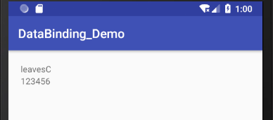

[TOC]

# DataBinding

参考

[Data Binding Library | Android Developers](https://developer.android.com/topic/libraries/data-binding/)

[Android DataBinding 从入门到进阶](https://www.jianshu.com/p/bd9016418af2)

[[译文] 我不使用Android Data Binding的四个理由](http://mafei.me/2016/08/14/%E8%AF%91%E6%96%87-%E6%88%91%E4%B8%8D%E4%BD%BF%E7%94%A8Android-Data-Binding%E7%9A%84%E5%9B%9B%E4%B8%AA%E7%90%86%E7%94%B1/)

[MVVM 和 Android Data Binding](https://www.jianshu.com/p/2047db8df2c7)

## 概念

* Google发布的数据绑定框架，可以单项或双向绑定到layout

* 面向MVVM，省去 findViewById() ，大量减少 Activity 内的代码

  > MVVM 代表的是 Model-View-ViewModel。MVVM 模式将 Presenter 改名为 ViewModel，基本上与 MVP 模式完全一致，唯一区别在于 ViewModel 将密切关联的 Model 和 View 的逻辑单独提取出来，用数据绑定将他们关联到一起。Model 的改变会通过 ViewModel 来映射到 View 上，反之亦然。数据绑定你可以认为是 Observer 模式或者是 Publish/Subscribe 模式，原理都是为了用一种统一的集中的方式实现频繁需要被实现的数据更新问题。
  >
  > 

* 自动检测空指针，避免内存泄漏

* 在build.gradle中启用

  ```groovy
  android {
      dataBinding {
          enabled = true
      }
  }
  ```

## 基本使用

### 声明Model

```java
public class User {
    private String name;
    private String password;
    // get和set方法定义
}
```

> 必须定义get和set，否则会导致layout无法访问Model

### 转换布局

option + Enter转换layout


转换后的格式是使用layout包裹原布局，data标签用于声明变量和变量类型

```xml
<?xml version="1.0" encoding="utf-8"?>
<layout xmlns:android="http://schemas.android.com/apk/res/android"
        xmlns:app="http://schemas.android.com/apk/res-auto"
        xmlns:tools="http://schemas.android.com/tools">

    <data>
        <variable
                  name="userInfo"
                  type="com.leavesc.databinding_demo.model.User" />
    </data>

    <android.support.constraint.ConstraintLayout
                                                 android:layout_width="match_parent"
                                                 android:layout_height="match_parent"
                                                 tools:context=".MainActivity">
        <TextView
                  android:id="@+id/tv_userName"
                  android:text="@{userInfo.name}" />

        <TextView
                  android:text="@{userInfo.password}" />

    </android.support.constraint.ConstraintLayout>
</layout>
```

> 启用databinding后，需要将所有的布局都改为databinding布局，否则会报错

### 绑定数据

每个数据绑定布局文件都会生成一个绑定类，**ViewDataBinding** 的实例名是根据布局文件名来生成，将之改为首字母大写的驼峰命名法来命名，并省略布局文件名包含的下划线。控件的获取方式类似，但首字母小写

> ViewDataBinding的类不是实时生成的

```java
private User user;

@Override
protected void onCreate(Bundle savedInstanceState) {
    super.onCreate(savedInstanceState);
    ActivityMain2Binding activityMain2Binding = DataBindingUtil.setContentView(this, R.layout.activity_main2);
    user = new User("leavesC", "123456");
    activityMain2Binding.setUserInfo(user);
}
```



### 别名设置

可以使用alias指定别名，解决同名类的引用问题

```xml
<data>
    <import type="com.leavesc.databinding_demo.model.User" />
    <import
            alias="TempUser"
            type="com.leavesc.databinding_demo.model2.User" />
    <variable
              name="userInfo"
              type="User" />
    <variable
              name="tempUserInfo"
              type="TempUser" />
</data>
```

### 指定默认值

```xml
android:text="@{userInfo.name,default=defaultValue}"
```

### 根据id获取控件

```java
activityMain2Binding.tvUserName.setText("leavesC");
```

### 指定ViewDataBinding实例名

```xml
<data class="CustomBinding">
</data>
```

### 在Fragment或RecyclerView中使用

```java
@Override
public View onCreateView(@NonNull LayoutInflater inflater, ViewGroup container, Bundle savedInstanceState) {
    FragmentBlankBinding fragmentBlankBinding = DataBindingUtil.inflate(inflater, R.layout.fragment_blank, container, false);
    fragmentBlankBinding.setHint("Hello");
    return fragmentBlankBinding.getRoot();
}
```

## 单向数据绑定

实现数据变化自动驱动 UI 刷新

### BaseObservable

* notifyChange()：会刷新所有的值域
* notifyPropertyChanged()：只更新对应 BR 的 flag，该 BR 的生成通过注释 @Bindable 生成
  * 如果是 public 修饰符，则可以直接在成员变量上方加上 @Bindable 注解
  * 如果是 private 修饰符，则在成员变量的 get 方法上添加 @Bindable 注解
* OnPropertyChangedCallback()：允许注册一个监听器，当可观察对象的属性更改时就会通知这个监听器

### ObservableField

官方对 BaseObservable 中字段的注解和刷新等操作的封装

* 基本数据类型：ObservableBoolean、ObservableByte、ObservableChar等
* 其他类型： ObservableField\<T\> 泛型

### ObservableCollection

提供了包装类用于替代原生的 `List` 和 `Map`，分别是 `ObservableList` 和 `ObservableMap`,当其包含的数据发生变化时，绑定的视图也会随之进行刷新

## 双向数据绑定

当数据改变时同时使视图刷新，而视图改变时也可以同时改变数据

绑定变量的方式比单向绑定多了一个等号：`android:text="@={goods.name}"`

## 事件绑定

### 可以绑定的回调事件

包括且不限于以下事件

- android:onClick
- android:onLongClick
- android:afterTextChanged
- android:onTextChanged

### 方法引用的方式

* 保持事件回调方法的签名一致
  * 方法名可以不一样，但方法参数和返回值必须和原始的回调函数保持一致
  * 例如`@{userPresenter.afterTextChanged}`
* 不遵循默认签名的函数
  * 可以使用方法引用 **::** 的形式来进行事件绑定，也可以使用lambda表达式
  * 例如`@{()->userPresenter.onUserNameClick(userInfo)}`

## BindingAdapter

支持对数据进行转换，或者进行类型转换

例如将布局文件中所有以`@{String}`方式引用到的`String`类型变量加上后缀`-conversionString`

```java
@BindingConversion
public static String conversionString(String text) {
    return text + "-conversionString";
}
```

## 其他方面

* 支持大部分Java运算符，不支持this，super，new和显式泛型调用
* 支持`<include>`标签和ViewStub
* 支持使用类静态方法，与绑定事件类似，可以使用lambda表达式
* 支持对尺寸和字符串这类资源的访问
* 支持在布局文件中使用 Array、List、Set 和 Map等，使用时需要尖括号需要的转义字符，例如`List<String>`需要变为`List&lt;String&gt`

## 评价

### 优势

* 不使用findViewById()，减少了反射调用，提高了性能

* 更快速轻量，不需要引入第三方库，可以减少方法数
* 更简单地实现MVVM模式

### 劣势

* 扩展性很差，目前来说可定义的内容不如ButterKnife多
* 业务逻辑应该写在代码中而不是在layout中
* 单元测试不能使用，layout改变时无法确定View的数据正确性