Flutter

[TOC]

# 简介

## 框架介绍

* 同一套代码同时运行在Android和iOS系统上

* 渲染引擎依靠跨平台的Skia图形库来实现，依赖系统的只有图形绘制相关的接口

* 逻辑处理使用支持AOT的Dart语言

  * 同时支持AOT和JIT运行方式，JIT支持Hot Reload

    > 在Android Studio中编辑Dart代码后，只需要点击保存或者“Hot Reload”按钮，就可以立即更新到正在运行的设备上，不需要重新编译App，甚至不需要重启App，立即就可以看到更新后的样式

* 执行效率也比JavaScript高得多

## 同类框架对比

* 基于WebView的Cordova、AppCan等
  * 几乎可以完全继承现代Web开发的所有成果
  * 不需要太多的学习和迁移成本
  * WebView的渲染效率和JavaScript执行性能太差，兼容性差
* 使用HTML+JavaScript渲染成原生控件的React Native、Weex等
  * 充分利用原生控件，相对于WebView绘制效率较高
  * 框架本身和App开发者绑在了系统的控件系统上，跨平台能力差

# 配置

## 安装（Mac OS）

```shell
# 拉取flutter的git仓库
git clone https://github.com/flutter/flutter ~/flutter
# 查询最新beta版本的tag，并切换到最新版本 https://flutter.io/sdk-archive/#macos
git co v0.6.0
# 添加flutter/bin路径到PATH中，最好配置到.zshrc中
export PATH=~/flutter/bin:$PATH
# 配置flutter依赖
flutter doctor
```

[Get Started: Install on macOS](https://flutter.io/setup-macos/)

## 配置IDE（Android Studio）

安装flutter和dart插件

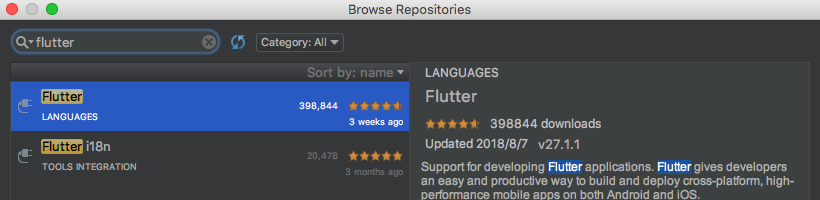

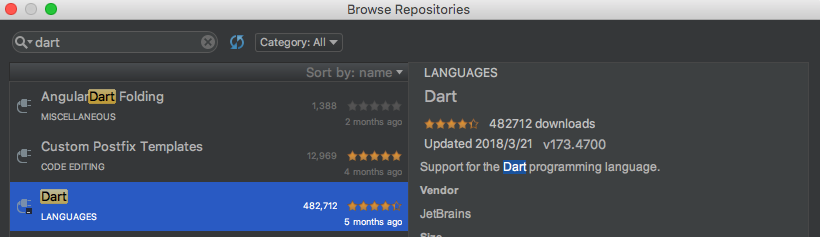

重启Studio，选择`Start a new Flutter Project `

[Get Started: Configure Editor](https://flutter.io/get-started/editor/)

[Get Started: Test Drive](https://flutter.io/get-started/test-drive/)

## 依赖库

### 配置

依赖包由[Pub](https://pub.dartlang.org/)仓库管理，项目依赖配置在pubspec.yaml文件中声明即可（类似于NPM的版本声明 [Pub Versioning Philosophy](https://www.dartlang.org/tools/pub/versioning)），对于未发布在Pub仓库的插件可以使用git仓库地址或文件路径

`^`开头的版本表示[和当前版本接口保持兼容](https://www.dartlang.org/tools/pub/dependencies#caret-syntax)的最新版，`^1.2.3` 等效于 `>=1.2.3 <2.0.0` 而 `^0.1.2` 等效于 `>=0.1.2 <0.2.0`

例如添加english_words库

```yaml
dependencies:
  flutter:
    sdk: flutter

  cupertino_icons: ^0.1.0
  english_words: ^3.1.0
```

运行`flutter package get`获取依赖库

### 插件

**Dart语言无法直接调用Android系统提供的Java接口**，这时就需要使用插件来实现中转

| 插件名                                                       | 介绍                                                         |
| ------------------------------------------------------------ | ------------------------------------------------------------ |
| [android_alarm_manager](https://github.com/flutter/plugins/blob/master/packages/android_alarm_manager) | 访问Android系统的`AlertManager`                              |
| [android_intent](https://github.com/flutter/plugins/blob/master/packages/android_intent) | 构造Android的Intent对象                                      |
| [battery](https://github.com/flutter/plugins/blob/master/packages/battery) | ，获取和监听系统电量变化。                                   |
| [connectivity](https://github.com/flutter/plugins/blob/master/packages/connectivity) | ，获取和监听系统网络连接状态。                               |
| [device info](https://github.com/flutter/plugins/blob/master/packages/device_info) | ，获取设备型号等信息。                                       |
| [image_picker](https://github.com/flutter/plugins/blob/master/packages/image_picker) | ，从设备中选取或者拍摄照片。                                 |
| [package_info](https://github.com/flutter/plugins/blob/master/packages/package_info) | ，获取App安装包的版本等信息。                                |
| [path_provider](https://github.com/flutter/plugins/blob/master/packages/path_provider) | ，获取常用文件路径。                                         |
| [quick_actions](https://github.com/flutter/plugins/blob/master/packages/quick_actions) | ，App图标添加快捷方式，iOS的[eponymous concept](https://developer.apple.com/ios/human-interface-guidelines/extensions/home-screen-actions)和Android的[App Shortcuts](https://developer.android.com/guide/topics/ui/shortcuts.html)。 |
| [sensors](https://github.com/flutter/plugins/blob/master/packages/sensors) | ，访问设备的加速度和陀螺仪传感器。                           |
| [shared_preferences](https://github.com/flutter/plugins/blob/master/packages/shared_preferences) | ，App KV存储功能。                                           |
| [url_launcher](https://github.com/flutter/plugins/blob/master/packages/url_launcher) | ，启动URL，包括打电话、发短信和浏览网页等功能。              |
| [video_player](https://github.com/flutter/plugins/blob/master/packages/video_player) | ，播放视频文件或者网络流的控件。                             |

# Widgets

[Material](https://material.io/guidelines/)

## 基本Widgets

- StatelessWidget：不可修改，所有的属性都是final
  - 用来展示静态的文本或者图片
- StatefulWidget：同样不可修改，不过在生命周期内可以包含一个可变的State的类
  * 用来展示动态内容，用来展示静态的文本或者图片
  * State\<T\>：提供给`StatefulWidget#createState`，只能在其生命周期内存在

## 其他Widgets

- Scaffold：主屏幕的widget tree，包含title，bar和body等部分

- ListView：列表，主要调用`ListView.builder`返回`ListView`
  - ListTile：用于构建LiveView中一行的Widget
  - Divider：1px高的分隔线
- Navigator：用于管理子Widget的返回栈

## 常见方法

* build：用于描述如何构造页面
* setState：类似于notifyDataSetChanged()，提醒State的信息有改变
* ListTile#divideTiles：用于构造List\<ListTile\>，在每两个元素中插入Divider

## Demo

```dart
import 'package:flutter/material.dart';
import 'package:english_words/english_words.dart';

// => 用于单行函数
void main() => runApp(MyApp());

// Widget包含padding，margin等，基本组件
// StatelessWidget是不可更改的，所有的属性都是final
class MyApp extends StatelessWidget {
    // build方法提供一个
    @override
    Widget build(BuildContext context) {
        // 默认Material主题
        return MaterialApp(
            title: 'Welcome to Flutter',
            theme: ThemeData(          // Add the 3 lines from here...
                primaryColor: Colors.red,
            ),
            home: RandomWords(),
        );
    }
}

// StatefulWidget同样不可变，但是在生命周期内可以包含一个可变的state
class RandomWords extends StatefulWidget {
    @override
    RandomWordsState createState() => new RandomWordsState();
}

// 提供给StatefulWidget的State
class RandomWordsState extends State<RandomWords> {
    // 前缀加_表示是private类型
    final List<WordPair> _suggestions = <WordPair>[];

    final Set<WordPair> _saved = new Set<WordPair>();

    // const表示常量
    final TextStyle _biggerFont = const TextStyle(fontSize: 18.0);

    @override
    Widget build(BuildContext context) {
        // Material库中的Widget，包含app bar，title和body用于显示主屏幕内容
        return Scaffold(
            appBar: AppBar(
                title: Text("Flutter Demo"),
                actions: <Widget>[
                    // 点击触发_pushSaved
                    IconButton(icon: Icon(Icons.list), onPressed: _pushSaved)
                ],
            ),
            body: _buildSuggestions(),
        );
    }

    Widget _buildSuggestions() {
        return ListView.builder(
            // padding = 16px
            padding: const EdgeInsets.all(16.0),

            // itemBuilder对于每行只会调用一次，类似于Android中的RecyclerView中的bindView
            itemBuilder: (context, i) {
                // 单数行时，return 1px高的分行符
                if (i.isOdd) return Divider();

                // ~/整除
                final index = i ~/ 2;
                // 达到列表底部时，随机生成10个单词添加到列表中
                if (index >= _suggestions.length) {
                    _suggestions.addAll(generateWordPairs().take(10));
                }
                return _buildRow(_suggestions[index]);
            });
    }

    Widget _buildRow(WordPair pair) {
        final bool alreadySaved = _saved.contains(pair);

        // ListTile
        return ListTile(
            title: Text(
                pair.asPascalCase,
                style: _biggerFont,
            ),
            trailing: Icon(
                alreadySaved ? Icons.favorite : Icons.favorite_border,
                color: alreadySaved ? Colors.red : null,
            ),
            // (){...} => setOnClickListener(new GestureTapCallback(){...})
            onTap: () {
                // setState => notifyDataSetChanged() in Android
                setState(() {
                    if (alreadySaved) {
                        _saved.remove(pair);
                    } else {
                        _saved.add(pair);
                    }
                });
            },
        );
    }

    void _pushSaved() {
        // 将一个route压入Navigator的返回栈
        Navigator.of(context).push(
            new MaterialPageRoute(builder: (BuildContext context) {
                // 构造ListTile
                final List<Widget> divided = ListTile.divideTiles(
                    context: context,
                    tiles: _saved.map((WordPair pair) {
                        return ListTile(
                            title: Text(
                                pair.asPascalCase,
                                style: _biggerFont,
                            ),
                        );
                    })
                ).toList();

                return Scaffold(
                    appBar: AppBar(
                        title: const Text("Saved Suggestions"),
                    ),
                    body: ListView(
                        children: divided,
                    ),
                );
            }),
        );
    }
}
```

[Write Your First Flutter App](https://flutter.io/get-started/codelab/)

[Flutter for Android Developers](https://flutter.io/flutter-for-android/)

# 常见语法

* =>：单行函数

## const与final的区别

- final：只能被设一次值，在声明处赋值，值和普通变量的设值一样，可以是对象、字符串、数字等，用于修饰值的表达式不变的变量
- const：只能被设一次值，在声明处赋值，且值必须为编译时常量，用于修饰常量

```dart
int Func() {
  // 代码
}

final int m1 = 60;
final int m2 = Func(); // 正确
const int n1 = 42;
const int n2 = Func(); // 错误
```

# Hot Reload

## 运行过程

* 注入新代码到正在运行的DartVM中
* 类结构更新
* 重建整个控件树
* 更新界面

## 无法生效的情况

* 编译错误
  * 无法通过编译，控制台报错

* 控件类型从`StatelessWidget`到`StatefulWidget`的转换
  * 在执行热刷新时会保留程序原来的state，重新创建会报错
  * stageless→stateful：`myWidget is not a subtype of StatelessWidget`
  * stateful→stateless：`type 'myWidget' is not a subtype of type 'StatefulWidget' of 'newWidget'`

* 全局变量和静态成员变量不会在热刷新时更新

* 修改了main函数中创建的根控件节点
  * 热刷新后只会根据原来的根节点重新创建控件树，不会修改根节点

* 某个类从普通类型转换成枚举类型，或者类型的泛型参数列表变化

热刷新无法实现更新时，执行一次热重启（Hot Restart）就可以全量更新所有代码，同样不需要重启App，区别是restart会将所有Dart代码打包同步到设备上，并且所有状态都会重置。

# Platform Channels——Native通信

Platform Channels提供了Flutter和Native通信的能力。比如，Flutter app要显示手机的电量，而电量只能通过平台的系统API获取。这时Flutter就可以通过某种方式来调用这个系统API并且获得返回值

## 原理

Flutter定义了三种不同类型的Channel，为了保证UI的响应，通过Platform Channels传递的消息都是**异步**的

- BasicMessageChannel：用于传递字符串和半结构化的信息。
- MethodChannel：用于传递方法调用（method invocation）。
- EventChannel: 用于数据流（event streams）的通信。

每种Channel均有三个重要成员变量，以下将分别介绍

### Channel name

一个Flutter应用中可能存在多个Channel，每个Channel在创建时必须指定一个独一无二的name，Channel之间使用name来区分彼此。当有消息从Flutter端发送到Platform端时，会根据其传递过来的channel name找到该Channel对应的Handler

### BinaryMessenger

代表消息信使，是Platform端与Flutter端通信的工具，通过JNI层代码实现回调，运行在主线程

> 不能在Platform Channel中执行耗时操作

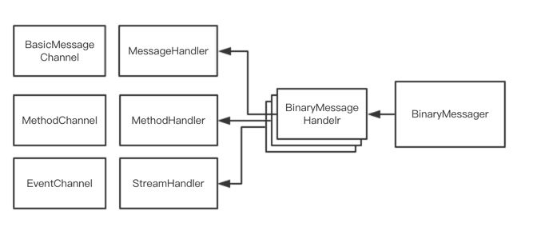

#### 实现形式

* Android：接口形式，具体实现为FlutterView

  > FlutterView实现了BinaryMessenger接口，本质是一个SurfaceView

* iOS：协议形式，名称为FlutterBinaryMessenger，FlutterViewController中使用

#### Channel的工作工程

* 注册

  * 初始化Channel，并注册处理消息的Handler

  * 生成对应的BinaryMessageHandler，并以channel name为key注册到BinaryMessenger中

    > Binarymessenger并不知道Channel的存在，它只和BinaryMessageHandler打交道。而Channel和BinaryMessageHandler则是一一对应的

* 查找和使用

  * Flutter端发送消息到BinaryMessenger
  * 根据入参channel找到对应的BinaryMessageHandler
  * 解码消息，调用BinaryMessageHandler回调函数返回result
  * 编码result，通过BinaryMessenger发送回Flutter端

### Codec

消息编解码器，消息编解码器Codec主要用于将二进制格式的数据转化为Handler能够识别的数据，Flutter定义了两种Codec：MessageCodec和MethodCodec

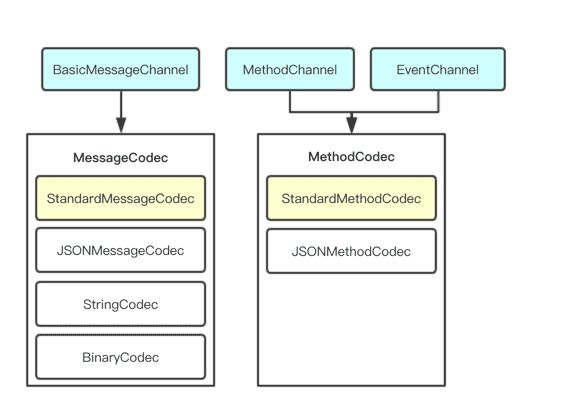

#### MessageCodec

用于二进制格式数据与基础数据之间的编解码

常见类型如下

* BinaryCodec：返回值类型和入参的类型相同，均为二进制格式

- StringCodec：用于字符串编解码，UTF-8。

- JSONMessageCodec：用于JSON数据与二进制数据之间的编解码

- StandardMessageCodec：BasicMessageChannel的默认编解码器，支持基础数据类型、二进制数据、列表、字典，对照表如下

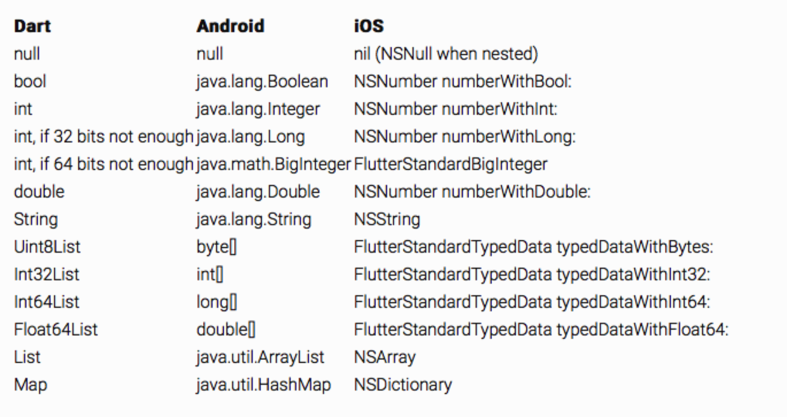

#### MethodCodec

用于MethodCall对象的编解码

> MethodCall有2个成员变量
>
> - `method`：String，方法名称
> - `arguments`：通用类型(Android中为Object，iOS中为id)，方法入参。

常见类型

- JSONMethodCodec：依赖于JSONMessageCodec
  - 调用：`{"method":method,"args":args}`
  - 成功结果：`[result]`
  - 失败结果：`[code,message,detail]`

- StandardMethodCodec：MethodCodec的默认实现，依赖于StandardMessageCodec
  - 成功结果：数值0和result
  - 失败结果：数值1和message、detail

### Handler

向Channel注册一个Handler时，实际上就是向BinaryMessager注册一个与之对应的BinaryMessageHandler。当消息派分到BinaryMessageHandler后，Channel会通过Codec将消息解码，并传递给Handler处理

常见的有以下几种Handler

* MessageHandler：用于处理字符串或者半结构化的消息

  > ```java
  > public interface Reply<T> {
  >     void reply(T result);
  > }
  > 
  > public interface MessageHandler<T> {
  >     void onMessage(T message, BasicMessageChannel.Reply<T> result);
  > }
  > ```

* MethodCallHandler：用于处理方法的调用

  > ```java
  > public interface Result {
  >     void success(@Nullable Object result);
  > 
  >     void error(String code, @Nullable String message, @Nullable Object detail);
  > 
  >     void notImplemented();
  > }
  > public interface MethodCallHandler {
  >     void onMethodCall(MethodCall call, MethodChannel.Result var2);
  > }
  > ```

* StreamHandler：用于事件流的通信，本质上使用了MethodCall实现

  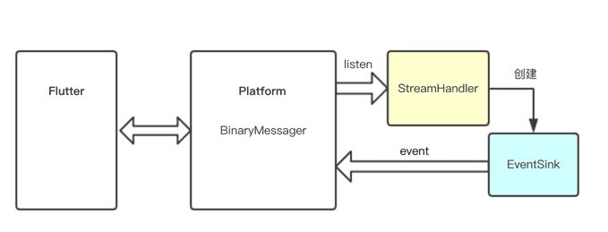

  > ```java
  > public interface EventSink {
  >     void success(@Nullable Object result);
  > 
  >     void error(String code, @Nullable String message, @Nullable Object detail);
  > 
  >     void endOfStream();
  > }
  > 
  > public interface StreamHandler {
  >     void onListen(Object arguments, EventChannel.EventSink events);
  > 
  >     void onCancel(Object arguments);
  > }
  > ```

[深入理解Flutter Platform Channel](https://zhuanlan.zhihu.com/p/43163159)

## MethodChannel Demo

例如要实现一个方法`getBatteryLevel`，从Native层获取当前电量

### Android

为了方便起见直接注册在MainActivity中

每个`MethodChannel`需要有唯一的字符串作为标识，用以互相区分，这个名称建议使用`package.module...`这样的模式来命名

```kotlin
class MainActivity: FlutterActivity() {
    override fun onCreate(savedInstanceState: Bundle?) {
        super.onCreate(savedInstanceState)
        // 自动生成的文件，注册一些Flutter需要的通用方法
        GeneratedPluginRegistrant.registerWith(this)

        initBatteryLevelChannel()
    }

    /**
     * 电量获取注册，建立通道
     */
    private fun initBatteryLevelChannel() {
        MethodChannel(flutterView, BATTERY_CHANNEL).setMethodCallHandler { 
            call, result -> {
                if (call.method == "getBatteryLevel") {
                    Log.d(TAG, "getBatteryLevel called")
                    try {
                        result.success(getBatteryLevel())
                    } catch (e: Exception) {
                        result.error(e.stackTrace.toString(), null, null)
                    }
                } else {
                    result.notImplemented()
                }
            }
        }
    }

    companion object {
        const val BATTERY_CHANNEL = "com.lizij.flutter/battery"
    }
}
```

> 如果直接在Flutter工程中编辑Android部分的java或kotlin文件，可能会提示当前min API level等于1，一些方法会飘红
>
> 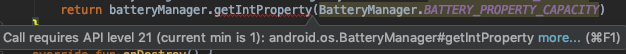
>
> 这是目前Flutter插件的问题，无法正确识别工程结构，所以右上角还提示了这个
>
> 
>
> 点击后在Android Studio打开Android子工程，即可正确识别

### Flutter

```dart
import 'package:flutter/material.dart';
import 'package:flutter/services.dart'; // Channels相关
import 'dart:async'; // 异步任务相关

// 注册MethodChannel
const batteryChannel = const MethodChannel("com.lizij.flutter/battery");

class _PlatformChannelState extends State<PlatformChannel> {

    String _batteryLevel = "Unknown";

    @override
    void initState() {
        super.initState();
        // 初始化时获取一次电量
        _getBatteryLevel();
    }

    Future<Null> _getBatteryLevel() async {
        String batteryLevel;
        try {
            // 异步调用方法，await和aync关键字表示是异步操作
            final int result = await batteryChannel.invokeMethod('getBatteryLevel');
            batteryLevel = '$result%';
        } on PlatformException catch (e) {
            batteryLevel = "Failed to get battery level: '${e.message}'.";
        }

        setState(() {
            // 更新状态
            _batteryLevel = batteryLevel;
        });
    }

    @override
    Widget build(BuildContext context) {
        return Material(
            child: Column(
                mainAxisAlignment: MainAxisAlignment.center,
                children: <Widget>[
                    Row (
                        mainAxisAlignment: MainAxisAlignment.center,
                        children: <Widget>[
                            Padding(
                                padding: EdgeInsets.symmetric(
                                    vertical: 0,
                                    horizontal: 8
                                ),
                                child: const Icon(Icons.battery_charging_full),
                            ),
                            // 显示电量
                            Text(_batteryLevel)
                        ],
                    ),
                    Padding(
                        padding: EdgeInsets.all(16),
                        child: RaisedButton(
                            child: const Text("Refresh"),
                            onPressed: () {
                                // 更新电量状态
                                _getBatteryLevel();
                            },
                        ),
                    ),
                ],
            ),
        );
    }
}
```

最终效果如图

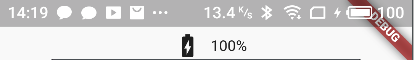

> 同样Native也可以调用Flutter的方法，只要Flutter注册`MethodHandler`，然后Native端invoke对应方法即可，例如想从Native端请求Flutter端的一个`getName`方法获取一个字符串。
>
> 在Flutter端需要给`MethodChannel`设置一个`MethodCallHandler`
>
> ```dart
> _channel.setMethodCallHandler(platformCallHandler);
> 
> Future<dynamic> platformCallHandler(MethodCall call) async {
>     switch (call.method) {
>         case "getName":
>             return "Hello from Flutter";
>             break;
>     }
> }
> ```
>
> 在Native端，只需要让对应的的channel调用`invokeMethod`
>
> ```java
> channel.invokeMethod("getName", null, new MethodChannel.Result() {
>     @Override
>     public void success(Object o) {
>         // 这里就会输出 "Hello from Flutter"
>         Log.i("debug", o.toString());
>     }
>     @Override
>     public void error(String s, String s1, Object o) {
>     }
>     @Override
>     public void notImplemented() {
>     }
> });
> ```

## EventChannel Demo

相比MethodChannel需要主动调用，EventChannel适合以事件通知的形式推送信息，类似于Android上的`BroadcastReceiver`

本质上也是用MethodChannel实现的，不同的是使用了数据流形式的消息队列实现，不需要手动写轮询

### Native

类似于MethodChannel的方式，注册一个EventChannel

```kotlin
/**
 * 充电状态注册
 */
private fun initChargingChannel() {
    EventChannel(flutterView, CHARGING_CHANNEL).setStreamHandler(object : EventChannel.StreamHandler {

        private var chargingStateChangeReceiver: BroadcastReceiver? = null

        /**
         * 这个是Flutter端用于开始监听channel时的回调，EventSink是数据载体
         */
        override fun onListen(arguments: Any?, events: EventChannel.EventSink?) {
            // 注册一个BroadcastReceiver用于监听充电状态
            chargingStateChangeReceiver = object : BroadcastReceiver() {
                override fun onReceive(context: Context?, intent: Intent?) {
                    val status = intent?.getIntExtra(BatteryManager.EXTRA_STATUS, -1)

                    if (status == BatteryManager.BATTERY_STATUS_UNKNOWN) {
                        events?.error("Unavailable", null, null)
                    } else {
                        val isCharging = status == BatteryManager.BATTERY_STATUS_CHARGING || status == BatteryManager.BATTERY_STATUS_FULL
                        events?.success(if (isCharging) "charging" else "discharging")
                    }
                }
            }

            registerReceiver(chargingStateChangeReceiver, IntentFilter(Intent.ACTION_BATTERY_CHANGED))
        }

        override fun onCancel(arguments: Any?) {
            // 解注册
            unregisterReceiver(chargingStateChangeReceiver)
            chargingStateChangeReceiver = null
        }
    })
}
```

### Flutter

```dart
const chargingChannel = const EventChannel('com.lizij.flutter/charging');

class _PlatformChannelState extends State<PlatformChannel> {
    bool _isCharging = false;

    @override
    void initState() {
        super.initState();
        // 注册EventChannel，开始监听
        chargingChannel.receiveBroadcastStream().listen(_onEvent, onError: _onError);
    }

    /// 成功事件处理
    void _onEvent(Object event) {
        setState(() {
            _isCharging = event == "charging";
        });
    }

    /// 错误事件处理
    void _onError(Object error) {
        Scaffold.of(context).showSnackBar(SnackBar(content: Text(error.toString())));
    }

    @override
    Widget build(BuildContext context) {
        return Material(
            child: Column(
                mainAxisAlignment: MainAxisAlignment.center,
                children: <Widget>[
                    Row (
                        mainAxisAlignment: MainAxisAlignment.center,
                        children: <Widget>[
                            Padding(
                                padding: EdgeInsets.symmetric(
                                    vertical: 0,
                                    horizontal: 8
                                ),
                                // 根据充电状态，改变图标
                                child: Icon(_isCharging ? Icons.battery_charging_full : Icons.battery_full),
                            ),
                        ],
                    ),
                ],
            ),
        );
    }
}
```

最终效果

充电时


断开连接时

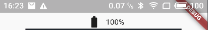

[Flutter如何和Native通信-Android视角](https://juejin.im/post/5b4c3c9a5188251ac446d915)

## 视频播放 Demo

以下代码和原理参考了官方提供的插件[video_player](https://github.com/flutter/plugins/blob/master/packages/video_player)

### 原理

#### SurfaceFlinger

* Android负责绘制UI的服务，管理Android系统的帧缓冲区（Frame Buffer）
* 运行在System进程
* Android应用程序与SurfaceFlinger服务，通过Binder服务跨进程通信，将自己的UI绘制在系统的帧缓冲区上
* 底层绘制服务使用和dart绘制相同的Skia


#### ShareClient

* 匿名共享内存的封装

  Android应用程序在通知SurfaceFlinger服务来绘制自己的UI的时候，需要将大量的UI相关数据传递给SurfaceFlinger服务，为了提高通信效率使用了匿名共享内存机制（Anonymous Shared Memory）与SurfaceFlinger服务进程开辟一块共享内存。

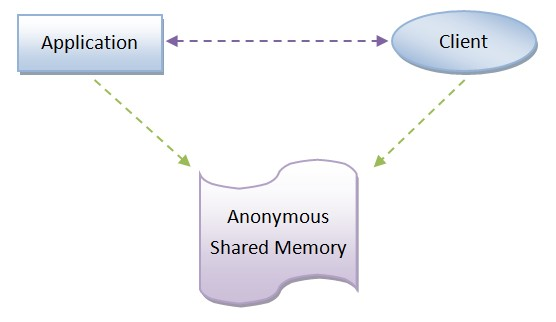

* 存储ShareBufferStack，与Surface一一对应

  > ShareBufferStack是描述UI元数据的缓冲区
  >
  > 一个Surface对应一个窗口，通过Surface可以获取Canvas进行绘制UI到FrameBuffer中

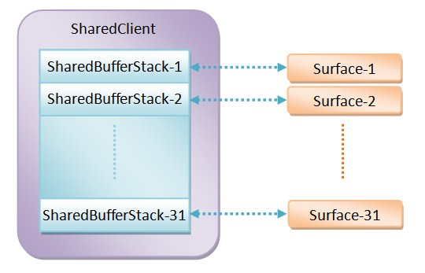

#### Flutter Texture Widget

* 用于显示一个Backend Texture，可以将一组image映射到Flutter View上

  > Backend textures are images that can be applied (mapped) to an area of the Flutter view. They are created, managed, and updated using a platform-specific texture registry. This is typically done by a plugin that integrates with host platform video player, camera, or OpenGL APIs, or similar image sources.

* 通过int类型id标识，该标识可以通过TextureRegistry获得，而TextureRegistry可以在Activity里在注册MethodChannel后获得

  通过TextureRegistry可以生成一个Surface，Android Native代码可以通过该Surface进行绘制，并通过id唯一映射到Flutter的一个Texture Widget上

  > A texture widget refers to its backend texture using an integer ID. Texture IDs are obtained from the texture registry and are scoped to the Flutter view. Texture IDs may be reused after deregistration, at the discretion of the registry. The use of texture IDs currently unknown to the registry will silently result in a blank rectangle.

### Native

```kotlin
class SurfaceChannel private constructor(var flutterRegistrar: PluginRegistry.Registrar) : MethodChannel.MethodCallHandler {

    lateinit var textureRegistry: TextureRegistry
    lateinit var surfaceTextureEntry: TextureRegistry.SurfaceTextureEntry
    lateinit var surface: Surface
    lateinit var exoPlayer: SimpleExoPlayer

    companion object {
        /**
         * 注册SurfaceChannel
         */
        fun registerWith(registrar: PluginRegistry.Registrar, channelName: String): SurfaceChannel {
            val surfaceChannel = SurfaceChannel(registrar)
            val methodChannel = MethodChannel(registrar.messenger(), channelName)
            methodChannel.setMethodCallHandler(surfaceChannel)
            return surfaceChannel
        }
    }

    /**
     * 监听方法调用
     */
    override fun onMethodCall(call: MethodCall?, result: MethodChannel.Result?) {
        Log.d(TAG, "onMethodCall: " + call.toString())
        val method = call?.method

        when(method) {
            "init" -> {
                // 获取SurfaceTextureEntry，其中包含了当前Flutter应用所有SurfaceTexture的登记信息
                textureRegistry = flutterRegistrar.textures()
                surfaceTextureEntry = textureRegistry.createSurfaceTexture()
                // 通过SurfaceTextureEntry创建一个Surface
                surface = Surface(surfaceTextureEntry.surfaceTexture())
                // 初始化播放器
                initPlayer()
                // 将texture的id回传给Flutter，用来创建Texure控件
                val reply = HashMap<String, Long>()
                val textureId = surfaceTextureEntry.id()
                reply["texture_id"] = textureId
                result?.success(reply)
            }

            "render" -> {
                // 播放视频
                playVideo()
                result?.success(null)
            }
        }
    }

    fun playVideo() {
        // 循环播放视频
        if (!exoPlayer.playWhenReady) {
            exoPlayer.playWhenReady = true
            exoPlayer.repeatMode = REPEAT_MODE_ALL
        } else {
            exoPlayer.playWhenReady = false
        }
    }

    fun initPlayer() {
        // 从asset中读取一个视频资源
        val dataSourceFactory = DefaultDataSourceFactory(flutterRegistrar.activeContext(), "ExoPlayer")
        val mediaSource = ExtractorMediaSource(Uri.parse("asset:///flutter_assets/assets/test.mp4"),
                                               dataSourceFactory,
                                               DefaultExtractorsFactory(),
                                               null, null)
        exoPlayer = ExoPlayerFactory.newSimpleInstance(flutterRegistrar.activeContext(), DefaultTrackSelector())
        // 将Surface交给播放器去绘制
        exoPlayer.setVideoSurface(surface)
        exoPlayer.prepare(mediaSource)
    }
}
```

### Flutter

Flutter层主要的工作，就是拿到texture id，然后创建一个Texture widget显示内容

```dart
// surface channel
const surfaceChannel = const MethodChannel("com.lizij.flutter/surface");
int _textureId;

void main() async {
    await _initSurfaceChannel();
    runApp(MyApp());
}

/// 获取texture id
void _initSurfaceChannel() async {
    final Map<dynamic, dynamic> response = await surfaceChannel.invokeMethod("init");
    _textureId = response["texture_id"];
}

void _renderSurfaceChannel() async {
    surfaceChannel.invokeMethod("render", <String, dynamic>{});
}

class VideoView extends StatefulWidget {
    @override
    State<StatefulWidget> createState() {
        return VideoState();
    }
}

class VideoState extends State<VideoView> {
    @override
    Widget build(BuildContext context) {
        // 根据texture id创建一个Texture
        return Texture(textureId: _textureId);
    }
}

class _PlatformChannelState extends State<PlatformChannel> {
    bool _isPlaying = false;

    @override
    Widget build(BuildContext context) {
        return Material(
            child: Column(
                mainAxisAlignment: MainAxisAlignment.center,
                children: <Widget>[
                    SizedBox(
                        width: 270,
                        height: 480,
                        child: VideoView(),
                    ),
                    Padding(
                        padding: EdgeInsets.all(16),
                        child: RaisedButton(
                            /// 播放/暂停
                            child: Text(_isPlaying ? "pause" : "play"),
                            onPressed: () {
                                _renderSurfaceChannel();
                                _isPlaying = !_isPlaying;
                            },
                        ),
                    ),
                ],
            ),
        );
    }
}
```

最终效果

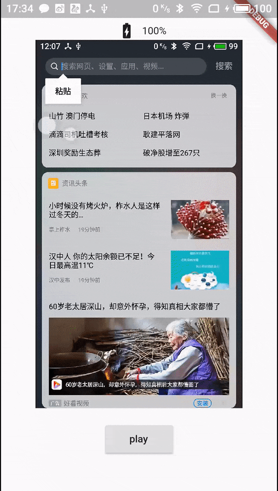

[使用Native(以Android为例)播放器构建Flutter播放插件](https://juejin.im/post/5b7ba79a6fb9a01a1826776b)

# TODO

[Flutter原理与实践](https://tech.meituan.com/waimai-flutter-practice.html)