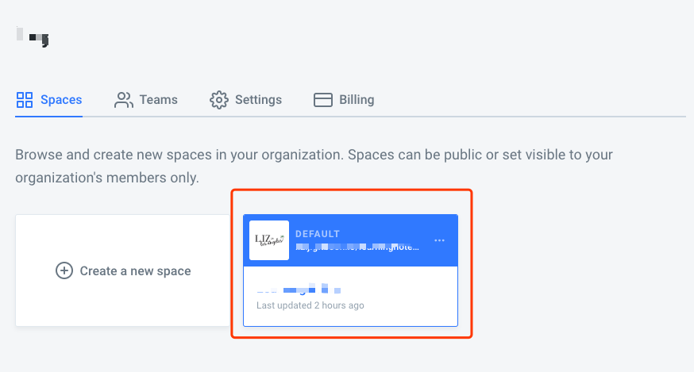
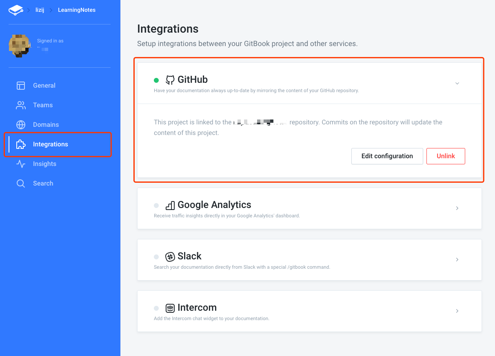

[TOC]

# 快捷键

## Finder

`command` + `shift` + `.`: 显示隐藏文件

`option` + `command` + `v`: 移动文件

## Android Studio

`command` + `左` / `右`: 移动到行首/尾

`option` +  `左` / `右`: 移动到单词首/尾

`command` + `backspace`: 删除整行

`option` + `backspace`: 删除单词

`command` + `f12`: 查找文件中的方法

`command` + `[` / `]`: 光标移动到上/下一个历史点

`command` + `shift` + `f`: 全局搜索，可以使用正则

`command` + `shift` + `上` / `下`: 向上/下移动一段代码（包括括号内的部分）

`option` + `shift` + `上` / `下`: 向上/下移动一行代码（不包括括号内的部分）

`command` + `,`: 打开设置

# 搭建Gitbook

## 本地准备

安装HomeBrew

```shell
/usr/bin/ruby -e "$(curl -fsSL https://raw.githubusercontent.com/Homebrew/install/master/install)"
```

安装npm

```shell
brew install node
```

安装gitbook-cli和gitbook-summary

```shell
sudo npm install -g gitbook-cli gitbook-summary
```

切换到书籍目录，运行`book sm`自动寻找md文件并生产`SUMMARY.md`，之后运行`gitbook serve`，访问http://127.0.0.1:4000预览

> 注意`gitbook serve`将生产_book目录，记得将该目录添加到.gitignore中

## 上传gitbook

gitbook最大的好处就是可以直接关联github仓库，便于管理，将准备好的本地书籍目录上传到github仓库后就可以登录[gitbook](https://www.gitbook.com/)管理了

首先需要创建一个organization，在这个过程中指定organization和project的名称和域名


之后点击刚才创建的space进入编辑页面



之后在Integration中关联github，即可同步相关仓库内容到gitbook中

