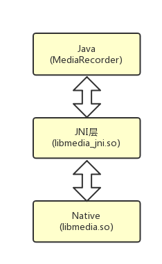
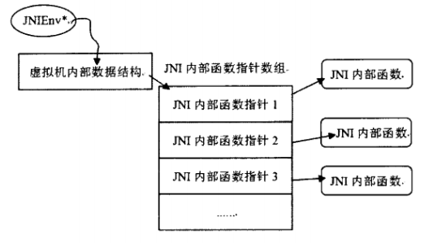

# JNI和NDK

[TOC]

## 定义

JNI的全称是Java Native Interface（Java本地接口）是一层接口，是用来沟通Java代码和C/C++代码的，是Java和C/C++之间的桥梁。通过JNI，Java可以完成对外部C/C++编写的库函数的调用，相对的，外部C/C++也能调用Java中封装好的类和方法

NDK(Native Development Kit)是Android所提供的一个工具集合，通过NDL可以在Android更加方便地通过JNI来调用本地代码（C/C++）。NDK提供了交叉编译器，开发时只需要修改mk文件就能生成特定的CPU平台的动态库

## 原理

例如MediaRecorder: Java对应的是MediaRecorder.java，也就是我们应用开发中直接调用的类。JNI层对用的是libmedia_jni.so，它是一个JNI的动态库。Native层对应的是libmedia.so，这个动态库完成了实际的调用的功能





## 应用

实际中的驱动都是C/C++开发的,通过JNI,Java可以调用C开发好的驱动，从而扩展Java虚拟机的能力。另外，在高效率的数学运算、游戏的实时渲染、音视频的编码和解码等方面，一般都是用C开发的

## 一般步骤

下载并配置NDK

在Java代码中中声明一个native方法

```java
static {
    System.loadLibrary("hello"); // 加载hello库，文件名需要和Android.mk文件中的LOCAL_MODULE属性指定的值相同
}
public native String sayHello();
```

使用javah命令生成带有native方法的头文件

```shell
javac com/xxx/TestHelloActivity.java
javah com.xxx.TestHelloActivity
```

> JDK1.7 需要在工程的src目录下执行上面的命令，JDK1.6 需要在工程的bin/classes目录下执行以上命令

创建`jni`目录，并在`jni`目录中创建一个Hello.c文件，根据头文件实现C代码。写C代码时，结构体JNIEnv*对象对个别object对象很重要，在实现的C代码的方法中必须传入这两个参数

```c
jstring Java_com_xxx_TestHelloActivity_sayHello(JNIEnv* env,jobject obj){
    char* text = "hello from c!";
    return (**env).NewsStringUTF(env,text);
}
```

在JNI的目录下创建Android.mk和Application.mk,并根据需要编写里面的内容

```makefile
# Android.mk
#LOCAL_PATH是所编译的C文件的根目录，右边的赋值代表根目录即为Android.mk所在的目录
LOCAL_PATH:=$(call my-dir)
#在使用NDK编译工具时对编译环境中所用到的全局变量清零
include $(CLEAR_VARS)
#最后声称库时的名字的一部分
LOCAL_MODULE:=hello
#要被编译的C文件的文件名
LOCAL_SRC_FILES:=Hello.c
#NDK编译时会生成一些共享库
include $(BUILD_SHARED_LIBRARY)

# Application.mk
# 常见架构有armeabi，x86和mips，默认编译all，即所有平台
APP_ABI := armeabi
```

在工程的根目录下执行`ndk_build`命令，编译.so文件

这是会创建一个`jni`目录平级的目录libs，libs下放的就是so库的目录

在`app/src/main`下创建`jniLibs`目录，将so库拷贝到`jniLibs`中，通过AndroidStudio编译运行即可。如果想用其他目录，则在gradle中配置

```
android {
    ...
    sourceSets.main {
        jniLibs.srcDir 'src/main/jni_libs'
    }
}
```

还可以在defaultConfig中添加NDK选项，让AndroidStudio可以自动编译JNI代码。将JNI代码放在`app/src/main/jni`中，或者手动指定`jni.srcDirs`

```
android {
    ...
    defaultConfig {
        ...
        ndk {
            moduleName 'jni-test'
        }
        
        sourceSets.main {
            jni.srcDirs 'src/main/jni_src'
        }
    }
}

```

AndroidStudio默认会将所有CPU平台的so库打包到apk中，可以在gradle中指定只需要打包armeabi的so库，然后在Build Variants面板中选择armDebug选项进行编辑

```
android {
    ...
    productFlavors {
        arm {
            ndk {
                abiFilter "armeabi"
            }
        }
        x86 {
            ndk {
                abiFilter "x86"
            }
        }
    }
}

```

## 方法注册

静态注册多用于NDK开发，而动态注册多用于Framework开发

### 静态注册

编写Java文件

```java
package com.example;
public class MediaRecorder {
    static {
        System.loadLibrary("media_jni");
        native_init();
    }

    private static native final void native_init();
    public native void start() throws IllegalStateException;
}
```

接着进入项目的media/src/main/java目录中执行如下命令：

```shell
javac com.example.MediaRecorder.java
javah com.example.MediaRecorder
```

第二个命令会在当前目录中（media/src/main/java）生成com_example_MediaRecorder.h文件，如下所示。

```c
/* DO NOT EDIT THIS FILE - it is machine generated */
#include <jni.h>
/* Header for class com_example_MediaRecorder */

#ifndef _Included_com_example_MediaRecorder
#define _Included_com_example_MediaRecorder
#ifdef __cplusplus
extern "C" {
    #endif
    /*
 * Class:     com_example_MediaRecorder
 * Method:    native_init
 * Signature: ()V
 */
    JNIEXPORT void JNICALL Java_com_example_MediaRecorder_native_1init
        (JNIEnv *, jclass);
    // 方法名多了一个“_l”，这是因为native_init方法有一个“_”，它会在转换为JNI方法时变成“_1”，类似于转义。 

    /*
 * Class:     com_example_MediaRecorder
 * Method:    start
 * Signature: ()V
 */
    JNIEXPORT void JNICALL Java_com_example_MediaRecorder_start
        (JNIEnv *, jobject);

    #ifdef __cplusplus
}
#endif
#endif
```

`native_init`方法被声明为注释1处的方法，格式为`Java_包名_类名_方法名`

`extern "C"`表示内部的函数采用C语言命名风格编译

`JNIEnv *` 是一个指向全部JNI方法的指针，该指针只在创建它的线程有效，不能跨线程传递。 

`jclass`是JNI的数据类型，对应Java的java.lang.Class实例

`jobject`同样也是JNI的数据类型，对应于Java对象中的this

`JNIEXPORT`和`JNICALL`是JNI中定义的宏

当我们在Java中调用`native_init`方法时，就会从JNI中寻找`Java_com_example_MediaRecorder_native_1init`方法，如果没有就会报错，如果找到就会为`native_init`和`Java_com_example_MediaRecorder_native_1init`建立关联，其实是保存JNI的方法指针，这样再次调用native_init方法时就会直接使用这个方法指针就可以了。 
静态注册就是根据方法名，将Java方法和JNI方法建立关联，但是它有一些缺点：

- JNI层的方法名称过长。
- 声明Native方法的类需要用javah生成头文件。
- 初次调用JIN方法时需要建立关联，影响效率。

静态方法就是根据函数名来建立Java函数和JNI函数之间的关联关系的，这里要求JNI层函数的名字必须遵循特定的格式

### 动态注册

JNI中有一种结构用来记录Java的Native方法和JNI方法的关联关系，它就是JNINativeMethod，它在jni.h中被定义

```c
typedef struct{  
    const char* name;  // Java中native函数的名字，不用携带包的路径，例如“native_init”  
    const char* signature; // Java函数的签名信息，用字符串表示，是参数类型和返回类型的组合，用以应对Java里的函数重载  
    void* fnPtr; // JNI层对应函数的函数指针，注意他是void*类型  
} JNINativeMethod  
```

定义JNINativeMethod数组，依次为方法名，函数签名和函数指针

```c
JNINativeMethod nativeMethod[] = {
    {"dynamicRegFromJni", "()Ljava/lang/String;", (void*)nativeDynamicRegFromJni}
};
```

在`JNI_Onload`方法中注册

```c
JNIEXPORT jint JNICALL JNI_OnLoad(JavaVM *jvm, void *reserved)
{
    JNIEnv *env;
    if ((*jvm) -> GetEnv(jvm, (void**) &env, JNI_VERSION_1_4) != JNI_OK)
    {
        return -1;
    }

    jclass clz = (*env) -> FindClass(env, "github/jp1017/hellojni/MainActivity");

    (*env) -> RegisterNatives(env, clz, nativeMethod, sizeof(nativeMethod) / sizeof(nativeMethod[0]));

    return JNI_VERSION_1_4;
}
```

> `JNI_OnLoad()`作用：
>
> 1. 指定 jni 版本：告诉 JVM 该组件使用哪一个 jni 版本(若未提供`JNI_OnLoad()`函数，JVM 会默认该使用最老的 JNI 1.1版本)，如果要使用新版本的JNI，例如JNI 1.4版，则必须由 `JNI_OnLoad()` 函数返回常量 JNI_VERSION_1_4 (该常量定义在 jni.h 中) 来告知 JVM 
> 2. 一系列初始化操作，当 JVM 执行到 System.loadLibrary() 函数时，会立即调用` JNI_OnLoad() `方法，因此在该方法中进行各种资源的初始化操作最为恰当

> ` jint RegisterNatives(JNIEnv *env, jclass clazz, const JNINativeMethod *methods, jint nMethods)`
>
> 向 clazz 参数指定的类注册本地方法。methods 参数将指定 JNINativeMethod 结构的数组，其中包含本地方法的名称、签名和函数指针。nMethods 参数将指定数组中的本地方法数

[安卓jni开发之native方法的动态注册](https://www.jianshu.com/p/67019062774b)

## JNI数据类型和类型签名





JNIEnv是指向可用JNI函数表的接口指针，原生代码通过JNIEnv接口指针提供的各种函数来使用虚拟机的功能。JNIEnv是一个指向线程-局部数据的指针，而线程-局部数据中包含指向线程表的指针。实现原生方法的函数将JNIEnv接口指针作为它们的第一个参数。

### 数据类型转换

基本类型

| Java类型 | 别名     | C++本地类型    | 字节         | 签名 |
| -------- | -------- | -------------- | ------------ | ---- |
| boolean  | jboolean | unsigned char  | 8, unsigned  | Z    |
| byte     | jbyte    | signed char    | 8            | B    |
| char     | jchar    | unsigned short | 16, unsigned | C    |
| short    | jshort   | short          | 16           | S    |
| int      | jint     | long           | 32           | I    |
| long     | jlong    | __int64        | 64           | J    |
| float    | jfloat   | float          | 32           | F    |
| double   | jdouble  | double         | 64           | D    |
| void     | void     | void           |              | V    |

引用类型


类的签名：`L+包名+类名+；`，例如`Ljava/lang/String`

数组签名：`[+类型签名`，可以多级嵌套，例如`[java/lang/String`

方法签名：`(参数类型签名)+返回值类型签名`，例如`boolean fun1(int a , String b, int[]c)`的签名为`(ILjava/lang/String;[I)Z`

[Android面试题：对JNI和NDK的理解](http://blog.csdn.net/yyg_2015/article/details/72229892)

[Android深入理解JNI（一）JNI原理与静态、动态注册](http://blog.csdn.net/itachi85/article/details/73459880)

[JNIEnv结构体解析](https://www.jianshu.com/p/453b0463a84c)

## jni调用java

### 一般步骤

在本地方法中调用Java对象的方法的步骤：

1. 获取你需要访问的Java对象的类

   - `FindClass`通过传java中完整的类名来查找java的class
   - `GetObjectClass`通过传入jni中的一个java的引用来获取该引用的类型。

   > 前者要求你必须知道完整的类名，后者要求在Jni有一个类的引用。

2. 获取MethodID,调用方法

   - `GetMethodID` 得到一个实例的方法的ID 
   - `GetStaticMethodID` 得到一个静态方法的ID 

3. 获取对象的属性

   - `GetFieldID `得到一个实例的域的ID 
   - `GetStaticFieldID` 得到一个静态的域的ID

   > JNI通过ID识别域和方法，一个域或方法的ID是任何处理域和方法的函数的必须参数。

### 常用函数

- `jclass FindClass (JNIEnv *env, const char *name)`

  该函数用于加载本地定义的类。它将搜索由CLASSPATH 环境变量为具有指定名称的类所指定的目录和 zip文件

- `jobject NewObject (JNIEnv *env ,  jclass clazz,  jmethodID methodID, ...)`

  构造新 Java 对象。方法 ID指示应调用的构造函数方法。该 ID 必须通过调用 GetMethodID() 获得，且调用时的方法名必须为 \<init>，而返回类型必须为 void (V)

- `jfieldID   GetFieldID(JNIEnv *env, jclass clazz, const char *name, const char *sig)`

  返回类的实例（非静态）域的域 ID。该域由其名称及签名指定。访问器函数的Get\<type>Field 及 Set\<type>Field 系列使用域 ID 检索对象域

- `jmethodID GetMethodID(JNIEnv *env, jclass clazz,    const char *name, const char *sig)`

  返回类或接口实例（非静态）方法的方法 ID。方法可在某个 clazz 的超类中定义，也可从 clazz 继承。该方法由其名称和签名决定。 GetMethodID() 可使未初始化的类初始化。要获得构造函数的方法 ID，应将 \<init> 作为方法名，同时将void (V) 作为返回类型

- `NativeType Call<type>Method (JNIEnv*en v, jobject obj, jmethodID methodID, ...)`

  根据所指定的方法 ID 调用 Java 对象的实例非静态方法，参数附加在函数后面

- `NativeType Call<type>StaticMethod (JNIEnv*env, jclass classzz, ...)`

  根据所指定的方法 ID 调用 Java 对象的实例静态方法，参数附加在函数后面

### 示例

```java
public static void methodCalledByJni(String msgFromJni) {
    Log.d(TAG, "methodCalledByJni, msg: " + msgFromJni);
}
```

```c
void callJavaMethod(JNIEnv *env, jobject thiz) {
    jclass clazz = env->FindClass("com/ryg/JniTestApp/MainActivity");
    if (clazz == NULL) {
        printf("find class MainActivity error!");
        return;
    }
    jmethodID id = env->GetStaticMethodID(clazz, "methodCalledByJni", "(Ljava/lang/String;)V");
    if (id == NULL) {
        printf("find method methodCalledByJni error!");
    }
    jstring msg = env->NewStringUTF("msg send by callJavaMethod in test.cpp.");
    env->CallStaticVoidMethod(clazz, id, msg);
}
```

### 常见问题

#### JNIEnv和jobject多线程共享问题

JNIEnv是一个线程相关的变量， 对于每个 thread 而言是唯一的 ，所以`*env`指针不可以为多个线程共用

不能直接保存一个线程中的jobject指针到全局变量中,然后在另外一个线程中使用它

**解决办法：**

java虚拟机的JavaVM指针是整个jvm公用的，我们可以通过JavaVM来得到当前线程的JNIEnv指针

用env->NewGlobalRef创建一个全局变量，将传入的obj(局部变量)保存到全局变量中,其他线程可以使用这个全局变量来操纵这个java对象

> 若不是一个 jobject，则不需要这么做。如：
>
> jclass 是由 jobject public 继承而来的子类，所以它当然是一个 jobject，需要创建一个 global reference 以便日后使用。
>
> 而 jmethodID/jfieldID 与 jobject 没有继承关系，它不是一个 jobject，只是个整数，所以不存在被释放与否的问题，可保存后直接使用

```c
#include<stdio.h>
#include<stdlib.h>
#include<unistd.h>
#include<pthread.h>
#include<jni.h>
#include<android/log.h>
#define LOGI(...) ((void)__android_log_print(ANDROID_LOG_INFO, "native-activity", __VA_ARGS__))
#define LOGW(...) ((void)__android_log_print(ANDROID_LOG_WARN, "native-activity", __VA_ARGS__))
#define LOGE(...) ((void)__android_log_print(ANDROID_LOG_ERROR, "native-activity", __VA_ARGS__))
static JavaVM *gs_jvm = NULL; // 保存起来  
static jobject gs_object = NULL; // 保存起来  

JNIEXPORT jint JNICALL Java_com_example_testjni_Hunter_test(JNIEnv *env, jclass obj) {  
    // 注意了，在第一次进来的时候，我就保存他们了，要快！！！！  
    env->GetJavaVM(&gs_jvm); //保存到全局变量中JVM     
    gs_object = env->NewGlobalRef(obj); //直接赋值obj到全局变量是不行的,应该调用以下函数: 
    return 0;  
}  

/* 服务器发送过来的消息到达了 */  
int frecvMsg_callback() {  
    // 注意！！我要调用了  
    JNIEnv *env;  
    // 获取当前线程的 env   
    //Attach主线程
    if((*gs_jvm)->AttachCurrentThread(gs_jvm, &env, NULL) != JNI_OK) {
        LOGE("%s: AttachCurrentThread() failed", __FUNCTION__);
        return NULL;
    }
    // 这个class默认是初始化gs_object时所调用的Java 类  
    jclass cls;
    //找到对应的类
    cls = (*env)->GetObjectClass(env,gs_obj);
    if(cls == NULL) {
        LOGE("FindClass() Error.....");
        goto error;
    }
    //再获得类中的方法
    mid = (*env)->GetMethodID(env, cls, "fromJNI", "(I)V");
    if (mid == NULL) {
        LOGE("GetMethodID() Error.....");
        goto error; 
    }
    //最后调用java中的方法
    (*env)->CallVoidMethod(env, cls, mid ,(int)arg);

    // 用完之后一定要  DetachCurrentThread 取消关联，要不然程序退出会有异常  
    error:   
    //Detach主线程
    if((*gs_jvm)->DetachCurrentThread(gs_jvm) != JNI_OK) {
        LOGE("%s: DetachCurrentThread() failed", __FUNCTION__);
    }

    return 0;  
}

//由java调用以创建子线程
JNIEXPORT void Java_com_test_JniThreadTestActivity_mainThread( JNIEnv* env, jobject obj, jint threadNum) {
    int i;
    pthread_t* pt;
    pt = (pthread_t*) malloc(threadNum * sizeof(pthread_t));
    for (i = 0; i < threadNum; i++) {
        //创建子线程
        pthread_create(&pt[i], NULL, &thread_fun, (void *)i);
    }

    for (i = 0; i < threadNum; i++) {
        pthread_join(pt[i], NULL);
    }
    LOGE("main thread exit.....");
}

//当动态库被加载时这个函数被系统调用
JNIEXPORT jint JNICALL JNI_OnLoad(JavaVM *vm, void *reserved) {
    JNIEnv* env = NULL;
    jint result = -1;   

    //获取JNI版本
    if ((*vm)->GetEnv(vm, (void**)&env, JNI_VERSION_1_4) != JNI_OK) {
        LOGE("GetEnv failed!");
        return result;
    }

    return JNI_VERSION_1_4;
}
```

[深入了解android平台的jni---本地多线程调用java代码](http://www.cnblogs.com/aiguozhe/p/5355226.html)

[JNI方法整理](https://blog.csdn.net/autumn20080101/article/details/8646431)